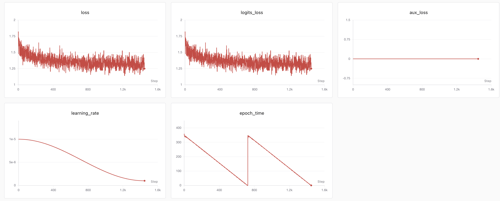

# minimind-deep-dive

**源码精读式的 MiniMind 学习笔记**

从每一行代码弄清楚：一个最小可训练 LLM 怎么搭、怎么训练、怎么对齐。

   

[不同之处](#这份笔记的不同) · [学习路径](#学习路径) · [怎么读](#怎么读) · [路线图](#路线图)

---

这套笔记不复制 MiniMind 的源码，而是带你**对照源码读**：每节标出对应的源码文件与符号（函数 / 类名），并排打开 [MiniMind](https://github.com/jingyaogong/minimind) 一起看。符号引用以 MiniMind2 主线（`minimind-master`）为准，版本差异集中在第 9 章。

面向想从源码层面真正搞懂一个 LLM 全流程的人。不需要精通，但先了解交叉熵、反向传播、self-attention、causal mask、RoPE、RMSNorm、PPO clip 会读得更顺。

## 这份笔记的不同

除了带你逐行读懂源码，这份笔记还做了三件事：

- **版本演进对照（第 9 章）** — MiniMind2 与 MiniMind-3 / Qwen3-style 逐条源码 diff：QK-Norm、移除 shared expert、PPO 重写（5→4 模型 + token-level GAE）、GRPO 默认 CISPO。
- **真实实验证据（第 10 章）** — 不是「应该更好」，而是真实服务器训练曲线 + 固定 prompt 评测，含 RL 的 reward-hacking（训练 reward 升，事实 / 代码正确性没升）。
- **统一训练数学链（第 8 章）** — 一条 `logits → token log-prob → 序列 loss → backward → optimizer.step` 贯穿 Pretrain / SFT / DPO / PPO / GRPO，把六种训练的更新骨架统一起来。

 第 10 章的证据之一：服务器 SFT 训练曲线（SwanLab）

## 学习路径

按 **结构 → 训练 → 机制 → 版本 → 实验** 推进。每章是一个目录，下分 `NN-子主题.md`；章末有思考题，参考答案折叠在下方。

| Part | 章 | 内容 | 状态 |
|---|---|---|---|
| 结构 | [00 · overview](chapters/00-overview/) | MiniMind 是什么、四层源码地图、环境与快速开始 | ✅ |
| 结构 | [01 · foundations](chapters/01-foundations/) | Tokenizer、Embedding、数据格式 | ✅ |
| 结构 | [02 · model](chapters/02-model/) | Block / RMSNorm / Attention / RoPE / GQA / SwiGLU / MoE（+归一化演进） | ✅ |
| 训练 | [03 · pretrain](chapters/03-pretrain/) | 数据与标签、前向到 loss、Pretrain 主循环 | ✅ |
| 训练 | [04 · inference](chapters/04-inference/) | KV cache 与 generate（RL 在线采样的前置）、推理服务、权重格式 | ✅ |
| 训练 | [05 · sft](chapters/05-sft/) | SFT：为什么只监督 assistant 回复 | ✅ |
| 训练 | [06 · dpo](chapters/06-dpo/) | DPO：偏好优化与 −logsigmoid 目标 | ✅ |
| 训练 | [07 · ppo-grpo](chapters/07-ppo-grpo/) | RL 总览、PPO、GRPO、SPO、训练信号总表（+GRPO 变体家族） | ✅ |
| 机制 | [08 · training-mechanics](chapters/08-training-mechanics/) | 从 logits 到参数更新的完整训练机制 | ✅ |
| 版本 | [09 · minimind2-vs-3](chapters/09-minimind2-vs-3/) | MiniMind2 → MiniMind-3 / Qwen3-style 逐条对照 | ✅ |
| 实验 | [10 · experiments](chapters/10-experiments/) | 固定 prompt 设计、服务器训练记录、SFT vs RL 评测 | ✅ 持续补充 |
| 进阶 | [appendix](chapters/appendix/) | Flash Attention / LoRA / 蒸馏 / Agent RL 点到为止 | ✅ |

## 怎么读

- **对照源码**：每节给出源码文件 + 符号位置。全书无行号，用函数 / 类名 + 代码片段定位，抗上游更新。
- **分层深浅**：正文讲清概念与机制；张量级细节（shape / mask / padding / 索引技巧）收在每节的 `
源码细节
` 折叠块，按需展开。
- **章末自测**：每章末有思考题，参考答案折叠在题目下方。

## 路线图

主线（源码精读）已完成，随自学进度持续更新：

- **可运行对照实验**（计划中）— CPU 可跑的小实验（如 RoPE 多频、Pre/Post-Norm），把第 10 章的证据扩展到读者可复现。
- **第 10 章实验补充**（进行中）— 补充更多服务器训练曲线与评测。
- **RoPE 配图**（待补）— 第 2 章 RoPE 的旋转示意图。

## 范围与边界

本书是 **v1**：忠于 MiniMind2 主线（默认 `hidden_size=512`，MiniMind2-Small 约 26M）做一遍完整、准确的精读。有源码 / 实操支撑的写深，没有的诚实标边界、点到为止（见 appendix）。

## 来源与致谢

- 源码：MiniMind / MiniMind-3，作者 [jingyaogong](https://github.com/jingyaogong/minimind)。
- 数据格式与样本：引自 MiniMind-3 README；训练数据集见 [minimind_dataset](https://huggingface.co/datasets/jingyaogong/minimind_dataset)（ModelScope / HuggingFace）。
- 配图：正文流程图（SVG）为源码精读时绘制，训练曲线截图来自 SwanLab，均存于 [`images/`](images/)。
- 本仓库是个人学习笔记的重构整理，不隶属于原项目。

## 许可

教学内容采用 [CC BY 4.0](LICENSE)（署名）；引用的 MiniMind 源码片段版权归原项目 [jingyaogong/minimind](https://github.com/jingyaogong/minimind)，遵循其 Apache-2.0 协议。
