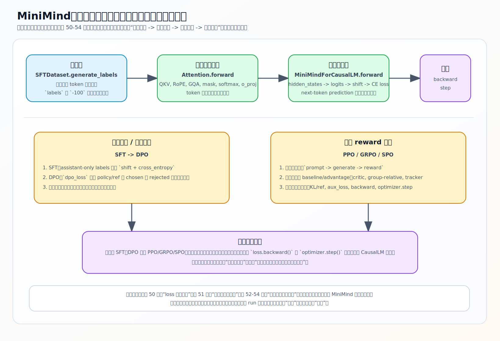

# MiniMind 是什么，源码长什么样

MiniMind 是一个从零训练的极小语言模型项目。它不调用 `transformers` / `trl` / `peft` 的高层封装去"十行代码跑通训练"，而是把 tokenizer 训练、预训练、监督微调、LoRA、DPO、强化学习（PPO/GRPO）、蒸馏的每一步都用可读的源码写出来。模型本身也小：默认 dense 配置 `hidden_size=512`、`num_hidden_layers=8`，即项目所说的 MiniMind2-Small，约 26M 参数；更大的 Base 是 `768/16`（约 104M），MoE 配置约 145M（参数量见 `eval_llm.py` 的 `--hidden_size` 说明，结构默认值见 `model/model_minimind.py` 的 `MiniMindConfig`）。小到可以在单张消费级显卡上几小时跑完一轮预训练。

对学习者来说，这两个特点正是价值所在：流程是完整的，代码是看得穿的。这套笔记的全部前提，就是这份源码足够小，可以逐行读懂。

## 能跑出什么

一条完整链路：先训练或复用一个 6400 词表的 tokenizer，用 `text` 语料做预训练得到 `pretrain_*.pth`，再用多轮对话数据做 SFT 得到 `full_sft_*.pth`，之后可选地接 DPO / PPO / GRPO 做偏好对齐或强化学习。每个阶段都产出一份独立权重，可以单独加载、对比输出。第 10 章会用这些权重做真实的固定 prompt 评测。

模型有两种结构：dense（标准 Transformer）和 MoE（用混合专家替换 FFN）。两者共用同一套训练代码，区别集中在 `FeedForward` 与 `MOEFeedForward`，第 2 章会讲清楚。

## 源码地图：四层

读 MiniMind 时，把源码分成四层，能很快定位"某个机制在哪个文件"。

### 模型层 —— `model/model_minimind.py`

单文件 673 行，装下整个模型：

- `MiniMindConfig`：结构与超参配置（层数、维度、头数、是否 MoE 等）。
- `Attention`：QKV 投影、RoPE、GQA、KV cache、causal attention。
- `FeedForward` / `MOEFeedForward` + `MoEGate`：前馈层与专家路由、辅助损失。
- `MiniMindBlock`：一个 Transformer Block（Norm → Attention → 残差 → Norm → FFN → 残差）。
- `MiniMindForCausalLM`：最终前向，从 `hidden_states` 算到 `logits` 和 `loss`。

### 数据层 —— `dataset/lm_dataset.py`

每个训练阶段一个 `Dataset` 类，负责把 jsonl 变成 `input_ids` / `labels`：

- `PretrainDataset`：预训练文本。
- `SFTDataset`：监督微调，含 assistant-only 标签构造（第 5 章）。
- `DPODataset`：偏好数据 chosen / rejected（第 6 章）。
- `RLAIFDataset`：强化学习的 prompt 组织（第 7 章）。

### 训练层 —— `trainer/`

每种训练一个入口脚本，外加一份工具：

- `train_pretrain.py` / `train_full_sft.py` / `train_dpo.py` / `train_ppo.py` / `train_grpo.py` / `train_spo.py`：各阶段主循环。
- `train_tokenizer.py`：词表训练示例。
- `trainer_utils.py`：学习率调度、初始化、checkpoint、断点续训、分布式工具（附录会单独讲）。

### 推理与服务层 —— 根目录 + `scripts/`

- `eval_llm.py`：命令行加载权重、跑生成，是做实验最常用的入口。
- `scripts/web_demo.py`：最小 Web Demo。
- `scripts/serve_openai_api.py` / `chat_openai_api.py`：OpenAI 协议服务与调用示例。
- `scripts/convert_model.py`：`.pth` 与 Transformers 目录之间的权重转换。

## 这套笔记怎么读

笔记按 **结构 → 训练 → 机制 → 版本 → 实验** 排列：先把模型拆开（第 2 章），再看数据怎么进、loss 怎么出、参数怎么更新（第 3 章），然后是推理、对齐训练，最后把贯穿所有训练阶段的数学链单独拎出来深讲（第 8 章）。

每节开头标注对应的源码文件与符号，建议对照 `model/model_minimind.py` 等原文件一起看；笔记给的是讲解和图，不复制源码。符号位置（函数/类名）以 MiniMind2 主线为准，MiniMind-3 的差异集中在第 9 章。

## 练习

1. 不看上文，说出 MiniMind 源码的四层分别对应哪个文件或目录，各自负责什么。
2. dense 与 MoE 两种结构共用同一套训练代码，区别主要落在哪个类上？

参考答案

1. 模型层 `model/model_minimind.py`（结构与前向）、数据层 `dataset/lm_dataset.py`（jsonl → input_ids/labels）、训练层 `trainer/`（各阶段主循环 + `trainer_utils.py`）、推理与服务层 `eval_llm.py` + `scripts/`（生成、Web、API、权重转换）。
2. 落在前馈层：dense 用 `FeedForward`，MoE 用 `MOEFeedForward` + `MoEGate`；其余结构（Attention、Norm、Block 骨架）一致。

