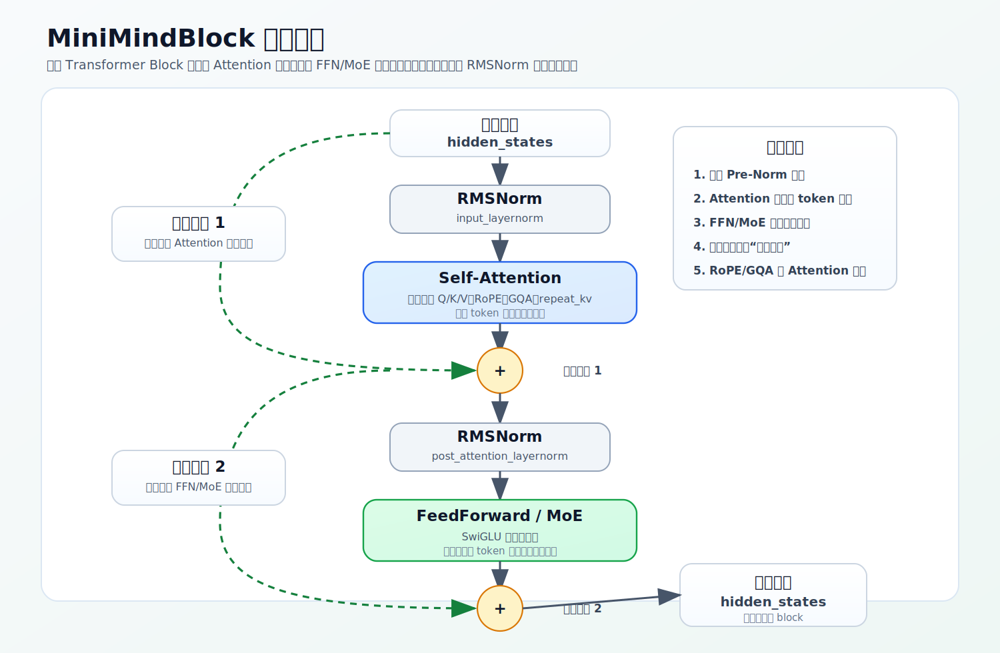

# Transformer Block 与 RMSNorm

模型的主体是把同一种结构（`MiniMindBlock`）堆叠 `num_hidden_layers` 层。看懂一个 block，就看懂了模型的 90%。这一节先讲 block 的整体骨架，再把它内部用到的归一化层 `RMSNorm` 讲透。Attention、RoPE、FFN、MoE 这些子模块各有专章，这里只关心它们在 block 里的**位置**。

源码：`model/model_minimind.py`，`MiniMindBlock`、`RMSNorm`。

## 模型主链路

`MiniMindModel.forward` 把整条链路串起来：

```text
input_ids → embed_tokens → MiniMindBlock × N → 最终 RMSNorm → hidden_states
```

每个 block 输出的 `hidden_states` 是下一个 block 的输入，形状始终是 `[batch, seq_len, hidden_size]`，逐层细化同一组 token 表示。最后还有一个 `self.norm` 做收尾归一化。

## 一个 block 的结构：Pre-Norm + 两次残差

`MiniMindBlock.forward` 的核心就六行：

```python
residual = hidden_states
hidden_states, present_key_value = self.self_attn(
    self.input_layernorm(hidden_states), position_embeddings,
    past_key_value, use_cache, attention_mask
)
hidden_states += residual                                                  # 残差 1
hidden_states = hidden_states + self.mlp(self.post_attention_layernorm(hidden_states))  # 残差 2
```

拆成两条子层路径：

```text
hidden → RMSNorm → Attention → + residual      （第一子层：token 间信息交互）
       → RMSNorm → FFN/MoE   → + residual      （第二子层：每个 token 表示的非线性加工）
```

两个要点：

- **Pre-Norm**：归一化放在子层**之前**（`Norm → 子层 → 残差`），而不是之后。残差分支走的是未经 norm 的原始表示，给信息和梯度留了一条直通路。深层 Transformer 用 Pre-Norm 通常更容易稳定训练。
- **两次残差**：Attention 和 FFN/MoE 各自的输出都加回进入该子层前的表示，而不是整个覆盖。每个子层做的是「在原表示上增量更新」——这正是深层网络能训得动的关键。

第二子层的 `self.mlp` 按配置二选一：

```python
self.mlp = FeedForward(config) if not config.use_moe else MOEFeedForward(config)
```

dense 用 `FeedForward`，MoE 用 `MOEFeedForward`。block 骨架对两者完全一样，区别只在这一行——这也是为什么第 2 章把 SwiGLU 和 MoE 分开讲，但它们插在 block 的同一个位置。



## RMSNorm：稳住每个 token 的尺度

block 里有两处 RMSNorm，分别在两个子层前。它要解决的问题是：层数一深，`hidden_states` 的数值尺度容易在不同 token、不同层之间漂移，后面的 Attention / FFN 就更难稳定处理。归一化先把尺度收回一个可控范围，再交给子层。

公式（源码 docstring）：

```text
RMSNorm(x) = w ⊙ (x / RMS(x))
RMS(x) = sqrt(mean(x_i²) + ε)
```

源码：

```python
def __init__(self, dim, eps=1e-5):
    self.eps = eps
    self.weight = nn.Parameter(torch.ones(dim))      # 可学习的逐维缩放

def _norm(self, x):
    return x * torch.rsqrt(x.pow(2).mean(-1, keepdim=True) + self.eps)

def forward(self, x):
    return self.weight * self._norm(x.float()).type_as(x)
```

逐行对应公式：

- `x.pow(2).mean(-1, keepdim=True)`：沿**最后一维**（`hidden_size`）求平方均值。归一化的是每个 token 自己的特征向量，不碰 batch 维和 seq 维。`keepdim=True` 保留维度，方便和 `x` 广播相乘。
- `torch.rsqrt(... + eps)`：`rsqrt(a) = 1/sqrt(a)`，所以 `x * rsqrt(mean(x²)+eps)` 就是 `x / RMS(x)`。`eps` 防止除零。
- `self.weight * ...`：长度 `hidden_size` 的可学习向量。归一化先把尺度统一，`weight` 再让模型学回「哪些维度该放大、哪些该缩小」，相当于给模型留了一个调节旋钮。
- `x.float()` 再 `.type_as(x)`：归一化涉及平方、均值、开方倒数，对数值精度敏感，所以**先升到 float32 算、算完再转回原 dtype**。这和混合精度训练是一致的——低精度训练不代表每一步都低精度，敏感操作会保留高精度。

## RMSNorm 和 LayerNorm 差在哪

LayerNorm 做两件事：减均值、除以标准差，让向量大致变成「均值 0、方差 1」。RMSNorm **省掉减均值**，只用 root mean square 控制尺度：

- LayerNorm 同时管「中心」和「尺度」；
- RMSNorm 只管「尺度」。

少一步减均值，计算更省，而在 Transformer 里效果足够好，所以 LLaMA、Qwen 这类模型普遍改用 RMSNorm。直觉上 RMSNorm 更像是在**控制向量长度**，而不重新居中向量，表示的方向信息保留得更完整。

> 想看 RMSNorm 在整个归一化谱系里的位置——为什么从 BatchNorm 一路演化到它、之后又有 QK-Norm——见本章延伸节 [07-normalization-evolution](07-normalization-evolution.md)。

<details>
<summary>源码细节：两次残差的写法差异、weight 的广播</summary>

正文是骨架，这里补两个看 `forward` 时容易一扫而过的点（贴真实片段）。

**1. 两次残差：一次 in-place `+=`，一次普通 `+`**

`MiniMindBlock.forward` 两次残差的写法其实不一样：

```python
residual = hidden_states
hidden_states, present_key_value = self.self_attn(self.input_layernorm(hidden_states), ...)
hidden_states += residual                                                  # 残差 1：in-place
hidden_states = hidden_states + self.mlp(self.post_attention_layernorm(hidden_states))  # 残差 2：新建张量
```

残差 1 用 `+=`（in-place，原地累加到 `hidden_states`），残差 2 用 `x = x + ...`（新建张量再绑定）。两者数学等价。要点是 `residual = hidden_states` 在 norm **之前**就存好——存的是进入子层前的原始表示，`input_layernorm` 只作用于喂给 attention 的那份拷贝，不改 `residual`。所以归一化是「子层的输入预处理」，残差走的始终是未归一化的原值，这正是 Pre-Norm 的关键（[08-training-mechanics](../08-training-mechanics/01-update-skeleton.md) 里 backward 能稳定回传，靠的就是这条残差直通路）。

**2. weight 是 `[hidden_size]`，靠广播逐维缩放**

```python
self.weight = nn.Parameter(torch.ones(dim))          # [hidden_size]
return self.weight * self._norm(x.float()).type_as(x)  # [H] * [B,T,H] → [B,T,H]
```

`weight` 只有一维 `[hidden_size]`，`_norm(x)` 是 `[B, T, H]`，相乘时 `weight` 自动广播到每个 batch、每个位置——即**所有 token 共享同一组逐维缩放**。初始全 1（等于不缩放），训练中再学出每维的强度。

</details>

## 练习

1. 一个 `MiniMindBlock` 内部，Attention 和 FFN/MoE 各自前面和后面有什么？为什么叫 Pre-Norm？
2. RMSNorm 归一化的是 `[batch, seq_len, hidden_size]` 的哪一维？为什么是这一维？
3. `torch.rsqrt(x.pow(2).mean(-1, keepdim=True) + eps)` 对应公式里的哪一部分？
4. RMSNorm 的 `self.weight` 已经做了归一化，为什么还要它？
5.（源码细节）`residual = hidden_states` 为什么要在 `input_layernorm` 之前存？残差分支走的是归一化前还是归一化后的值？

<details>
<summary>参考答案</summary>

1. 每个子层都是 `RMSNorm → 子层 → 残差`：Attention 前一次 norm、后一次残差；FFN/MoE 前一次 norm、后一次残差。归一化放在子层之前，所以叫 Pre-Norm，残差分支保留未归一化的原始表示。
2. 最后一维 `hidden_size`，因为这一维才是单个 token 的特征向量；RMSNorm 归一化的是每个 token 自身的尺度。
3. 对应 `1 / RMS(x)`：`rsqrt = 1/sqrt`，平方均值加 eps 再开方倒数，乘到 `x` 上等价于 `x / sqrt(mean(x²)+eps)`。
4. 归一化把所有 token 的尺度拉到同一范围会丢掉「各维度重要性不同」的信息，`weight` 是可学习的逐维缩放，让模型在稳定尺度后重新学回每维合适的强度。
5. 因为残差要保留进入子层前的原始表示；`input_layernorm` 只处理喂给 attention 的那份，先存 `residual` 才能确保残差走的是**归一化前**的值（Pre-Norm 的直通路）。
</details>
