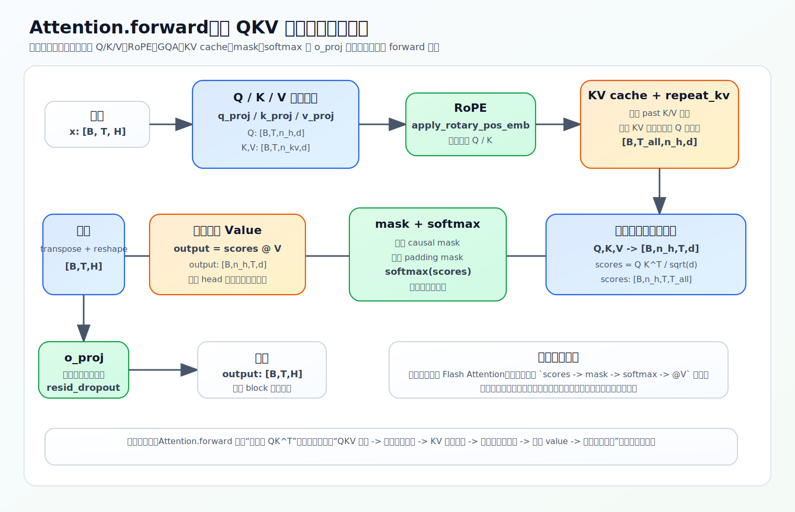

# Attention 主链路与张量形状

Attention 是 block 里最核心的子层，负责 token 之间的信息交互。这一节把 `Attention.forward`（`model/model_minimind.py` L259–316）从头走到尾，重点盯**张量形状**怎么变——看懂形状，就看懂了多头注意力在做什么。

RoPE 和 GQA 各有专章（[03-rope](03-rope.md)、[04-gqa](04-gqa.md)），这里只标出它们出现的位置。

全程用一组默认配置当例子：`hidden_size=512`、`num_attention_heads=8`、`num_key_value_heads=2`，于是 `head_dim = 512/8 = 64`。

## 进去和出来，形状不变

Attention 的输入 `x` 和输出都是 `[batch, seq_len, hidden_size]`，即 `[B, T, 512]`。中间为了做多头并行临时拆出更多维度，最后再拼回去。记住这个「进出同形」，中间的变形就不会乱。

另一个输入是 `position_embeddings`，即预计算好的 `(cos, sin)`，用来给 Q、K 注入 RoPE。

## 九步走完一次 attention

**1. 投影出 Q、K、V**（L267）

```python
xq, xk, xv = self.q_proj(x), self.k_proj(x), self.v_proj(x)
```

同一个 `x` 过三个独立线性层。注意 Q 和 K/V 的输出维度不同（L248–250）：`q_proj` 输出 `8×64=512`，`k_proj`/`v_proj` 只输出 `2×64=128`——因为 KV 头数更少（GQA）。直觉上 Q 是「拿着问题去匹配」，K 是「可被匹配的索引」，V 是「真正被汇聚的内容」。

**2. reshape 成多头**（L269–271）

```python
xq = xq.view(bsz, seq_len, self.n_local_heads,    self.head_dim)  # [B, T, 8, 64]
xk = xk.view(bsz, seq_len, self.n_local_kv_heads, self.head_dim)  # [B, T, 2, 64]
xv = xv.view(bsz, seq_len, self.n_local_kv_heads, self.head_dim)  # [B, T, 2, 64]
```

把那一个大向量拆成多个 head，每个 head 在自己的 64 维子空间里独立做注意力。Q 是 8 个头，K/V 是 2 个头。

**3. 给 Q、K 注入 RoPE**（L274–275）

```python
cos, sin = position_embeddings
xq, xk = apply_rotary_pos_emb(xq, xk, cos, sin)
```

位置信息加在 **Q、K 上而不是 V 上**，因为位置要参与 `QK^T` 的匹配打分，才能影响「关注谁」。细节见 [03-rope](03-rope.md)。

**4. 拼接 KV cache**（L278–281）

推理时把历史 K/V 和当前 K/V 沿序列维拼接，避免每生成一个 token 都重算整段历史。训练时 `past_key_value` 为 `None`，可暂时略过，细节见 [04-inference/01-kv-cache-and-generate](../04-inference/01-kv-cache-and-generate.md)。

**5. repeat_kv + 转置**（L285–289）

```python
xq, xk, xv = (
    xq.transpose(1, 2),                      # [B, 8, T, 64]
    repeat_kv(xk, self.n_rep).transpose(1, 2),  # 2 头 → 复制到 8 头 → [B, 8, T, 64]
    repeat_kv(xv, self.n_rep).transpose(1, 2)   # 同上
)
```

`n_rep = 8/2 = 4`，把 2 个 KV 头复制成 8 个，对齐 Q 的头数；再转置成 `[B, heads, T, head_dim]`，方便按 head 并行算 `Q@K^T`。GQA 为什么能用更少 KV 头，见 [04-gqa](04-gqa.md)。

**6. 算 attention scores**（L297）

```python
scores = (xq @ xk.transpose(-2, -1)) / math.sqrt(self.head_dim)
```

即经典公式 $\text{scores} = QK^\top / \sqrt{d_k}$。形状：`[B,8,T,64] @ [B,8,64,T] = [B,8,T,T]`。这个 `[T,T]` 矩阵就是每个位置对序列中每个位置的打分。除以 $\sqrt{d_k}$ 是为了让点积尺度不随 `head_dim` 增大而爆掉，softmax 才稳定。

**7. 加 causal mask**（L299）

```python
scores[:, :, :, -seq_len:] += torch.triu(
    torch.full((seq_len, seq_len), float("-inf")), diagonal=1)
```

上三角填 `-inf`，softmax 后这些位置权重变 0，保证每个位置只能看自己和之前的 token、看不到未来。这正是 next-token prediction 训练成立的前提：预测第 `t` 个 token 时不能偷看第 `t` 个及之后的答案。

**8. softmax 再对 V 加权求和**（L308–311）

```python
scores = F.softmax(scores.float(), dim=-1).type_as(xq)
output = scores @ xv          # [B,8,T,T] @ [B,8,T,64] = [B,8,T,64]
```

分数转成概率分布（softmax 同样先升 float 再转回，理由同 RMSNorm），再用这个分布对 V 加权求和。一句话：先算「该关注谁」，再把「关注到的内容」按权重汇总。

**9. 拼回隐藏维度**（L314–315）

```python
output = output.transpose(1, 2).reshape(bsz, seq_len, -1)   # [B, T, 512]
output = self.resid_dropout(self.o_proj(output))            # [B, T, 512]
```

多头结果拼回一个大向量，过 `o_proj` 融合各头信息，恢复成 `[B, T, hidden_size]`，回到 block 主链路。



## Flash Attention 路径

源码里还有一条更快的分支（L292–293）：

```python
if self.flash and (seq_len > 1) and (past_key_value is None) and ...:
    output = F.scaled_dot_product_attention(xq, xk, xv, ..., is_causal=True)
```

它和上面第 6–8 步**数学等价**，只是 PyTorch 2.0+ 提供的融合实现，更快更省显存（`is_causal=True` 内部处理因果掩码）。学原理时盯标准路径就够，不必被它分散。

## 练习

1. attention 进入和离开时的张量形状是什么？中间为什么要拆成多头？
2. `num_attention_heads=8`、`num_key_value_heads=2` 时，`scores` 的形状是多少？`repeat_kv` 把 K/V 从几个头扩到几个头？
3. 为什么 RoPE 加在 Q/K 上而不是 V 上？
4. causal mask 用什么方式实现？它和 next-token prediction 有什么关系？

<details>
<summary>参考答案</summary>

1. 进出都是 `[batch, seq_len, hidden_size]`；中间拆多头是为了让每个 head 在不同子空间并行关注不同关系，算完再拼回。
2. `scores` 是 `[B, 8, T, T]`（按 Q 的 8 个头）；`repeat_kv` 把 K/V 从 2 个头复制成 8 个（`n_rep=4`），对齐 Q 头数。
3. 位置要参与 `QK^T` 的匹配打分才能影响「关注谁」，所以加在 Q/K 上；V 只提供被汇总的内容，不需要位置参与打分。
4. 给分数矩阵上三角加 `-inf`，softmax 后权重为 0，使每个位置只能看自己和之前的 token；这保证预测第 t 个 token 时看不到未来答案，是因果 LM 训练的前提。
</details>
