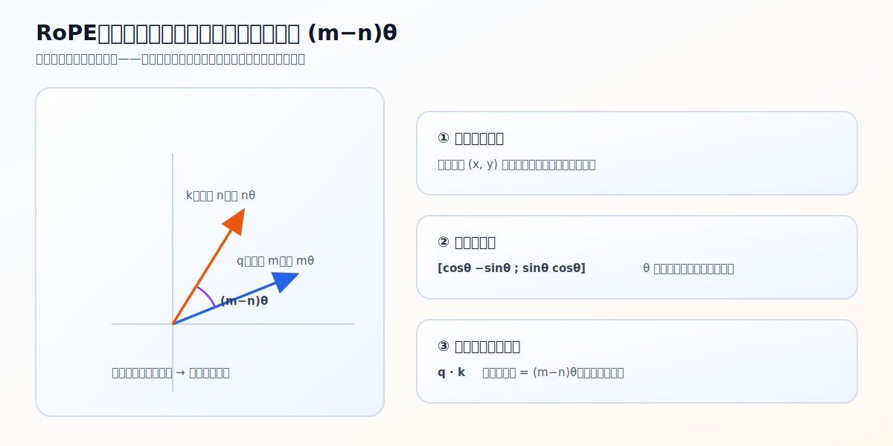

# RoPE：旋转位置编码

self-attention 本身不带顺序——打乱 token 顺序，`QK^T` 的结果不变。位置信息得额外注入。RoPE（Rotary Position Embedding）的做法不是给 embedding 加一个位置向量，而是**按位置把 Q、K 向量旋转一个角度**。这一节讲清楚它怎么旋转、为什么这样能让注意力感知到「相对位置」。

源码：`model/model_minimind.py`，`precompute_freqs_cis`、`apply_rotary_pos_emb` / `rotate_half`。

## 为什么作用在 Q/K，不在 embedding，也不在 V

注意力分数来自 $\text{scores} = QK^\top/\sqrt{d_k}$。位置信息要影响「关注谁」，就得直接进入这个匹配打分。

- 加在 **embedding** 上：位置信息要先穿过很多层线性变换，到了某一层算 `QK^T` 时未必还以直接的形式存在。
- 加在 **V** 上：V 是被加权汇总的「内容」，改它只改「取出来什么」，不改「关注谁」。
- 加在 **Q、K** 上：直接改变每一对 query-key 的点积，位置立刻参与匹配。

所以 RoPE 选择改 Q、K。

## 二维旋转：RoPE 的核心

把 Q（或 K）向量的维度两两配对，每一对 $(x, y)$ 当成平面上的二维向量。把它旋转角度 $\theta$，标准旋转公式是：

$$
(x', y') = (x\cos\theta - y\sin\theta,\; x\sin\theta + y\cos\theta)
$$

源码不显式构造旋转矩阵，而是用一个技巧凑出来。把上式拆成两项：

$$
(x, y)\cdot\cos\theta \;+\; (-y, x)\cdot\sin\theta
$$

第一项是原向量乘 $\cos\theta$，第二项是「把后半维取负挪到前面」得到的 $(-y, x)$ 乘 $\sin\theta$。后者正是 `rotate_half`：

```python
def rotate_half(x):
    # [x1..x_{d/2}, y1..y_{d/2}]  ->  [-y1..-y_{d/2}, x1..x_{d/2}]
    return torch.cat((-x[..., x.shape[-1] // 2:], x[..., : x.shape[-1] // 2]), dim=-1)
```

于是 `apply_rotary_pos_emb`就是旋转公式的逐元素版：

```python
q_embed = (q * cos) + (rotate_half(q) * sin)
k_embed = (k * cos) + (rotate_half(k) * sin)
```

`q * cos` 对应 $(x,y)\cos\theta$，`rotate_half(q) * sin` 对应 $(-y,x)\sin\theta$，相加即旋转后的向量。**`rotate_half` 不是随便换维度顺序，它在构造旋转公式里的 $(-y, x)$ 那一项。**

## precompute_freqs_cis：每个位置的旋转角提前算好

不同维度对用不同的旋转频率：

$$
\theta_i = \text{rope\_base}^{-2i/\dim},\quad i = 0,1,\dots,\dim/2-1
$$

`dim` 是单个 head 的维度（默认 `512/8 = 64`）。靠前的维度对频率高、对短距离敏感；靠后的频率低、变化平缓、表达长距离。再把位置索引和频率做外积，得到「每个位置在每个频率下的旋转角」，最后转成 cos/sin 表，形状 `[max_position_embeddings, dim]`：

```python
freqs = 1.0 / (rope_base ** (torch.arange(0, dim, 2)[: dim//2].float() / dim))  # [dim/2]
freqs = torch.outer(torch.arange(end), freqs)                                   # [end, dim/2]
freqs_cos = torch.cat([torch.cos(freqs), torch.cos(freqs)], dim=-1)             # [end, dim]
freqs_sin = torch.cat([torch.sin(freqs), torch.sin(freqs)], dim=-1)
```

这套表在 `MiniMindModel.__init__` 里算一次、注册成 buffer，前向时按当前位置 `start_pos:start_pos+seq_len` 切片取用，不必每步重算。`rope_base` 默认 `1e6`。

## 为什么能体现「相对位置」

关键在于旋转的一个性质：query 在位置 `m` 被转了 `mθ`，key 在位置 `n` 被转了 `nθ`，两者做点积时，旋转带来的影响只剩下角度差 `(m−n)θ`。也就是说，旋转后的 `q_m · k_n` 只依赖**它们相隔多远**，与它们在序列里的绝对位置无关。

这正是 RoPE 的好处：模型在算注意力时，天然感知到「这两个 token 相隔几步」，而不是「这个 token 在第几位」。相对位置通常比绝对位置更有用——同样的语法关系，在句首和句中应该一样成立。

一个反直觉但关键的点：**源码里你找不到 `m - n` 这样一行**。RoPE 不显式构造相对位置矩阵，而是「先按各自的绝对位置 `m`、`n` 旋转 Q、K，再让点积自己把 `m−n` 算出来」——`m`、`n` 分别作为旋转角进入 Q、K，`m−n` 是两者点积时自然冒出来的副产物。



## 长上下文与 YaRN（点到为止）

RoPE 把不同维度绑定到不同频率，序列远超训练长度时，高频部分变化过快、位置模式会失真。长上下文方法（如 YaRN）就从这里入手：对原始频率做缩放/插值，让旋转在更长上下文下更稳。源码 `precompute_freqs_cis` 里 `rope_scaling`（`factor` / `beta_fast` / `beta_slow` / `type: "yarn"`）就是这条路径，默认关闭。主线读到这里，知道「长上下文改的是 RoPE 频率、不是 attention 主体」即可；想看完整谱系（PI→NTK→YaRN）怎么一步步来、又如何逐行对应这段源码，见延伸篇 [08-rope-length-extrapolation](08-rope-length-extrapolation.md)。

<details>
<summary>源码细节：cat 复制半维、unsqueeze 广播到 head</summary>

正文讲清了旋转的数学，这里补两个张量形态上容易卡的点（贴真实片段）。

**1. cos/sin 为什么 `cat([·, ·])` 复制成全维**

`freqs` 只有 `dim/2` 个频率（每个频率管一对维度），但 cos/sin 表却 cat 成完整 `dim`：

```python
freqs = torch.outer(t, freqs)                                 # [end, dim/2]
freqs_cos = torch.cat([torch.cos(freqs), torch.cos(freqs)], dim=-1)   # [end, dim]，前后半相同
```

为什么复制？因为旋转是逐元素写的 `q * cos + rotate_half(q) * sin`，`q` 是完整 `dim`，cos 必须也对齐 `dim` 才能逐元素相乘。而 `rotate_half` 把后半维取负挪到前面（`[x1..x_{d/2}, y1..y_{d/2}] → [-y1.., x1..]`），所以**位置 `i` 和位置 `i+dim/2` 必须用同一个角度** `θ_i`——`cat([cos,cos])` 正好让前半和后半的 cos/sin 值相同，配对上 rotate_half 的前后半结构。这不是冗余复制，是和 rotate_half 的写法严格咬合的。

**2. `cos.unsqueeze(unsqueeze_dim=1)` 广播到 head 维**

`apply_rotary_pos_emb` 里 cos/sin 要广播到带 head 维的 q/k：

```python
q_embed = (q * cos.unsqueeze(unsqueeze_dim)) + (rotate_half(q) * sin.unsqueeze(unsqueeze_dim))
```

q 是 `[B, T, n_heads, head_dim]`（[02-attention](02-attention.md) 里 RoPE 在 transpose **之前**注入，所以是这个布局，不是 `[B, n_heads, T, head_dim]`），cos 切片出来是 `[T, head_dim]`。`unsqueeze_dim=1` 在第 1 维插一维 → `[T, 1, head_dim]`。广播按右对齐：cos 的 `[T, 1, head_dim]` 对上 q 末三维 `[T, n_heads, head_dim]`，正中间那个长度 1 的维对应 `n_heads`——于是**所有 head 共享同一套位置旋转**。位置信息只和「第几个 token」有关，与「第几个 head」无关，所以同位置的所有 head 转同样的角度。

</details>

## 常见误区

- **「RoPE 在代码里直接算了 `m−n`」**——没有。源码不显式构造 `m−n`，它是旋转后 Q/K 点积的自然产物（见「为什么能体现相对位置」一节）。
- **「RoPE 只是另一种绝对位置编码」**——不准确。它确实按绝对位置旋转 Q/K，但进入 attention 分数后，点积体现的是相对位置差。
- **「必须先掌握复数形式才能理解 RoPE」**——不必。先抓住「二维旋转 + 点积比较相对角度 + 位置差自然出现」三点，就足够读懂源码里的 RoPE 主线。

## 练习

1. RoPE 为什么作用在 Q/K 上，而不是加到 embedding 或 V 上？
2. `q * cos + rotate_half(q) * sin` 在数学上等价于什么操作？`rotate_half` 起什么作用？
3. 为什么说 RoPE 编码的是相对位置而非绝对位置？
4. 不同维度对的旋转频率一样吗？这样设计有什么用意？
5.（源码细节）`freqs` 只有 `dim/2` 个频率，为什么 cos/sin 表要 `cat` 成完整 `dim`？这和 `rotate_half` 有什么关系？

<details>
<summary>参考答案</summary>

1. 位置要影响 `QK^T` 的匹配打分（关注谁），所以加在参与打分的 Q/K 上；embedding 加位置会被后续线性层稀释，V 只是被汇总的内容、改它不影响关注谁。
2. 等价于把每一对维度当二维向量按角度 θ 旋转：`q*cos` 是 `(x,y)cosθ`，`rotate_half(q)*sin` 是 `(-y,x)sinθ`，相加即旋转公式 `(x cosθ − y sinθ, x sinθ + y cosθ)`。`rotate_half` 负责构造 `(-y, x)` 那一项。
3. 因为 query 在位置 m 转 mθ、key 在位置 n 转 nθ，点积后只剩角度差 (m−n)θ，结果只依赖两者间距，与绝对位置无关。
4. 不一样，`θ_i = rope_base^(−2i/dim)` 随维度递减：靠前维度对频率高、敏感短距离，靠后频率低、表达长距离，让模型同时建模远近不同尺度的位置关系。
5. 因为旋转是逐元素 `q * cos + rotate_half(q) * sin`，q 是完整 `dim`，cos 必须对齐 `dim`；`rotate_half` 把后半维挪到前面，要求位置 `i` 和 `i+dim/2` 用同一个角度 θ_i，`cat([cos,cos])` 让前后半 cos/sin 相同，正好配对 rotate_half 的前后半结构。
</details>
