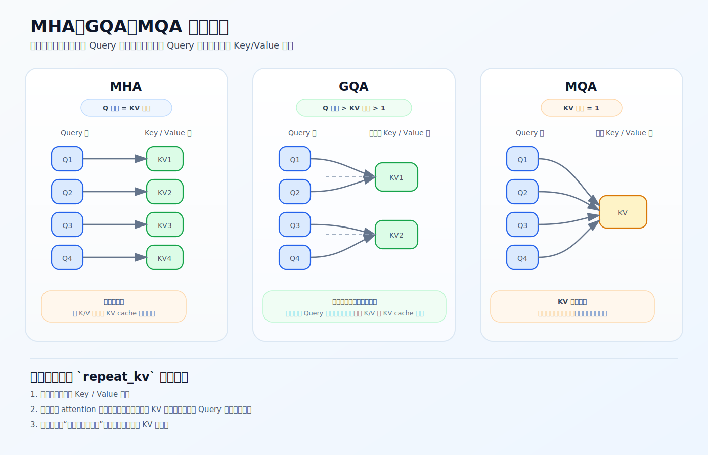

# GQA 与 repeat_kv

上一节的 attention 里，Q 是 8 个头，K/V 只有 2 个头。这就是 GQA（Grouped Query Attention）：让 query 头数多于 key/value 头数。这一节讲它为什么能这么做、`repeat_kv` 怎么把头数对齐、以及它省在哪。

源码：`model/model_minimind.py`，`Attention.__init__`（L236–251）、`repeat_kv`（L214–221）。



## 头数怎么设

`Attention.__init__`（L239–245）：

```python
self.n_local_heads = args.num_attention_heads          # Q 头数，默认 8
self.n_local_kv_heads = self.num_key_value_heads       # KV 头数，默认 2
self.n_rep = self.n_local_heads // self.n_local_kv_heads  # 每个 KV 头被几个 Q 头共享 = 4
self.head_dim = args.hidden_size // args.num_attention_heads  # 64
```

要求 `num_attention_heads % num_key_value_heads == 0`（L240）。这直接体现在三个投影层的输出维度上（L248–250）：

```python
self.q_proj = nn.Linear(hidden_size, num_attention_heads  * head_dim, bias=False)  # 8×64=512
self.k_proj = nn.Linear(hidden_size, num_key_value_heads * head_dim, bias=False)   # 2×64=128
self.v_proj = nn.Linear(hidden_size, num_key_value_heads * head_dim, bias=False)   # 2×64=128
```

Q 投影到 512 维（8 头），K/V 只投影到 128 维（2 头）。

## MHA / GQA / MQA 是一条谱

按 Q 头数和 KV 头数的关系：

| | 关系 | 特点 |
|---|---|---|
| MHA | Q heads = KV heads | 表达最强，KV 开销最大 |
| GQA | Q heads > KV heads > 1 | 折中（MiniMind 默认 8 : 2） |
| MQA | KV heads = 1 | KV 开销最省，共享最强 |

GQA 处在中间：保留较多 query 视角，但让多个 query 头共享同一组 K/V。

## repeat_kv：共享后展开，不是造新信息

K/V 只有 2 个头，但算 `QK^T` 时要和 8 个 Q 头对齐。`repeat_kv`（L214–221）负责把 2 个头复制成 8 个：

```python
def repeat_kv(x, n_rep):  # x: [B, T, num_kv_heads, head_dim]
    bs, slen, num_key_value_heads, head_dim = x.shape
    if n_rep == 1:
        return x
    return (x[:, :, :, None, :]
            .expand(bs, slen, num_key_value_heads, n_rep, head_dim)
            .reshape(bs, slen, num_key_value_heads * n_rep, head_dim))  # [B, T, 8, head_dim]
```

`n_rep=4` 时，`[B, T, 2, 64] → [B, T, 8, 64]`，每个 KV 头被复制 4 份。注意它用 `expand`（只建视图、不真正占内存）再 `reshape`，本质是**共享**——不会凭空学出新的 K/V 表示。

## 共享 K/V 为什么不退化成单头

因为参与匹配的不只有 K/V，还有 Q。即使 4 个 Q 头共享同一组 K/V：

- 这 4 个 Q 头的 `q_proj` 不同，算出的 query 不同；
- 对同一组 K/V，它们会给出不同的打分和加权。

也就是说，**共享的是「被查询的对象」（K/V），不共享的是「查询视角」（Q）**。所以多头注意力的差异性大部分还在。

## 省在哪：KV cache

GQA 最直接省的是 K/V 侧：

- `k_proj` / `v_proj` 参数和中间激活更少（128 维 vs 512 维）；
- 推理时 KV cache 只需缓存 2 个头的 K/V，而不是 8 个。

第三点最关键。长上下文推理时，KV cache 占用随序列长度线性增长，是显存大户（见 [04-inference/01-kv-cache-and-generate](../04-inference/01-kv-cache-and-generate.md)）。KV 头数减到 1/4，这部分占用也降到约 1/4。这就是为什么现代大模型几乎都用 GQA——它主要是**推理部署**的优化，不只是训练效率。

## 练习

1. `num_attention_heads=8`、`num_key_value_heads=2` 时，`q_proj` 和 `k_proj` 的输出维度各是多少？`n_rep` 是几？
2. `repeat_kv` 是在学习新的 K/V 吗？它做了什么？
3. 多个 Q 头共享同一组 K/V，为什么不会退化成单头注意力？
4. GQA 最关键省的是什么开销？为什么对长上下文推理尤其重要？

<details>
<summary>参考答案</summary>

1. `q_proj` 输出 `8×64=512`，`k_proj` 输出 `2×64=128`；`n_rep = 8/2 = 4`。
2. 不是。它用 `expand`+`reshape` 把已有的 2 个 KV 头各复制 4 份，凑到 8 个以对齐 Q 头，不产生新表示。
3. 因为每个 Q 头的 `q_proj` 不同、query 不同，对同一组共享 K/V 仍会给出不同打分；共享的是被查询对象，不是查询视角。
4. KV cache。推理时每个 token 要缓存每层 K/V，GQA 把 KV 头数减少，缓存随之成比例下降，长上下文/大模型部署时显存收益最明显。
</details>
