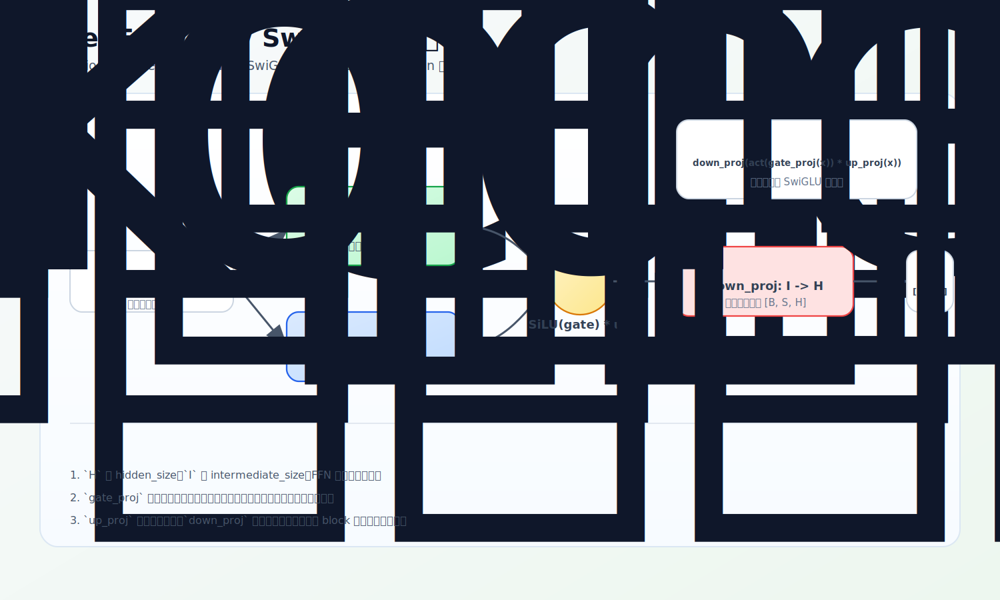

# FeedForward / SwiGLU

block 的第二个子层是前馈网络。Attention 负责 token 之间横向交换信息，FeedForward 负责对每个 token 自己的 hidden 向量做非线性加工——放大某些特征、压低另一些。这一节讲 MiniMind 用的 SwiGLU 变体，以及它和 MoE 的关系。

源码：`model/model_minimind.py`，`FeedForward`（L319–346）。

## Attention 和 FeedForward 的分工

- Attention：构造 `[seq_len, seq_len]` 的分数矩阵，直接混合不同 token 的信息（横向）。
- FeedForward：线性层只作用在最后一维 `hidden_size`，对每个 token 位置分别做同一套变换，**不混合不同 token**（纵向加工）。

一个 token 经 Attention 汇总了上下文后，FeedForward 在这个「已带上下文」的表示上继续做非线性变换，提取更复杂的特征。两者缺一不可。

## 源码：三个线性层 + 门控

```python
class FeedForward(nn.Module):
    def __init__(self, config):
        if config.intermediate_size is None:
            intermediate_size = int(config.hidden_size * 8 / 3)
            config.intermediate_size = 64 * ((intermediate_size + 64 - 1) // 64)  # 对齐 64
        self.gate_proj = nn.Linear(config.hidden_size, config.intermediate_size, bias=False)
        self.up_proj   = nn.Linear(config.hidden_size, config.intermediate_size, bias=False)
        self.down_proj = nn.Linear(config.intermediate_size, config.hidden_size, bias=False)
        self.act_fn = ACT2FN[config.hidden_act]   # 默认 SiLU

    def forward(self, x):
        return self.dropout(self.down_proj(self.act_fn(self.gate_proj(x)) * self.up_proj(x)))
```

核心是最后一行：`down_proj(SiLU(gate_proj(x)) * up_proj(x))`。

## 形状：先升维，再降维

设 `H = hidden_size`、`I = intermediate_size`：

```text
x              [B, T, H]
gate_proj(x)   [B, T, I]   ─┐
up_proj(x)     [B, T, I]   ─┤ 逐元素相乘 → [B, T, I]
down_proj(...) [B, T, H]   ←┘
```

在 `hidden_size` 里一直做线性变换表达空间有限；先升到更大的中间维度 `I` 给模型更多特征槽位，加工完再用 `down_proj` 压回 `H`——因为 block 主干必须保持 `hidden_size` 才能加残差、接下一层、最后接 `lm_head`。

## SwiGLU 的门控直觉

普通 FFN 是 `down_proj(act(up_proj(x)))`，一条分支。SwiGLU 多出一条 `gate_proj`：

```python
self.act_fn(self.gate_proj(x)) * self.up_proj(x)
```

- `up_proj(x)`：候选特征——「有哪些特征」。
- `SiLU(gate_proj(x))`：门控信号——「哪些特征该通过」。
- 两者逐元素相乘：某些维度被放大、某些被压低。

这里的 gate 是在**每个 token 的中间特征维度**上做逐元素调制，既不是选 token，也不是选专家（别和后面 MoE 的 router 混淆）。激活函数默认 SiLU（config `hidden_act='silu'`）——没有非线性，多个线性层叠起来还是线性；SiLU 让门控信号本身也是非线性的。



## intermediate_size 为什么是 8/3·H

传统 FFN 中间维度常取 `4H`。SwiGLU 有 `gate` 和 `up` 两条升维分支，若还用 `4H`，参数量翻倍。所以 LLaMA 系普遍取约 `8/3·H`，让 SwiGLU 的总参数量回到和传统 FFN 相近的范围。源码再把它向上对齐到 64 的倍数（`64 * ((I+63)//64)`），纯属让矩阵维度规整、利于硬件执行，不改数学结构。

## 和 MoE 的关系

记住一点：MoE 的每个 expert 就是一个 `FeedForward`（下一节会看到 `self.experts = nn.ModuleList([FeedForward(config) for _ in range(n_routed_experts)])`）。所以先吃透一个 FeedForward 怎么加工 token，再看 MoE 怎么为不同 token 选不同 FeedForward，会顺很多。

## 练习

1. Attention 和 FeedForward 在「是否混合不同 token」上有什么本质区别？
2. `gate_proj`、`up_proj`、`down_proj` 的输入输出维度各是什么？为什么必须有 `down_proj`？
3. `SiLU(gate_proj(x)) * up_proj(x)` 为什么叫门控？这里的 gate 在选什么？
4. SwiGLU 的 `intermediate_size` 为什么常取 `8/3·H` 而不是 `4H`？

<details>
<summary>参考答案</summary>

1. Attention 构造 `[seq_len, seq_len]` 分数矩阵，直接混合不同 token；FeedForward 的线性层只作用在最后一维 `hidden_size`，对每个 token 单独加工，不跨 token 混合。
2. `gate_proj`/`up_proj`：`H→I`；`down_proj`：`I→H`。必须有 `down_proj` 把中间维度压回 `hidden_size`，否则无法加残差、接下一层和 `lm_head`。
3. `gate_proj` 分支经 SiLU 后与 `up_proj` 的候选特征逐元素相乘，相当于对每个中间维度放大/压低，所以叫门控；这里的 gate 选的是「哪些特征维度通过」，不是选 token 或专家。
4. SwiGLU 有 gate、up 两条升维分支，用 `4H` 会使参数量过大；取 `8/3·H` 让总参数量与传统单分支 `4H` FFN 接近。
</details>
