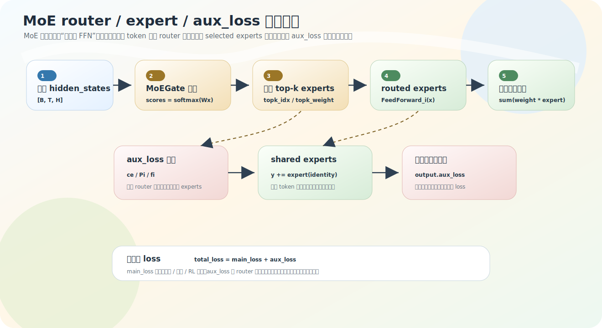

# MoE：router、expert 与 aux_loss

MoE（Mixture of Experts）把 block 后半段的单个 `FeedForward` 换成「多个 FeedForward + 一个路由器」。每个 token 只走其中少数几个专家，于是模型能堆很多参数，但单个 token 的计算量不跟着专家总数线性涨。这一节讲 MiniMind 的 MoE 实现：router 怎么选专家、aux_loss 为什么必须有、它怎么一路加到训练 loss。

源码：`model/model_minimind.py`，`MoEGate`、`MOEFeedForward`。由 `config.use_moe` 开关（dense 时这一节整段不生效）。

## 配置先看懂

```python
use_moe = False             # 是否启用 MoE
n_routed_experts = 4        # 可路由专家总数
num_experts_per_tok = 2     # 每个 token 选 top-k 个
n_shared_experts = 1        # 所有 token 都过的共享专家
aux_loss_alpha = 0.01       # 辅助损失权重
```

默认：4 个路由专家，每个 token 选 2 个；另有 1 个共享专家所有 token 都走。

## MoEGate：给每个 token 选专家

`MoEGate.forward`：

```python
hidden_states = hidden_states.view(-1, h)          # [B*T, H]
logits = F.linear(hidden_states, self.weight)      # weight: [n_experts, H] → logits [B*T, n_experts]
scores = logits.softmax(dim=-1)                    # 每个 token 对各专家的概率
topk_weight, topk_idx = torch.topk(scores, k=self.top_k, dim=-1, sorted=False)
if self.top_k > 1 and self.norm_topk_prob:
    topk_weight = topk_weight / (topk_weight.sum(dim=-1, keepdim=True) + 1e-20)  # 重新归一化
```

举例：某 token 对 4 个专家的概率是 `[0.10, 0.55, 0.05, 0.30]`，top-2 取出 `idx=[1,3]`、`weight=[0.55,0.30]`，归一化后 `[0.647, 0.353]`。含义：这个 token 送进 Expert 1 和 Expert 3，输出分别乘 0.647、0.353 再相加。

## 每个 expert 就是一个 FeedForward

```python
self.experts = nn.ModuleList([FeedForward(config) for _ in range(config.n_routed_experts)])
```

所以 MoE 不是全新计算，而是「多个 [FeedForward](05-swiglu.md) 并排放着，router 决定每个 token 走哪几个」。训练时按 expert 分发 token：

```python
x = x.repeat_interleave(num_experts_per_tok, dim=0)   # 一个 token 复制 top-k 份
for i, expert in enumerate(self.experts):
    expert_out = expert(x[flat_topk_idx == i])        # 每个 expert 只算分给它的 token
y = (y.view(*topk_weight.shape, -1) * topk_weight.unsqueeze(-1)).sum(dim=1)  # 按权重合并
```

token 复制 top-k 份，是因为它要同时送进 top-k 个专家。

## routed experts vs shared experts

```python
if config.n_shared_experts > 0:
    for expert in self.shared_experts:
        y = y + expert(identity)     # 所有 token 都额外过共享专家
```

- **routed experts**：router 选，每个 token 只走 top-k 个，不同 token 走不同专家——偏「分工」。
- **shared experts**：不经路由，所有 token 都走——偏「通用能力兜底」。

> 版本差异：MiniMind-3 **移除了 shared expert**，只保留 routed experts，更贴近 Qwen3-MoE。详见 [第 9 章](../09-minimind2-vs-3/02-architecture-diffs.md)。

## aux_loss：防止专家塌缩

MoE 有个典型风险：router 总把 token 分给少数几个专家，其余专家学不到东西，参数白堆。这叫路由不均衡 / 专家塌缩。`aux_loss` 是一个辅助损失，鼓励整体路由别长期挤向少数专家。

默认 `seq_aux=True`，核心是结合两个量：每个专家**实际被选中的频率** `ce`，和 router 给每个专家的**平均概率**。两者乘起来求和，当某专家既被频繁选中、平均概率又高时，惩罚变大，从而把路由推平。注意目标不是让每个 token 平均用所有专家，而是让**整体**负载均衡。



## aux_loss 怎么加到训练 loss

aux_loss 从 MoE 层一路冒泡到训练脚本：

1. `MoEGate.forward` 算出 `aux_loss`，`MOEFeedForward.forward` 存到 `self.aux_loss`。
2. `MiniMindModel.forward`汇总所有 MoE 层：
   ```python
   aux_loss = sum([l.mlp.aux_loss for l in self.layers if isinstance(l.mlp, MOEFeedForward)],
                  hidden_states.new_zeros(1).squeeze())
   ```
   dense 模型没有 MoE 层，结果就是 0。
3. `MiniMindForCausalLM.forward`挂到 `output.aux_loss`。
4. 训练脚本把它加到语言模型 loss：`loss = res.loss + res.aux_loss`。

所以总目标是 `语言模型 loss + MoE 辅助损失`。即使是 dense 模型 aux_loss 也是 0，训练脚本统一写 `res.loss + res.aux_loss` 不出错。

## 训练路径 vs 推理路径

`MOEFeedForward.forward` 里训练和推理走不同实现：训练路径直接按 expert 分发、便于反向传播；推理用 `moe_infer`（`@torch.no_grad()`）按专家分组批量处理 token，避免逐 token 调用专家的低效。两条路径的张量分发逻辑都比较绕，拆在下方折叠块——理解 MoE 机制本身不需要它，但想读懂源码值得一看。

<details>
<summary>源码细节：训练分发、moe_infer 的 argsort 分组</summary>

MoE 的难点全在「怎么把 token 分发给各自的专家、再收回来」。两条路径分别看（贴真实片段+函数名锚点，无行号，以片段为准）。

**1. 训练路径：repeat_interleave 复制 + 按专家 ID 掩码分发**

```python
topk_idx, topk_weight, aux_loss = self.gate(x)        # topk_idx: [B*T, top_k]
x = x.view(-1, x.shape[-1])                            # [B*T, H]
flat_topk_idx = topk_idx.view(-1)                     # [B*T*top_k]，拉平
x = x.repeat_interleave(self.config.num_experts_per_tok, dim=0)  # [B*T*top_k, H]，每 token 连复制 top_k 份
y = torch.empty_like(x)
for i, expert in enumerate(self.experts):
    y[flat_topk_idx == i] = expert(x[flat_topk_idx == i]).to(y.dtype)  # 第 i 个专家只算选了它的那些行
y = (y.view(*topk_weight.shape, -1) * topk_weight.unsqueeze(-1)).sum(dim=1)  # [B*T, top_k, H] 加权求和 → [B*T, H]
```

关键是 `repeat_interleave(top_k)` 让每个 token **连续**复制 top_k 份，和 `flat_topk_idx = topk_idx.view(-1)` 的拉平顺序对齐——第 `j` 份拷贝对应该 token 选的第 `j` 个专家。然后遍历专家，用布尔掩码 `flat_topk_idx == i` 一次性取出「所有选了专家 i 的行」批量算（不是逐 token）。最后 `y.view(*topk_weight.shape, -1)` 把 `[B*T*top_k, H]` 还原成 `[B*T, top_k, H]`，乘 `topk_weight` 加权、对 top_k 维 `sum` 合并。源码里还有一个 `else` 分支对空专家加 `0 * sum(p.sum())`——专家 i 没分到任何 token 时，制造一个值为 0 但**连到该专家参数**的项，确保它仍在计算图里、能收到（零）梯度，避免 DDP 因「参数未参与 forward」报错。

**2. 推理路径 moe_infer：argsort 把同专家 token 聚到一起**

训练那套布尔掩码每个专家都要扫一遍全部行，推理时换成排序分组更省：

```python
@torch.no_grad()
def moe_infer(self, x, flat_expert_indices, flat_expert_weights):
    expert_cache = torch.zeros_like(x)
    idxs = flat_expert_indices.argsort()                       # 按专家 ID 排序，同专家 token 聚到连续段
    tokens_per_expert = flat_expert_indices.bincount().cpu().numpy().cumsum(0)  # 每个专家的 token 数 → 累积边界
    token_idxs = idxs // self.config.num_experts_per_tok       # 排序后的位置 ÷ top_k 还原成原 token 下标
    for i, end_idx in enumerate(tokens_per_expert):
        start_idx = 0 if i == 0 else tokens_per_expert[i - 1]
        if start_idx == end_idx: continue                      # 专家 i 没分到 token
        exp_token_idx = token_idxs[start_idx:end_idx]          # 专家 i 负责的原 token 下标
        expert_out = self.experts[i](x[exp_token_idx])
        expert_out.mul_(flat_expert_weights[idxs[start_idx:end_idx]])  # 乘 router 权重
        expert_cache.scatter_add_(0, exp_token_idx.view(-1,1).repeat(1, x.shape[-1]), expert_out)  # 散回原位
```

三个关键算子：

- **`argsort`**：把 `flat_expert_indices`（每行属于哪个专家）排序，**同一专家的 token 在排序后连续相邻**，于是可以一段一段切给对应专家，每个专家只调一次。
- **`bincount().cumsum()`**：`bincount` 数每个专家分到几个 token，`cumsum` 变成累积边界——`[start_idx:end_idx]` 就是专家 i 的那一段。
- **`idxs // top_k`**：排序索引是在「`B*T*top_k` 条展开行」上的，整除 `top_k` 还原回原始 token 下标（因为每个 token 占连续 top_k 行）。
- **`scatter_add_`**：专家输出按原 token 下标**散加**回 `expert_cache`——同一个 token 选了 top_k 个专家，它们的输出散回同一行自动累加，正好完成加权求和。

训练用掩码（便于反向传播、计算图完整），推理用 argsort 分组（无梯度、追求吞吐），数学结果一致。

</details>

## 练习

1. MoE 替换的是 block 里的哪一部分？每个 routed expert 本质是什么？
2. `MoEGate` 输出的 `topk_idx` 和 `topk_weight` 分别是什么？
3. 为什么 MoE 能增加参数容量，但单 token 计算量不按专家总数线性增长？
4. 没有 `aux_loss` 会出什么问题？它在哪里被加进训练 loss？
5. routed experts 和 shared experts 的区别是什么？
6.（源码细节）`moe_infer` 为什么先对 `flat_expert_indices` 做 `argsort`？`idxs // top_k` 在还原什么？

<details>
<summary>参考答案</summary>

1. 替换 block 后半段的 FFN/MLP（不是 Attention）；每个 routed expert 就是一个 `FeedForward`。
2. `topk_idx` 是每个 token 选中的专家编号，`topk_weight` 是合并这些专家输出时的权重（可选归一化到和为 1）。
3. 模型可以有很多专家参数，但每个 token 只激活 top-k 个 routed expert，不计算全部专家。
4. router 可能长期偏向少数专家，导致负载不均、部分专家学不到东西（专家塌缩）；aux_loss 在 `MiniMindModel.forward` 汇总、挂到 `output.aux_loss`，训练脚本用 `res.loss + res.aux_loss` 加进总 loss。
5. routed experts 由 router 按 token 选 top-k，不同 token 走不同专家；shared experts 不经路由，所有 token 都走。
6. `argsort` 把同一专家的 token 在排序后聚成连续段，于是每个专家只需处理切片 `[start:end]`、调用一次（配合 `bincount().cumsum()` 算边界）；`idxs // top_k` 把「`B*T*top_k` 条展开行」上的排序索引整除 top_k，还原成原始 token 下标（每个 token 占连续 top_k 行）。
</details>
