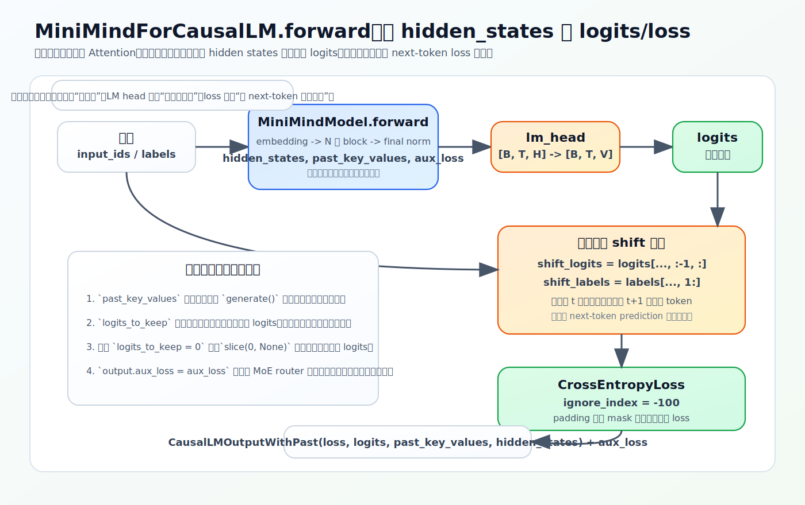

# 前向到 Loss：从 input_ids 到一个标量

训练脚本里就一句 `res = model(input_ids, labels=labels)`，背后是整条前向链：token 变向量、过多层 Transformer、投影回词表、和右移的标签做交叉熵。这一节把这条链走清楚，重点是 `shift` 和 `-100` 怎么把「预测下一个 token」落实成一个能 backward 的标量 loss。

源码：`model/model_minimind.py`，`MiniMindForCausalLM.forward`。

## 两个模型类，各管一段

- `MiniMindModel`：embedding + 多层 block + 最终 RMSNorm，输出 `hidden_states`——「提取特征」。
- `MiniMindForCausalLM`：在上面加一个 `lm_head`，把特征投影到词表、并在有 `labels` 时算 loss——「特征变词表概率 + 算损失」。

训练脚本调的是后者。整条链：

```text
input_ids → embed_tokens → MiniMindBlock×N → 最终 norm → hidden_states → lm_head → logits → shift + cross_entropy → loss
```

## 源码：hidden_states → logits → loss

```python
def forward(self, input_ids=None, ..., labels=None, ..., logits_to_keep=0, **args):
    hidden_states, past_key_values, aux_loss = self.model(input_ids=input_ids, ...)
    slice_indices = slice(-logits_to_keep, None) if isinstance(logits_to_keep, int) else logits_to_keep
    logits = self.lm_head(hidden_states[:, slice_indices, :])

    loss = None
    if labels is not None:
        shift_logits = logits[..., :-1, :].contiguous()
        shift_labels = labels[..., 1:].contiguous()
        loss = F.cross_entropy(shift_logits.view(-1, shift_logits.size(-1)),
                               shift_labels.view(-1), ignore_index=-100)

    output = CausalLMOutputWithPast(loss=loss, logits=logits, past_key_values=past_key_values, hidden_states=hidden_states)
    output.aux_loss = aux_loss
    return output
```

形状：`hidden_states` 是 `[B, T, hidden_size]`，`lm_head` 投影成 `logits` `[B, T, vocab_size]`（默认 vocab 6400）。logits 是 softmax 前的原始分数，每个位置给词表上每个 token 一个打分。（`logits_to_keep` 是推理优化：只保留末尾若干位置的 logits 省显存，训练时为 0、保留全部。）



## shift：为什么 logits 去尾、labels 去头

因果语言模型用位置 `t` 的表示预测位置 `t+1` 的 token。以序列 `[BOS, 我, 爱, 你, EOS]` 为例：

```text
用 BOS 预测 我
用 我  预测 爱
用 爱  预测 你
用 你  预测 EOS
```

所以要把 logits 和 labels 错开一位：

```python
shift_logits = logits[..., :-1, :]   # 去掉最后一个位置（它没有「下一个」要预测）
shift_labels = labels[..., 1:]       # 去掉第一个位置（它不是任何位置的预测目标）
```

错位放在**模型里**做，所以 [PretrainDataset](01-data-and-labels.md) 给的 `labels` 才可以是 `input_ids` 的直接拷贝、不用自己右移。

## cross_entropy 与 -100

```python
F.cross_entropy(shift_logits.view(-1, vocab_size), shift_labels.view(-1), ignore_index=-100)
```

把 `[B, T-1, vocab]` 摊平成 `[B*(T-1), vocab]`、标签摊成 `[B*(T-1)]`，对每个位置算交叉熵再平均，得到一个标量。`ignore_index=-100` 让标签为 `-100` 的位置（pad，或 SFT 里的非 assistant 部分）不参与——和 dataset 端写入的 `-100` 闭环。这个标量就是 backward 的起点（见 [08-training-mechanics/01-update-skeleton](../08-training-mechanics/01-update-skeleton.md)）。

## res.loss 和 res.aux_loss

模型返回 `CausalLMOutputWithPast`，并额外挂一个 `output.aux_loss`。训练脚本写 `loss = res.loss + res.aux_loss`：

- `res.loss`：语言建模主损失（cross_entropy），目标是更会预测下一个 token；
- `res.aux_loss`：MoE 路由负载均衡的辅助损失（见 [02-model/06-moe](../02-model/06-moe.md)）。

dense 模型没有 MoE 层，`aux_loss` 由 `MiniMindModel` 里 `sum([...], new_zeros(1))` 自然得到 0，所以训练脚本统一写 `res.loss + res.aux_loss` 不需要判断是否开 MoE。

<details>
<summary>源码细节：contiguous、view 摊平、logits_to_keep 切片</summary>

正文走通了形状链，这里补三个张量操作的细节（贴真实片段+函数名锚点，无行号，以片段为准）。

**1. `.contiguous()` 为什么必要**

```python
shift_logits = logits[..., :-1, :].contiguous()
shift_labels = labels[..., 1:].contiguous()
loss = F.cross_entropy(shift_logits.view(-1, shift_logits.size(-1)), shift_labels.view(-1), ignore_index=-100)
```

`logits[..., :-1, :]` 这种切片返回的是**非连续视图**（底层内存没动，只改了 stride/offset）。紧跟的 `.view(-1, vocab)` 要求张量内存连续，直接对非连续张量 `view` 会报错。`.contiguous()` 在需要时把数据复制成连续布局（已连续则原样返回），让后面的 `view` 能展平。这和 [GQA 的 repeat_kv](../02-model/04-gqa.md) 里 expand 后必须 reshape 物化是同一类问题——切片/扩张产生非连续视图，展平/合并维度前要先连续化。

**2. `view(-1, vocab)` 把 loss 拍成「逐 token 分类」**

`shift_logits` 是 `[B, T-1, vocab]`，`view(-1, vocab)` 摊成 `[B*(T-1), vocab]`；`shift_labels` 从 `[B, T-1]` 摊成 `[B*(T-1)]`。这样 `cross_entropy` 看到的就是 `B*(T-1)` 个独立的「在 vocab 类里选一个」的分类问题，每个位置算一次、对非 `-100` 位置求平均。语言模型训练本质就是「每个位置做一次词表大小的分类」，view 把 batch 和序列两维拍平成一长串分类样本。

**3. `logits_to_keep` 的切片**

```python
slice_indices = slice(-logits_to_keep, None) if isinstance(logits_to_keep, int) else logits_to_keep
logits = self.lm_head(hidden_states[:, slice_indices, :])
```

训练时 `logits_to_keep=0`，`slice(-0, None) == slice(0, None)` 即取全部位置（`-0==0`），算整段 loss。推理生成时传一个正数 `n`，`slice(-n, None)` 只取末尾 n 个位置过 `lm_head`——生成下一个 token 只需要最后一个位置的 logits，没必要对整段历史都投影到 6400 维词表，省显存和算力（[04-inference/01](../04-inference/01-kv-cache-and-generate.md) 的增量推理用到）。

</details>

## 练习

1. `MiniMindModel` 和 `MiniMindForCausalLM` 各输出什么？为什么 `hidden_states` 不能直接算交叉熵？
2. `shift_logits = logits[..., :-1, :]`、`shift_labels = labels[..., 1:]` 分别去掉了哪个位置？为什么？
3. 错位为什么放在模型里、而不是 dataset 里做？这对 `PretrainDataset` 的 `labels` 有什么影响？
4. dense 模型 `res.aux_loss` 是多少？训练脚本为什么仍能统一写 `res.loss + res.aux_loss`？
5.（源码细节）`shift_logits` 后面为什么要 `.contiguous()`？`view(-1, vocab)` 把 loss 变成了什么形式？

<details>
<summary>参考答案</summary>

1. `MiniMindModel` 输出 `hidden_states` `[B,T,hidden_size]`，`MiniMindForCausalLM` 经 `lm_head` 输出 `logits` `[B,T,vocab_size]` 并算 loss。交叉熵需要词表维度的打分，`hidden_states` 只是 `hidden_size` 维中间表示，必须先过 `lm_head`。
2. `shift_logits` 去掉最后一个位置（它没有下一个 token 可预测），`shift_labels` 去掉第一个位置（它不作为任何位置的预测目标）；这样第 t 个 logits 对齐第 t+1 个 label。
3. 错位在模型里做让逻辑集中；因此 dataset 给的 `labels` 可以是 `input_ids` 的直接拷贝，不用自己右移。
4. dense 模型 `aux_loss=0`（由 `sum([...], new_zeros(1))` 得到）；所以加不加都不变，训练脚本统一写法不需判断是否开 MoE。
5. 切片 `logits[..., :-1, :]` 产生非连续视图，`view` 要求连续内存，故先 `.contiguous()` 物化；`view(-1, vocab)` 把 `[B,T-1,vocab]` 摊成 `[B*(T-1), vocab]`，即 `B*(T-1)` 个独立的词表分类问题。
</details>
