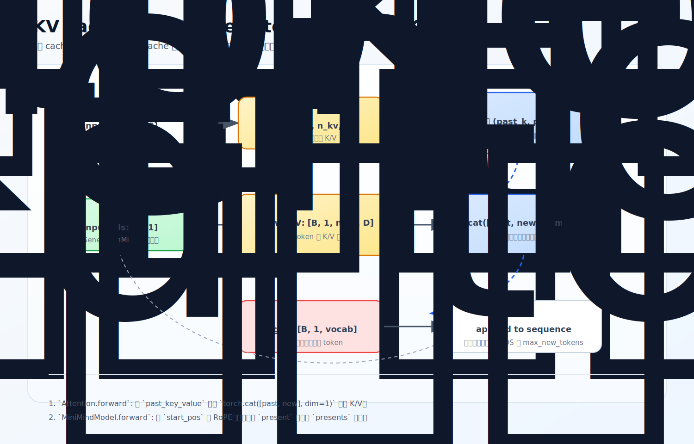

# KV cache 与 generate：自回归推理为什么不重算历史

训练时一次 forward 输入整段序列，一次算出所有位置的 logits。生成时不一样：自回归是「预测一个 token → 拼回序列 → 再预测下一个」，每次只多一个 token。如果每步都把从 prompt 到当前的整段前缀重新过一遍模型，历史 token 的 K/V 会被反复重算。KV cache 就是把算过的历史 K/V 存下来复用。

源码：`model/model_minimind.py`，`Attention.forward`、`MiniMindModel.forward`。

## 缓存 K/V，不缓存 Q

单步生成第 `t` 个 token，要算的是「这个新 token 关注哪些历史 token」：

```text
scores_t = Q_t @ [K_1, ..., K_t]^T
output_t = softmax(scores_t) @ [V_1, ..., V_t]
```

角色分清：`Q` 是当前 token 发出的查询，`K` 是每个历史 token 的可匹配索引，`V` 是可汇总内容。历史 token 的 K/V 会被后续每个新 token 反复查询，**值得缓存**；历史 token 的 Q 只在它自己作为 query 算输出时有用，而那个输出早算完了，所以**不缓存 Q**。注意当前步仍然计算新 token 的 Q/K/V——只是新 K/V 要拼进 cache 留给后续，新 Q 用完即弃。

也不是缓存 hidden states 或 logits，缓存的就是每层 Attention 的历史 `(K, V)`。

## 源码：沿 seq 维拼接

```python
if past_key_value is not None:
    xk = torch.cat([past_key_value[0], xk], dim=1)   # 历史 K 接在前
    xv = torch.cat([past_key_value[1], xv], dim=1)   # 历史 V 接在前
past_kv = (xk, xv) if use_cache else None
```

`dim=1` 是序列维（`xk` 形状 `[batch, seq_len, n_kv_heads, head_dim]`），所以拼的是时间长度。拼完 `xk/xv` 覆盖「历史 + 当前」，新 token 的 Q 就能对完整历史打分。

两个易混的名字：

- `past_key_value`：**单层** Attention 的 `(past_k, past_v)`。
- `past_key_values`：**所有层** 的 cache 列表。

返回时同理：单层返回 `present`，`MiniMindModel` 收集成 `presents`，下一轮作为新的 `past_key_values` 传回来。



## start_pos：cache 和 RoPE 必须配合

KV cache 不只是把 K/V 拼起来，还得让新 token 的 RoPE 位置接在历史后面（`MiniMindModel.forward`）：

```python
start_pos = past_key_values[0][0].shape[1] if past_key_values[0] is not None else 0
...
position_embeddings = (self.freqs_cos[start_pos:start_pos + seq_length],
                       self.freqs_sin[start_pos:start_pos + seq_length])
```

RoPE 按 token 的绝对位置旋转（见 [02-model/03-rope](../02-model/03-rope.md)）。cache 里已有 100 个 token、新输入 1 个时，这个新 token 必须用第 100 个位置的 cos/sin，而不是第 0 个——否则它和历史 K 的相对位置差就错了。`start_pos` 用历史 cache 长度确定当前位置。

<details>
<summary>源码细节：缓存的是「已旋转」的 K、start_pos 取哪一维</summary>

两个时序/形状上的点（贴真实片段）。

**1. cat 在 RoPE 之后——缓存的 K 是已经旋转过的**

`Attention.forward` 里顺序是先 `apply_rotary_pos_emb`、再拼 cache：

```python
xq, xk = apply_rotary_pos_emb(xq, xk, cos, sin)   # 先注入 RoPE
if past_key_value is not None:
    xk = torch.cat([past_key_value[0], xk], dim=1)  # 再拼历史
```

所以存进 cache 的 `xk` 是**已经带位置旋转的** K。下一轮取出历史 K 直接用、不需要重新旋转——历史 token 的绝对位置不变，它的旋转角度也就固定了，一次转好永久复用。这也是为什么 `start_pos` 只用来给**当前新 token** 切对位置的 cos/sin（历史那些早在各自当轮转好了）。如果把 cat 写在 RoPE 之前，每轮都要对全部历史重转，cache 就失去意义了。

**2. `start_pos` 为什么取 `shape[1]`**

```python
start_pos = past_key_values[0][0].shape[1] if past_key_values[0] is not None else 0
```

`past_key_values[0][0]` 是第 0 层的历史 K，形状 `[batch, 已缓存长度, n_kv_heads, head_dim]`，`.shape[1]` 正是序列维=已经缓存了多少个 token。各层缓存长度相同，取第 0 层即可。首轮没有 cache（`None`）时 `start_pos=0`，从头开始。

</details>

## generate 来自 GenerationMixin

`eval_llm.py` 里 `model.generate(...)` 但 `model_minimind.py` 没有手写 `generate`。因为：

```python
class MiniMindForCausalLM(PreTrainedModel, GenerationMixin):
```

`generate` 的外层循环来自 HuggingFace `GenerationMixin`：它反复调用模型 `forward`、对最后位置的 logits 采样（`do_sample` / `top_p` / `temperature`）、维护 cache、拼下一个 token。MiniMind 只需提供 `forward` 接收/返回 `past_key_values`、`use_cache`，并用 `CausalLMOutputWithPast` 封装输出。`logits_to_keep`（[02-forward-to-loss](../03-pretrain/02-forward-to-loss.md) 提过）在生成时只算最后位置的 logits，省输出层开销。

这套 `generate` 不只服务推理。[第 7 章](../07-ppo-grpo/01-rl-overview.md) 的在线 RL（PPO/GRPO/SPO）训练时同样靠它：用当前 policy 对 prompt 采样出回答，再交给 reward 打分。RL 的「在线生成」不是新机制，就是这里的自回归 + KV cache——推理章是它的前置。

## 代价：cache 随长度增长

KV cache 省了重复计算，但每层都要存 `K/V: [batch, total_seq_len, n_kv_heads, head_dim]`，生成越长 cache 越大，是长上下文推理的显存大户。这正好接上 [GQA](../02-model/04-gqa.md)：`n_kv_heads` 越少，KV cache 越小——所以 GQA 不只是训练结构优化，更是推理显存优化。

## 练习

1. 自回归生成没有 KV cache 时，为什么浪费大量重复计算？cache 存的是什么？
2. 为什么缓存历史 K/V 而不缓存历史 Q？当前步还算 Q 吗？
3. `start_pos` 由什么决定？它和 RoPE 有什么关系？错了会怎样？
4. `model.generate` 的循环是谁实现的？MiniMind 提供哪些接口接入？
5. KV cache 和 GQA 有什么联系？
6.（源码细节）cache 拼接发生在 RoPE 之前还是之后？这对「历史 K 要不要重新旋转」有什么影响？

<details>
<summary>参考答案</summary>

1. 每步生成都要关注完整历史前缀，没 cache 时历史 token 的 K/V 每步都被重新投影计算；cache 存的是每层 Attention 的历史 `(K, V)`。
2. 历史 K/V 会被后续每个新 token 反复查询，值得缓存；历史 Q 只服务于历史 token 自己已算完的输出，后续不再需要。当前步仍计算新 token 的 Q/K/V，只是新 Q 用完即弃。
3. 由历史 cache 长度决定（`past_key_values[0][0].shape[1]`）；RoPE 按绝对位置旋转，新 token 必须用「历史长度」处的位置，否则与历史 K 的相对位置差出错。
4. 来自 HuggingFace `GenerationMixin`；MiniMind 提供 `forward`（收发 `past_key_values`/`use_cache`）和 `CausalLMOutputWithPast`。
5. 每层 KV cache 大小正比于 `n_kv_heads`；GQA 减少 KV 头数，直接减小 cache 显存，对长上下文推理收益明显。
6. 在 RoPE 之后。所以缓存的是已旋转的 K，历史 token 位置固定、旋转角固定，下轮取出直接用、不重转；`start_pos` 只给当前新 token 切对位置的 cos/sin。
</details>
