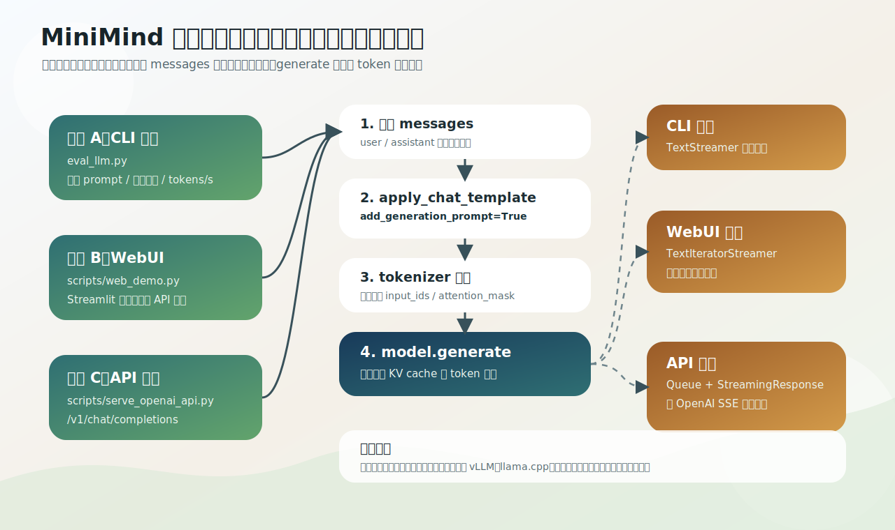

# 推理入口：eval_llm、WebUI、OpenAI API

训练出权重后怎么用它？MiniMind 给了三个入口：命令行 `eval_llm.py`、Streamlit 网页 `scripts/web_demo.py`、OpenAI 兼容服务 `scripts/serve_openai_api.py`。它们看着是三个脚本，核心链路其实一模一样——区别只是外面包了 CLI、网页还是 HTTP。

共享主线：

```text
messages → apply_chat_template(add_generation_prompt=True) → tokenizer → model.generate(...) → streamer / decode → 用户看到回答
```



## 三个入口

| 入口 | 文件 | 用途 | 输出 |
|---|---|---|---|
| CLI | `eval_llm.py` | 实验、固定 prompt、手动测试、看速度 | 终端打印 |
| WebUI | `scripts/web_demo.py` | 浏览器聊天体验、多轮对话 | 页面流式刷新 |
| API | `scripts/serve_openai_api.py` | OpenAI 兼容 HTTP 服务 | JSON / SSE 流式 |

做实验优先用 `eval_llm.py`：最短、离模型加载和 `generate` 最近、不需要先懂 Web/HTTP。

## 共享核心：add_generation_prompt 是关键

对齐后的聊天模型，推理时不是把用户原句直接塞进去，而是先组织成消息列表、过 chat template（`eval_llm.py` L73–76）：

```python
templates = {"conversation": conversation, "tokenize": False, "add_generation_prompt": True}
inputs = tokenizer.apply_chat_template(**templates) if args.weight != 'pretrain' else (tokenizer.bos_token + prompt)
```

`add_generation_prompt=True` 在末尾补上 `<|im_start|>assistant\n`，等于告诉模型「用户问完了，该你 assistant 回答了」。没有这个起始提示，模型可能继续补用户文本而不是开始回答。这和 SFT 的 assistant-only 监督是一对的（[05-sft](../05-sft/01-assistant-only-supervision.md)）：训练时模型学的就是「看到 assistant 起始后续写回复」，推理时要给同样的格式暗示。

注意 `pretrain` 权重例外：它不是聊天模型，直接用 `bos_token + prompt` 续写，不套 chat template。

生成统一走 `model.generate`（L80–85，`do_sample` / `top_p` / `temperature`），配 `TextStreamer` 边生成边打印。

## 三个入口怎么各自包装

- **eval_llm.py（CLI）**：`init_model` 按 `--load_from` 选原生 `.pth` 或 transformers 目录（[03-weight-formats](03-weight-formats.md)），内置 8 条 prompt 自动测试或手动输入，`TextStreamer` 流式打印，可显示 `tokens/s`。
- **web_demo.py（Streamlit，329 行）**：用 `st.session_state.messages` 存多轮对话、`st.chat_input` 收输入，流式靠 `TextIteratorStreamer` + `Thread(target=model.generate)`（生成在子线程、主线程取流刷新页面），另有重生成/删除按钮。模型核心仍是 `model.generate`。
- **serve_openai_api.py（FastAPI，178 行）**：暴露 `POST /v1/chat/completions`，请求体用 pydantic `ChatRequest`，流式用自定义 `CustomStreamer`（把生成文本推进 `Queue`）+ `Thread` 产出 SSE。接口模仿 OpenAI，所以 FastGPT、OpenWebUI、Dify 等能像调 OpenAI 一样调它。

三者的差异全在「怎么收输入、怎么吐输出」，模型推理那一步没有任何新机制。

## 练习

1. 三个推理入口共享的核心链路是什么？它们的区别在哪？
2. `add_generation_prompt=True` 起什么作用？为什么 `pretrain` 权重不套 chat template？
3. `web_demo.py` 和 `serve_openai_api.py` 用什么方式实现「边生成边输出」？

<details>
<summary>参考答案</summary>

1. 共享 `messages → apply_chat_template → tokenizer → model.generate → streamer/decode`；区别只在外层包装是 CLI、Streamlit 网页还是 FastAPI HTTP 服务。
2. 它在末尾补 `<|im_start|>assistant\n`，提示模型开始生成 assistant 回复，与 SFT 的 assistant-only 监督对应；`pretrain` 不是聊天模型，直接 `bos+prompt` 续写。
3. 都用子线程跑 `model.generate` + streamer：web_demo 用 `TextIteratorStreamer`，serve_openai_api 用 `CustomStreamer` 把文本推进 `Queue` 再吐 SSE。
</details>
