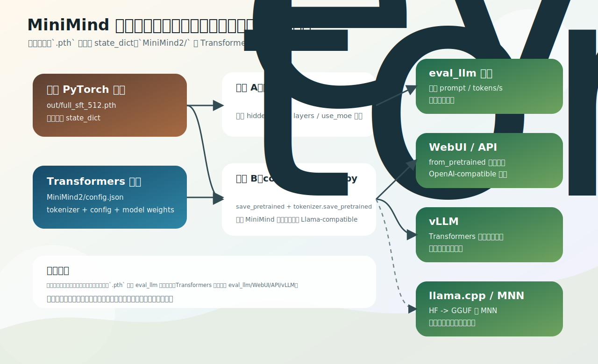

# 权重格式与转换：.pth、Transformers 目录、GGUF

「模型明明下载了，脚本却加载失败」——多数时候不是权重坏了，是**格式和入口没对上**。这一节理清 MiniMind 会遇到的几种权重格式，以及 `scripts/convert_model.py` 怎么在它们之间转换。

源码：`scripts/convert_model.py`。



## 几种格式

| 名称 | 形态 | 本质 | 用途 |
|---|---|---|---|
| 原生 PyTorch 权重 | `out/full_sft_512.pth` | `state_dict` 参数字典 | 原生训练、`eval_llm.py --load_from model` |
| Transformers 目录 | `MiniMind2/` | config + tokenizer + 权重 | `from_pretrained`、WebUI、API、vLLM |
| Llama 兼容目录 | `MiniMind2-Small/` | 用 `LlamaForCausalLM` 结构保存 | 接第三方生态更顺 |
| GGUF | `*.gguf` | llama.cpp 的格式 | llama.cpp / Ollama 端侧推理 |
| MNN 目录 | `MiniMind2-MNN/` | MNN runtime 格式 | Mac / 手机端侧 |

重点是前两类，GGUF / MNN 知道存在即可。

## .pth：只有参数

`.pth` 存的是 PyTorch `state_dict`，即「参数名 → 参数 tensor」，**不含** tokenizer、chat template、`config.json`、目录结构。所以 [eval_llm.py](02-eval-and-service.md) 的原生路线要先手动建结构、再灌参数：

```python
model = MiniMindForCausalLM(MiniMindConfig(hidden_size=args.hidden_size, num_hidden_layers=args.num_hidden_layers, use_moe=bool(args.use_moe)))
model.load_state_dict(torch.load(ckp, map_location=args.device), strict=True)
```

结构由当前代码的 `MiniMindConfig` 现搭，`.pth` 只提供参数。于是 `.pth` 路线最怕**参数和结构对不上**：512 权重却传 `--hidden_size 768`、dense 权重却加 `--use_moe 1`、MoE 权重忘了 `_moe` 后缀、层数不符——都会让 `load_state_dict(strict=True)` 报 missing/unexpected key。这就是运行原生权重时必须把 `--hidden_size / --num_hidden_layers / --use_moe` 和训练时对齐的原因。

## Transformers 目录：自带一切

Transformers 目录把结构、tokenizer、权重放一起：

```text
MiniMind2/
├── config.json            # 结构超参（hidden_size/层数/是否 MoE…）
├── tokenizer.json / tokenizer_config.json
├── model.safetensors
└── model_minimind.py      # 自定义模型代码（trust_remote_code）
```

于是脚本一句话加载，不用手动指定任何结构参数：

```python
AutoModelForCausalLM.from_pretrained("./MiniMind2", trust_remote_code=True)
```

这就是 `eval_llm.py --load_from ./MiniMind2`、WebUI、API、vLLM 都偏好 Transformers 目录的原因——结构信息写在目录里，不靠用户命令行传对。

## convert_model.py：.pth ↔ Transformers 目录

训练产出的是 `.pth`，要用 WebUI / API / vLLM / 第三方生态就得转成 Transformers 目录。`convert_model.py` 三个函数：

- `convert_torch2transformers_minimind`：转成**MiniMind 自定义结构**目录。先 `register_for_auto_class()` 告诉 transformers 怎么找到自定义模型，再 `save_pretrained`。**MoE 模型必须用这个**（保留 MiniMind 自己的 MoE 实现）。
- `convert_torch2transformers_llama`：转成**Llama 兼容结构**（`LlamaForCausalLM`）。MiniMind 的结构本就对齐 Llama 系，所以能映射过去，接 vLLM、llama.cpp 等第三方生态更顺。脚本 `__main__` 默认就跑这个，把 `full_sft_512.pth` 转成 `../MiniMind2-Small`。
- `convert_transformers2torch`：反向，把 Transformers 目录存回 `.pth`（half 精度）。

GGUF（llama.cpp/Ollama）和 MNN（端侧）是再下一层的导出，本书点到为止；知道它们是从 Transformers 目录进一步转出的端侧/推理格式即可。

## 练习

1. `.pth` 和 Transformers 目录在「包含什么」上有何区别？为什么 `eval_llm.py` 的原生路线要先手动建模型结构？
2. 用 `.pth` 跑推理时，为什么必须把 `--hidden_size / --use_moe` 和训练时对齐？对不上会报什么错？
3. `convert_model.py` 里转 MoE 模型该用哪个函数？为什么默认对外发布用 Llama 兼容结构？

<details>
<summary>参考答案</summary>

1. `.pth` 只有 `state_dict`（参数），不含 tokenizer/config/结构；Transformers 目录三者齐全。原生路线没有结构信息，必须用当前代码的 `MiniMindConfig`/`MiniMindForCausalLM` 现搭结构，再灌入 `.pth` 参数。
2. `.pth` 只提供参数，结构由命令行参数现搭；对不上时 `load_state_dict(strict=True)` 会报 missing/unexpected key（如 512 权重传 768、层数不符、MoE 开关错）。
3. MoE 用 `convert_torch2transformers_minimind`（保留自定义 MoE 实现）；Llama 兼容结构（`convert_torch2transformers_llama`）更容易接 vLLM、llama.cpp 等第三方生态，所以默认对外用它。
</details>
