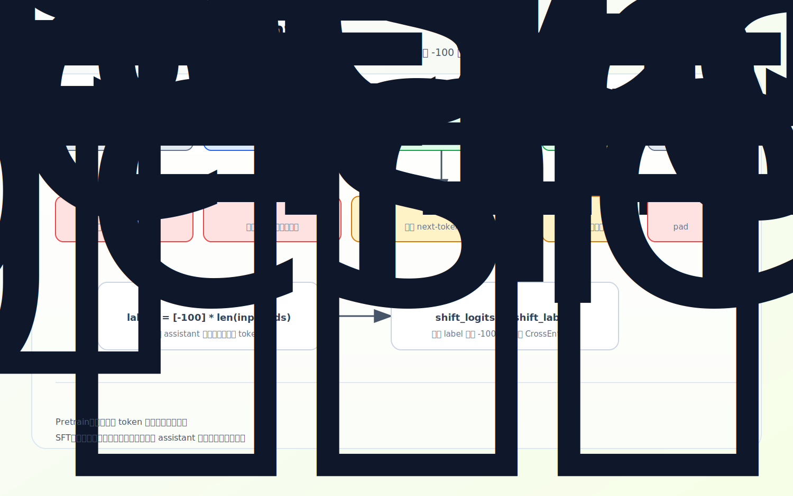
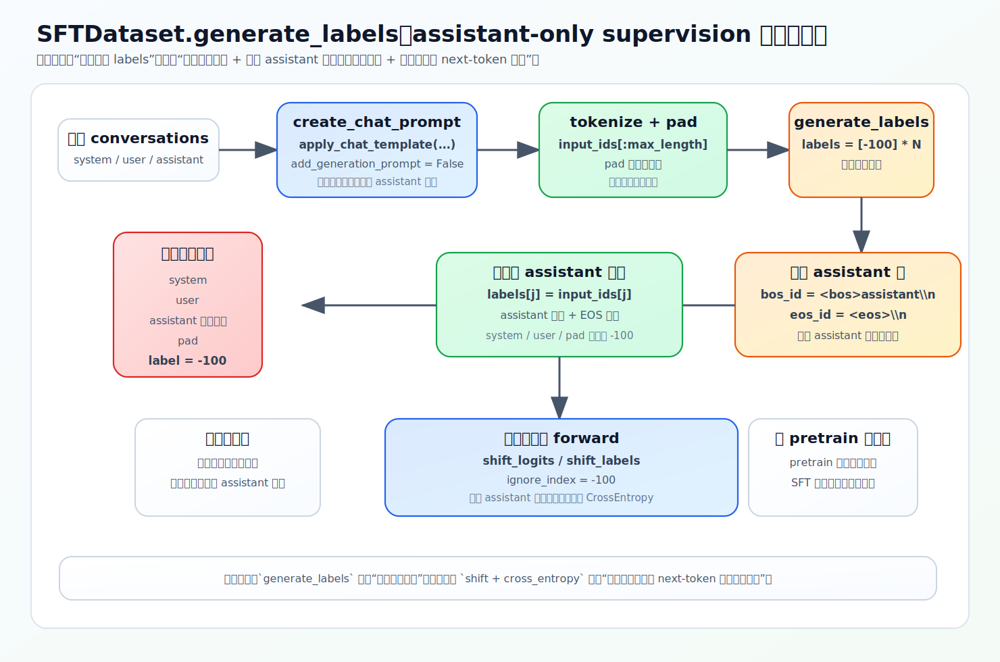

# SFT：为什么只监督 assistant 回复

预训练让模型学会预测任意文本的下一个 token；SFT（监督微调）让模型学会**在给定 system/user 上下文后，像 assistant 那样回答**。两者训练循环几乎一样，区别全在标签：SFT 只监督 assistant 回复，其余位置一律 `-100`。

源码：`dataset/lm_dataset.py`，`SFTDataset`、`generate_labels`。

## 为什么不能像 pretrain 那样复制全部 labels

预训练 `labels = input_ids.clone()`，监督每个有效 token。但 SFT 的输入是一整段对话：

```text
system: 你是一个有帮助的助手
user:   请解释一下 KV cache
assistant: KV cache 是一种推理加速机制……
```

如果整段都当监督目标，模型会被训练去「预测 system 设定」「预测 user 问题」——这不是我们要的。我们要的是「看到 system/user 之后，怎么生成 assistant 回复」。所以 system/user 仍然**作为上下文输入**模型（模型得看到它们才知道答什么），但**不承担 loss**。



## SFTDataset.__getitem__

```python
conversations = pre_processing_chat(sample['conversations'])  # 20% 概率随机加 system
prompt = self.create_chat_prompt(conversations)              # apply_chat_template, add_generation_prompt=False
prompt = post_processing_chat(prompt)
input_ids = self.tokenizer(prompt).input_ids[:self.max_length]
input_ids += [pad_token_id] * (self.max_length - len(input_ids))
labels = self.generate_labels(input_ids)
```

`create_chat_prompt` 用 chat template 把对话拼成 `<|im_start|>role\n...<|im_end|>\n` 的字符串（[01-tokenizer](../01-foundations/01-tokenizer.md)）。这里 `add_generation_prompt=False`——训练数据里**已经有** assistant 回复，不需要再补一个等待生成的 assistant 开头（推理时才需要 `True`，见下）。核心是 `generate_labels`。

## generate_labels：定位并只保留 assistant 段

```python
def generate_labels(self, input_ids):
    labels = [-100] * len(input_ids)          # 默认全部不监督
    i = 0
    while i < len(input_ids):
        if input_ids[i:i + len(self.bos_id)] == self.bos_id:   # 找到 assistant 段开头
            start = i + len(self.bos_id)
            end = start
            while end < len(input_ids):
                if input_ids[end:end + len(self.eos_id)] == self.eos_id:  # 找到段结束
                    break
                end += 1
            for j in range(start, min(end + len(self.eos_id), self.max_length)):
                labels[j] = input_ids[j]       # assistant 内容 + 结束符写回真实 label
            i = end + len(self.eos_id) if end < len(input_ids) else len(input_ids)
        else:
            i += 1
    return labels
```

两个标记（`SFTDataset.__init__`）：

```python
self.bos_id = tokenizer(f'{tokenizer.bos_token}assistant\n', add_special_tokens=False).input_ids  # <|im_start|>assistant\n
self.eos_id = tokenizer(f'{tokenizer.eos_token}\n', add_special_tokens=False).input_ids            # <|im_end|>\n
```

注意 `bos_id` 不是普通的句首 BOS，而是 **assistant 段起点**标记。逻辑：从左扫描，遇到 assistant 起点就把它到段结束（含 `<|im_end|>\n`）的 label 写回真实 token id，其余保持 `-100`。多轮对话里多个 assistant 段都会被这样命中（`while` 循环继续）。

默认全 `-100`、只对确认的 assistant 段「解除屏蔽」——这是更安全的写法：**除非确认是 assistant 回复，否则不监督**。



## 为什么 assistant 的结束符也要监督

注意循环上界是 `end + len(self.eos_id)`，assistant 回复后的 `<|im_end|>\n` 也进 label。因为模型不仅要学会答什么，还要学会**何时停**。不监督 EOS，模型就难学到在合适位置收尾（这也呼应第 [10 章](../10-experiments/03-eval-conclusions-sft-vs-rl.md) 观察到的：SFT 后模型会干净地 EOS 收束，而 pretrain 模型会续写不停）。

<details>
<summary>源码细节：子串匹配、list 而非 tensor、边界保护</summary>

`generate_labels` 的扫描看着像单 token 比对，其实是多 token 子串匹配（贴真实片段）。

**1. `bos_id`/`eos_id` 是 token 列表，匹配是「切片 == 列表」**

```python
self.bos_id = tokenizer(f'{tokenizer.bos_token}assistant\n', add_special_tokens=False).input_ids
# 编码出来是个列表，如 [<|im_start|>, assistant, \n] 三个 token，不是单个
...
if input_ids[i:i + len(self.bos_id)] == self.bos_id:   # 切片长度 = len(bos_id)，整段比对
```

`<|im_start|>assistant\n` 经 tokenizer 编码是**好几个 token**，所以 `bos_id` 是个列表。`input_ids[i:i+len(self.bos_id)]` 取出等长切片，`== self.bos_id` 是**两个列表逐元素相等**（子序列匹配），不是单 token 比较。这就是为什么要 `i + len(self.bos_id)` 而不是 `i + 1`——一次跨过整个起点标记。`eos_id` 同理，匹配 `<|im_end|>\n` 那几个 token。

**2. 此刻 `input_ids` 还是 Python list，不是 tensor**

`generate_labels` 在 `__getitem__` 里、`torch.tensor(...)` **之前**调用，所以 `input_ids` 是 Python `list[int]`。列表切片 `==` 是 Python 原生列表比较（返回单个 bool），如果是 tensor，`==` 会变成逐元素返回布尔张量、不能直接 `if`。返回前才 `torch.tensor(input_ids)`、`torch.tensor(labels)` 转成 LongTensor。

**3. `min(end + len(self.eos_id), self.max_length)` 防越界**

```python
for j in range(start, min(end + len(self.eos_id), self.max_length)):
    labels[j] = input_ids[j]
```

如果 assistant 段在序列末尾、`end + len(eos_id)` 可能超过 `max_length`（被截断的情况），`min(..., self.max_length)` 把上界夹住，避免 `labels[j]` 索引越界。

</details>

## mask 和 shift 是两回事

容易误解：labels 已经只留 assistant 位置，是不是不用 shift 了？不是。SFT 仍是 next-token prediction，模型内部照样做 `shift_logits = logits[..., :-1, :]`、`shift_labels = labels[..., 1:]`（[03-pretrain/02-forward-to-loss](../03-pretrain/02-forward-to-loss.md)）。两者分工不同：

- **mask（`-100`）**：决定哪些目标 token 参与 loss；
- **shift**：决定「当前位置 logits」和「下一个 token label」怎么对齐。

`-100` 的闭环和 pretrain 一样（dataset 标记、`F.cross_entropy(ignore_index=-100)` 忽略），只是 SFT 屏蔽得更多：system + user + pad 全屏蔽，只留 assistant。

小例子，token 序列 `[system, user, <a_start>, A, B, C, <a_end>, pad]`，labels 为 `[-100, -100, -100, A, B, C, <a_end>, -100]`。shift 后真正学的是：看到 `<a_start>` 预测 `A`、看到 `A` 预测 `B`……看到 `C` 预测 `<a_end>`。这就是 assistant-only supervision 的 next-token 形式。

## 训练循环与 LoRA

`train_full_sft.py` 的循环和 [train_pretrain.py](../03-pretrain/03-training-loop.md) 几乎一样，只是把 `PretrainDataset` 换成 `SFTDataset`——**SFT 的差异在数据监督信号，不在 optimizer/backward/step**。`train_lora.py` 也用同一个 `SFTDataset`，标签逻辑一致，区别只在更新哪些参数（full SFT 更新全部，LoRA 冻结主干只训 adapter，见[附录](../appendix/01-advanced-pointers.md)）。

训练用 `add_generation_prompt=False`（数据含 assistant 答案），推理用 `True`（只给到 assistant 开头让模型续写）——两者配套，见 [04-inference/02-eval-and-service](../04-inference/02-eval-and-service.md)。

## 练习

1. SFT 为什么不能像 pretrain 直接把全部 `input_ids` 复制成 `labels`？哪些位置被屏蔽？
2. `generate_labels` 为什么先把所有 label 设成 `-100`？`bos_id` 在这里指什么？
3. 为什么 assistant 回复的 `<|im_end|>` 也要参与监督？
4. labels 已按 assistant mask 处理，为什么还需要 shift？mask 和 shift 各解决什么？
5.（源码细节）`input_ids[i:i+len(self.bos_id)] == self.bos_id` 为什么是切片而不是单 token 比较？此刻 `input_ids` 是 tensor 还是 list？

<details>
<summary>参考答案</summary>

1. SFT 目标是学 assistant 如何回答，不是复述 system 设定或 user 问题；system/user 作上下文但不监督，连同 pad 一起设 `-100`，只留 assistant 回复。
2. 默认不监督任何位置，只有明确命中 assistant 段才解除屏蔽，更安全；`bos_id` 是 `<|im_start|>assistant\n`，即 assistant 段起点标记，不是普通句首 BOS。
3. 模型要学会何时停止回复；把 EOS 纳入 label 才能在合适位置生成结束符（否则像 pretrain 那样续写不停）。
4. mask（`-100`）决定哪些 token 算 loss，shift 决定「当前 logits」与「下一个 token label」的 next-token 对齐；两者正交，SFT 仍是 next-token prediction 所以仍需 shift。
5. `<|im_start|>assistant\n` 编码成多个 token，`bos_id` 是 token 列表，所以取等长切片整段比对（子序列匹配），`i` 也要跨 `len(bos_id)`；此刻 `input_ids` 还是 Python `list`（`torch.tensor` 在 `__getitem__` 返回前才转），`==` 是原生列表比较返回单个 bool。
</details>
