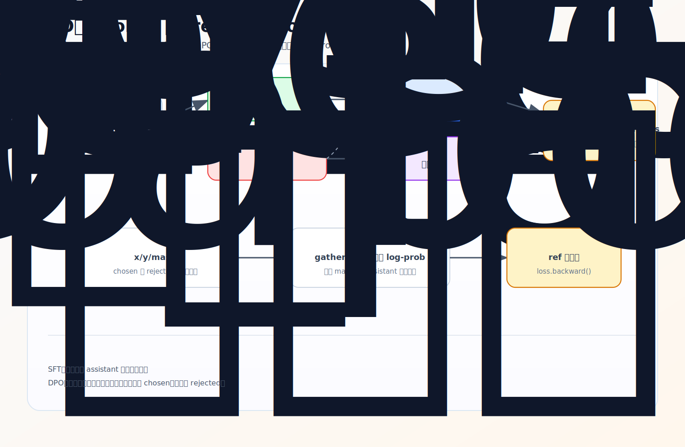

# DPO：偏好优化

SFT 给模型一个标准答案让它学；DPO（Direct Preference Optimization）给模型一对回答——chosen（更好）和 rejected（更差）——让它学会**偏好关系**：同一个问题下，chosen 应该比 rejected 更受青睐。这一节看数据怎么组织、policy 和 reference 两个模型怎么配合；具体的 loss 公式见 [02-dpo-loss-and-math](02-dpo-loss-and-math.md)。

源码：`dataset/lm_dataset.py` `DPODataset`、`trainer/train_dpo.py`。

## 从单答案到偏好对

- SFT 样本：`prompt → assistant answer`，监督信号是「这个上下文该生成这段回复」。
- DPO 样本：`同一 prompt` 配 `chosen` 和 `rejected` 两个回答，监督信号是「chosen 应比 rejected 更受偏好」。

DPO 默认从 SFT 模型继续训（`from_weight='full_sft'`），学的不再是单个标准答案，而是两个答案之间的相对好坏。

这也定下了 DPO 的边界：它更像一条**监督学习流程**——直接用成对偏好数据构造 loss，**不需要在线采样 rollout、不需要 value model、不需要 advantage**。这正是它比 PPO/GRPO/SPO（[第 7 章](../07-ppo-grpo/01-rl-overview.md) 那套在线 RL）简单的地方，也是通常先学 DPO 再进 RL 的原因。



## DPODataset：chosen/rejected 各造一份

`chosen` 和 `rejected` 都是 `[{role, content}, ...]` 的对话，共享 prompt、只是 assistant 回复不同。`__getitem__`对两者各跑一遍 chat_template + tokenize（`padding='max_length'`），再各算一个 mask，最后**在 dataset 里就错位好**：

```python
x_chosen = torch.tensor(chosen_input_ids[:-1])   # 输入
y_chosen = torch.tensor(chosen_input_ids[1:])    # 目标（已右移）
mask_chosen = torch.tensor(chosen_loss_mask[1:]) # assistant 区域 0/1
```

这是和 [SFTDataset](../05-sft/01-assistant-only-supervision.md) 的一个区别：SFT 返回完整 `input_ids/labels`、把 shift 留给模型；DPO 在 dataset 里就切好 `x=ids[:-1]`、`y=ids[1:]`。因为 DPO 要的是**每个 token 的 log-prob**（用来比较两条回答的概率），不走 `model(..., labels=...)` 的 CE 路径。

mask 仍是 assistant-only：`generate_loss_mask`和 SFT 的 `generate_labels` 几乎一样，只是用 `0/1` 标记（1=assistant 回复区域）而非 `-100`。system/user 仍作上下文输入，但不进入偏好比较。

## policy 与 reference 两个模型

`train_dpo.py` 初始化两个模型：

```python
model, tokenizer = init_model(lm_config, args.from_weight, ...)   # policy，要训练
ref_model, _ = init_model(lm_config, args.from_weight, ...)       # reference
ref_model.eval(); ref_model.requires_grad_(False)                 # 冻结
```

两者初始都来自同一份 `full_sft` 权重。**policy 会更新，reference 冻结**。为什么要冻结的 reference？DPO 要判断的是「policy 相比原模型，是否更偏向 chosen」——需要一个不动的参照系。如果参照也跟着训，就没法衡量「相对原模型变好了多少」。所以 ref 只负责给 chosen/rejected 打 log-prob，反向传播只更新 policy。

## 从 logits 取每个 token 的 log-prob

batch 里 chosen/rejected 沿 batch 维拼接（`x = cat([x_chosen, x_rejected])`，前半 chosen、后半 rejected），policy 和 ref 各前向一次，再用 `logits_to_log_probs` 取目标 token 的 log-prob：

```python
log_probs = F.log_softmax(logits, dim=2)                                  # 每个位置对全词表的 log 概率
log_probs_per_token = torch.gather(log_probs, 2, labels.unsqueeze(2)).squeeze(-1)  # 取目标 token 那一个
```

得到 `[2B, seq_len]` 的逐 token log-prob。为什么不用 SFT 那样的 CE loss？因为 SFT 要「最大化标准答案概率」，CE 合适；DPO 要「比较两条回答的概率差」，需要先拿到每个 token 的 log-prob 再聚合成序列分数。怎么聚合、怎么比、loss 长什么样——见下一节。

<details>
<summary>源码细节：chosen/rejected 拼成一个 batch、一次前向</summary>

`log_softmax + gather` 取 token log-prob 的张量机制和 [08-training-mechanics/02](../08-training-mechanics/02-logits-to-logprob.md) 是同一套，这里只补 DPO 特有的「拼 batch」技巧（贴真实片段）。

```python
x = torch.cat([x_chosen, x_rejected], dim=0)   # [B,T] + [B,T] → [2B, T]
y = torch.cat([y_chosen, y_rejected], dim=0)
mask = torch.cat([mask_chosen, mask_rejected], dim=0)
...
ref_log_probs = logits_to_log_probs(ref_model(x).logits, y)   # 一次前向出 [2B, T]
```

DPO 不是对 chosen、rejected 分别跑两次模型，而是 `cat` 成 `[2B, T]` 一个大 batch、**一次前向**算完，再在 [dpo_loss](02-dpo-loss-and-math.md) 里按 `batch_size // 2` 切回前半（chosen）后半（rejected）。这样 policy 和 ref 各只调一次 forward（而非各两次），省一半计算。约定是「前 B 条恒为 chosen、后 B 条恒为 rejected」——cat 的顺序和 dpo_loss 里 `[:bs//2]` / `[bs//2:]` 的切分严格对应，顺序写反偏好就反了。policy 和 ref 走同一套 `x/y/mask`，区别只在用哪个模型的 logits。

</details>

## 练习

1. DPO 的数据样本和 SFT 有什么本质不同？
2. `DPODataset` 为什么在 dataset 里就把 `x/y` 错位切好，而不像 SFT 留给模型 shift？
3. policy model 和 reference model 分别来自哪、谁更新谁冻结？为什么 reference 要冻结？
4. `logits_to_log_probs` 用哪两步从 logits 得到目标 token 的 log-prob？
5.（源码细节）DPO 为什么把 chosen 和 rejected `cat` 成 `[2B, T]` 一个 batch？前半后半的顺序约定有什么作用？

<details>
<summary>参考答案</summary>

1. SFT 是单个标准答案（prompt→answer）；DPO 是同一 prompt 的一对回答 chosen/rejected，学的是「chosen 比 rejected 更受偏好」的相对关系。
2. DPO 需要每个 token 的 log-prob 来比较两条回答，不走 `model(labels=...)` 的 CE 路径，所以直接在 dataset 里切好 `x=ids[:-1]`、`y=ids[1:]`。
3. 都来自同一份 `full_sft` 权重；policy 更新、reference 冻结（`requires_grad_(False)`）。冻结是为了提供一个不漂移的参照系，衡量 policy 相对原模型是否更偏向 chosen。
4. `F.log_softmax(logits, dim=2)` 得到每位置对全词表的 log 概率，再 `torch.gather` 按目标 token 取出对应那一个。
5. 把 chosen、rejected 拼成 `[2B,T]` 一次前向算完（policy 和 ref 各只调一次 forward，省一半计算），再按 `batch//2` 切回；前半恒 chosen、后半恒 rejected，cat 顺序和 dpo_loss 的 `[:bs//2]`/`[bs//2:]` 切分严格对应，写反偏好就反了。
</details>
