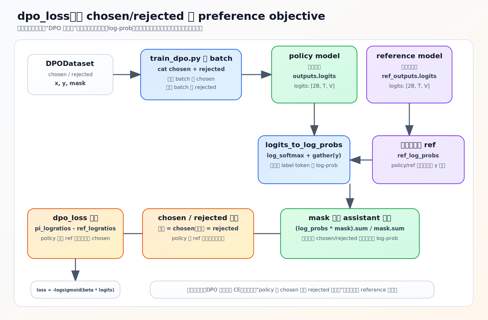

# DPO 的损失函数：为什么是 −logsigmoid(β·logits)

上一节拿到了 chosen/rejected 的逐 token log-prob。这一节看 `dpo_loss` 怎么把它们变成一个标量损失，并讲清那句最容易卡住的 `loss = -F.logsigmoid(beta * logits)` 到底在做什么。

一句话先记住：**DPO 不是在问「chosen 概率大不大」，而是在问「当前 policy 相对 reference，是否更站在 chosen 这一边」。**

源码：`trainer/train_dpo.py`，`dpo_loss`（L33–51）。

## 完整的 dpo_loss

```python
def dpo_loss(ref_log_probs, policy_log_probs, mask, beta):
    seq_lengths = mask.sum(dim=1, keepdim=True).clamp_min(1e-8)            # 防零长度除零
    ref_log_probs    = (ref_log_probs    * mask).sum(dim=1) / seq_lengths.squeeze()
    policy_log_probs = (policy_log_probs * mask).sum(dim=1) / seq_lengths.squeeze()

    batch_size = ref_log_probs.shape[0]
    chosen_ref_log_probs    = ref_log_probs[:batch_size // 2];   reject_ref_log_probs    = ref_log_probs[batch_size // 2:]
    chosen_policy_log_probs = policy_log_probs[:batch_size // 2]; reject_policy_log_probs = policy_log_probs[batch_size // 2:]

    pi_logratios  = chosen_policy_log_probs - reject_policy_log_probs
    ref_logratios = chosen_ref_log_probs   - reject_ref_log_probs
    logits = pi_logratios - ref_logratios
    loss = -F.logsigmoid(beta * logits)
    return loss.mean()
```

## 第一步：mask 平均成序列分数

```python
policy_log_probs = (policy_log_probs * mask).sum(dim=1) / seq_lengths
```

逐 token log-prob 先乘 assistant mask（只保留回复区域），求和再除以 mask 长度，得到每条回答在 assistant 区域上的**平均** log-prob。为什么平均而不是求和？因为 chosen/rejected 长度可能不同，平均能减少长度差异对分数的直接干扰。`clamp_min(1e-8)` 防止空 mask 除零成 NaN。

batch 前半是 chosen、后半是 rejected（[上一节](01-preference-optimization.md) 的 `cat([x_chosen, x_rejected])`），所以按 `batch_size // 2` 切开。

## 第二步：两层「偏好差」相减

```python
pi_logratios  = chosen_policy_log_probs - reject_policy_log_probs   # policy 的偏好差
ref_logratios = chosen_ref_log_probs   - reject_ref_log_probs       # reference 的偏好差
logits = pi_logratios - ref_logratios
```

- `pi_logratios`：当前 policy 对 chosen 相对 rejected 偏爱多少。
- `ref_logratios`：原始 reference 本来对 chosen 相对 rejected 偏爱多少。
- `logits = pi − ref`：**policy 相对 reference 的「偏好领先量」**。

读法：`logits > 0` 表示 policy 比 reference 更偏向 chosen；`= 0` 表示和 reference 差不多；`< 0` 表示还不如 reference 偏向 chosen、甚至站错边。这也是 DPO 必须保留冻结 reference 的原因——没有它就没有参照系，无法判断「相对原模型变好了多少」。

注意这里的 `logits` 不是分类模型那种类别分数，而是一个相对偏好量。

## 第三步：−logsigmoid 把「越大越好」变成可最小化的 loss

目标是让 `logits` 越大越好。`sigmoid(z)` 在 `z` 大时趋近 1、`z` 小时趋近 0，所以让 `sigmoid(beta * logits)` 趋近 1 就对应「logits 越大越好」；取 log 让目标更平滑，得到 `logsigmoid(beta * logits)`。训练要最小化 loss，而我们想最大化这个量，所以前面加负号：

```python
loss = -F.logsigmoid(beta * logits)
```

单调关系：

| logits | sigmoid(β·logits) | logsigmoid | −logsigmoid = loss |
|---|---|---|---|
| 大（policy 更偏 chosen） | →1 | →0 | →0（loss 小）|
| 负（policy 偏 rejected）| →0 | 很负 | 很大（loss 大）|

一句话：**policy 相对 ref 越偏向 chosen，loss 越小；越偏向 rejected，loss 越大。** 相比「直接判断 chosen 分数是否更大」这种硬判定，`−logsigmoid` 可导、平滑，适合做梯度优化。

`beta`（默认 0.1）是偏好差的缩放系数：越大，`logits` 的变化越强地影响 loss、更新越激进；越小越温和。它和 DPO 论文里的 KL 约束强度相关，这里先当「更新有多激进」的旋钮即可。

总 loss 仍统一加 MoE 辅助损失：`loss = dpo_loss_val + outputs.aux_loss`（dense 时 aux_loss=0，见 [02-model/06-moe](../02-model/06-moe.md)）。



## 常见误区

- **「DPO 在最大化 chosen 的概率」**——不准确。它最大化的是 chosen 相对 rejected 的偏好差，而且是**相对 reference** 看的。policy 完全可以让 chosen 概率略降，只要 rejected 降得更多，偏好差仍变大。
- **「logits 是分类分数」**——不是，它是 policy 相对 ref 的偏好领先量。
- **「必须先吃完论文推导」**——不必。先把 chosen/rejected、policy/ref、logits、−logsigmoid 这四层关系对齐就够用。

## 练习

1. `dpo_loss` 第一步为什么对 log-prob 做 mask **平均**而不是求和？`clamp_min(1e-8)` 防什么？
2. `pi_logratios`、`ref_logratios`、`logits` 三者分别表示什么？`logits > 0` 意味着什么？
3. 为什么 `logits` 大时 `-logsigmoid(beta*logits)` 会小？为什么不用「chosen 分数 > rejected 分数」的硬判定？
4. 「DPO 就是最大化 chosen 概率」错在哪？

<details>
<summary>参考答案</summary>

1. chosen/rejected 长度可能不同，平均能减少长度差异对序列分数的干扰；`clamp_min(1e-8)` 防止空 mask（长度 0）除零产生 NaN。
2. `pi_logratios` 是 policy 对 chosen 相对 rejected 的偏好差，`ref_logratios` 是 reference 的同款偏好差，`logits = pi − ref` 是 policy 相对 ref 的偏好领先量；`>0` 表示 policy 比 reference 更偏向 chosen。
3. logits 大 → `sigmoid(β·logits)`→1 → `logsigmoid`→0 → 加负号后 loss→0；硬判定不可导不平滑，无法做梯度优化，`-logsigmoid` 可导平滑。
4. DPO 最大化的是 chosen 相对 rejected、且相对 reference 的偏好差；只要 rejected 概率降得比 chosen 多，偏好差也增大，并不要求 chosen 绝对概率上升。
</details>
