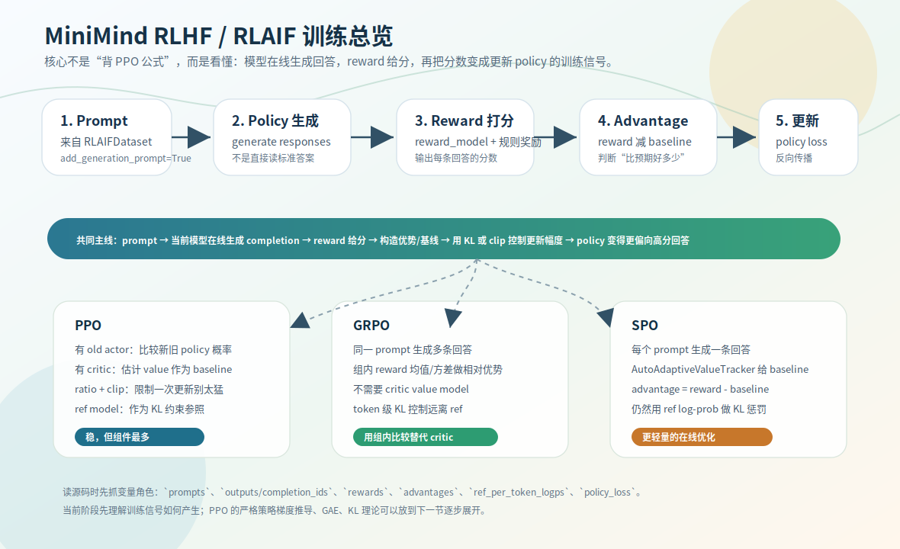

# RL 总览：从偏好数据到在线生成奖励

[DPO](../06-dpo/01-preference-optimization.md) 用现成的 chosen/rejected 偏好对离线训练。PPO / GRPO / SPO 不一样：训练时**只给 prompt，让当前 policy 自己生成回答，再用 reward 打分，把 reward 转成训练信号更新 policy**。最大的区别不是某个公式，而是训练闭环从「离线偏好监督」变成了「在线生成 + 奖励调整」。这一节建立共同骨架，三个算法的细节在后面四节。

源码：`dataset/lm_dataset.py` `RLAIFDataset`、`trainer/train_ppo.py` / `train_grpo.py` / `train_spo.py`。



## 把 RL 词汇翻译成 LLM 训练

| RL 术语 | LLM 里的对应 | 代码变量 |
|---|---|---|
| state | 当前 prompt / 上下文 | `prompts` |
| policy | 要训练的语言模型 | `actor_model` / `model` |
| action | 生成的 token | `completion_ids` |
| trajectory | 整条 response | `gen_out` / `outputs` |
| reward | 对回答的评分 | `rewards` |
| baseline | 对平均水平的估计 | `critic` / `value_tracker` / 组内均值 |
| advantage | 这条回答比预期好多少 | `advantages` |
| reference policy | 冻结参考模型 | `ref_model` |

一条 response 是一串 token action（一条轨迹），训练信号只落在 response 区域——prompt 是条件、不是被奖励的动作。这和 SFT/DPO 只监督 assistant 区域是同一个思想。

> 顺带厘清两对常混的词。**online / offline**：训练时要不要当前模型现场生成——SFT/DPO 是 offline（数据现成），PPO/GRPO/SPO 是 online（现场 `generate` 再打分）。**on-policy / off-policy**：更新用的数据是不是当前 policy 自己刚生成的——PPO/GRPO/SPO 都更接近 on-policy，而 DPO 用的是已有偏好数据，所以**不是 on-policy RL**。严格定义先不纠结，记住「DPO=离线偏好，三个 RL=在线 on-policy」即可。

## 共同骨架：loss = −log_prob × advantage

policy 给每个 token 分配概率，一条 response 的 log-prob 是各 token log-prob 之和。最小直觉：

- advantage > 0（回答比预期好）→ 提高这条 response 的 log-prob；
- advantage < 0（比预期差）→ 降低它的 log-prob。

优化器默认最小化 loss，于是骨架写成：

```text
loss = -log_prob(response) * advantage
```

PPO 的 ratio/clip、GRPO 的组内 advantage、SPO 的 tracker baseline，都是在这个骨架上加稳定性约束。

## reward、baseline、advantage 别混

- `reward`：回答拿到的原始分数（如 2.1）。
- `baseline`：预期/平均水平（如类似 prompt 正常 1.4）。
- `advantage = reward − baseline`（0.7）：比预期好多少。

为什么不直接用 reward？因为不同 prompt 难度不同，简单题天然高分。只看绝对 reward，模型会把「题目容易」误当「回答特别好」。baseline 把绝对 reward 转成**相对表现**，降低噪声、稳定训练。三种方法 baseline 来源不同——这正是它们的核心差异：

| 方法 | 在线生成 | baseline / advantage 来源 | critic | old actor | 文件 |
|---|:--:|---|:--:|:--:|---|
| DPO | 否 | chosen/rejected 相对偏好 | 否 | 否 | `train_dpo.py` |
| PPO | 是 | `reward − critic value` | 是 | 是 | `train_ppo.py` |
| GRPO | 是 | 同 prompt 多回答的组内相对 reward | 否 | 否 | `train_grpo.py` |
| SPO | 是 | `reward − AutoAdaptiveValueTracker baseline` | 否 | 否 | `train_spo.py` |

这张表是本章的地图。后续 [PPO](02-ppo.md)、[GRPO](03-grpo.md)、[SPO](04-spo.md) 各展开一种 baseline。

## 三脚本共享的主循环

```text
batch prompts
→ tokenize prompt
→ 当前 policy model.generate 生成 completion
→ reward model / 规则给 completion 打分
→ 构造 advantage（baseline 方式各异）
→ 算 policy 对生成 token 的 log-prob，ref_model 对同样 token 的 log-prob
→ 用 advantage + KL/ref 约束构造 loss
→ backward + optimizer.step 更新 policy
```

`RLAIFDataset` 提供的是 prompt 而非标准答案：`create_chat_prompt` 用 `add_generation_prompt=True` 把对话截到「轮到 assistant 回答」处（`<|im_start|>assistant\n`），返回 `{'prompt', 'answer'}`，但训练主循环用 `prompt` 让模型**在线生成**，不拿 `answer` 做 teacher forcing。

这里的「在线生成」就是 [04-inference](../04-inference/01-kv-cache-and-generate.md) 那套 `model.generate`：同样的自回归 + KV cache，只是换当前 policy 现场采样、采完立刻拿去打分。推理章学的生成机制，到 RL 这里成了训练循环里的一环。

## 为什么 RL 仍需要 reference model

只追 reward 很危险：模型会钻 reward model 的空子，生成格式讨喜但内容未必可靠的回答（reward hacking）。所以训练加 KL 约束，惩罚 policy 偏离冻结的 `ref_model` 太远。和 [DPO 的 ref](../06-dpo/01-preference-optimization.md) 一脉相承：DPO 里 ref 是偏好差的参照，RL 里 ref 是行为漂移的参照。第 [10 章](../10-experiments/03-eval-conclusions-sft-vs-rl.md) 有真实证据：RL 后输出更长更结构化，但事实/代码正确性没提升，还出现 reward-hacking 式新错。

## 练习

1. PPO/GRPO/SPO 和 DPO 在训练流程上最大的区别是什么？
2. 为什么 RL loss 常写成 `-log_prob(response) * advantage`？advantage 的正负各意味着什么？
3. `reward`、`baseline`、`advantage` 三者关系是什么？为什么要 baseline 而不直接用 reward？
4. `RLAIFDataset` 返回了 `answer`，为什么训练主循环主要用 `prompt`？
5. RL 里 `ref_model` 为什么仍然重要？

<details>
<summary>参考答案</summary>

1. DPO 用现成 chosen/rejected 离线训练；PPO/GRPO/SPO 让当前 policy 在线生成回答，再用 reward + advantage + KL 约束更新。
2. advantage>0 要提高该 response 的 log-prob、<0 要降低，优化器最小化 loss 所以加负号；正=比预期好、负=比预期差。
3. `advantage = reward − baseline`；reward 是绝对分数受题目难度影响，baseline 把它转成相对表现、降噪稳定训练。
4. RL 要让模型从 assistant 起点自己生成回答再打分，不是用标准答案 teacher forcing，所以用 `prompt`（`add_generation_prompt=True`）。
5. 只追 reward 会 reward hacking / 行为漂移；冻结 ref + KL 惩罚把 policy 约束在原模型附近。
</details>
