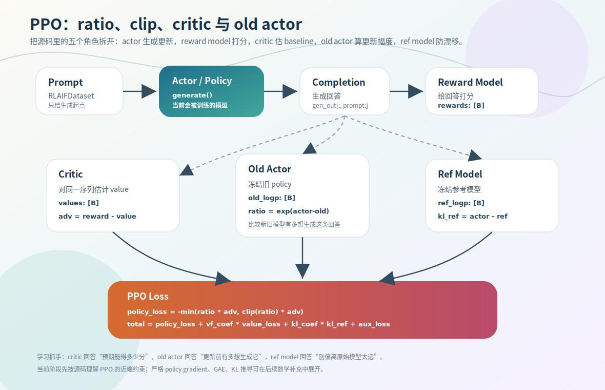

# PPO：ratio / clip / critic / old actor

PPO（Proximal Policy Optimization）是这个项目里最完整的在线 RL，也是理解 GRPO/SPO 的参照系。它的关键不只是「往哪个方向改」（advantage 决定），还要控制「这一步改多大」（ratio/clip 决定）。这一节讲 PPO 的五个模型角色，重点拆 `ratio / clip / min` 这套稳定化机制。

源码：`trainer/train_ppo.py`，`ppo_train_epoch`、`CriticModel`。

> 本节讲的是 MiniMind2 的 PPO（五模型、简化优势）。MiniMind-3 已重写为标准 PPO2（四模型、token-level GAE），见 [第 9 章](../09-minimind2-vs-3/03-ppo-rewrite.md)。

## 五个模型角色

| 模型 | 作用 | 是否训练 |
|---|---|---|
| `actor_model` | 当前 policy，要优化的模型 | 训练 |
| `old_actor_model` | 旧 policy 快照，提供更新前的概率参照 | 周期同步，不反传 |
| `critic_model` | value model，估计 baseline | 训练 |
| `ref_model` | 冻结参考，约束行为漂移（KL） | 冻结 |
| `reward_model` | 冻结奖励模型，给 response 打分 | 冻结 |

分工要记清：**reward_model 给分，critic 估 baseline，ref_model 防漂移，old_actor 量更新幅度。** `CriticModel` 继承自 `MiniMindForCausalLM`，把语言模型头换成输出标量 value 的头（见下方折叠的源码细节）。

## advantage = reward − critic value

```python
rewards = calculate_rewards(prompts, responses_text, reward_model, reward_tokenizer)
values = critic_model(input_ids=gen_out, ...)[..., last_indices]
advantages = rewards - values.detach()
```

critic 估「这个 prompt 正常能拿几分」，实际 reward 减去它就是 advantage：比预期好为正、差为负（[01-rl-overview](01-rl-overview.md) 的 baseline 思想，PPO 的 baseline 来自 critic）。`.detach()` 是因为这一步只用 value 当基准、不让 advantage 的梯度流回 critic（critic 另有自己的 value_loss 回归 reward）。

## ratio：新旧 policy 的概率比

PPO 不只看当前 actor 输出了什么，还看它相比更新前改了多少。`old_logp` 是旧 policy 对同一条 response 的 log-prob，`actor_logp` 是当前 policy 的：

```python
ratio = torch.exp(actor_logp - old_logp)
```

为什么这是概率比？因为 `log a − log b = log(a/b)`：

$$\text{actor\_logp} - \text{old\_logp} = \log\frac{\pi_\theta(y|x)}{\pi_{\text{old}}(y|x)} \;\Rightarrow\; \text{ratio} = \frac{\pi_\theta(y|x)}{\pi_{\text{old}}(y|x)}$$

`ratio > 1` 新 policy 更喜欢这条回答，`< 1` 更不喜欢，`= 1` 基本没变。所以 **ratio 表达「这一步改了多少」，advantage 表达「该不该强化」。**

## clip：限制单步幅度

只用 `surr1 = ratio * advantages` 会有问题：只要方向对，就可能一步把概率推得很猛，训练不稳、policy 偏离旧分布太快。PPO 加 clip：

```python
surr1 = ratio * advantages
surr2 = torch.clamp(ratio, 1.0 - clip_epsilon, 1.0 + clip_epsilon) * advantages
policy_loss = -torch.min(surr1, surr2).mean()
```

`clip_epsilon`（v2 默认 0.1）把 ratio 截在 `[0.9, 1.1]`。**clip 不改更新方向，只限更新幅度。**

`min(surr1, surr2)` 是关键保险丝：取更保守（更小）的那个目标。态度是「如果不 clip 时本来能拿更大收益，但收益来自改得太猛，那我宁可只认 clip 后更保守的收益」。一旦更新想冲出去，目标函数就不再奖励它。

分两种情况看：

- **advantage > 0**（该强化）：ratio 略大于 1 是好事；但若远超 `1+ε`，说明强化过猛，clip+min 截住。
- **advantage < 0**（该削弱）：若 ratio 还很大，等于把不该强化的回答反而推高了，更危险，同样被 clip+min 限制。

不管正负优势，目标一致：**允许朝对的方向改，但不允许一步改过头。** 末尾负号同前——想最大化 surrogate objective，写成 loss 加负号。



## 完整 loss

PPO 的总损失还包括 critic 的 value_loss（回归 reward）和对 ref_model 的 KL 惩罚（防漂移）：`policy_loss + value_loss + KL`。`ppo_train_epoch` 把生成、打分、算优势、算三部分 loss、更新串起来。`old_actor_model` 按 `update_old_actor_freq` 周期同步成当前 actor，提供下一轮的 `old_logp`。

<details>
<summary>源码细节：rollout 到 advantage 的张量链</summary>

上面是机制骨架。下面补几个读 `ppo_train_epoch` 时容易卡住的张量级细节，都贴真实片段。

**1. CriticModel：复用基座 + value_head，不是 lm_head**

`CriticModel` 继承 `MiniMindForCausalLM`，但 forward 不走 lm_head（那是投到词表），而是复用基座的最终 `norm`、再接一个输出标量的 `value_head`：

```python
class CriticModel(MiniMindForCausalLM):
    def __init__(self, params):
        super().__init__(params)
        self.value_head = nn.Linear(params.hidden_size, 1)   # 替换 lm_head：hidden → 标量 value

    def forward(self, input_ids=None, attention_mask=None, **kwargs):
        outputs = self.model(input_ids=input_ids, attention_mask=attention_mask, **kwargs)
        hidden_states = self.model.norm(outputs[0])           # 注意：outputs[0] 已 norm 过，这里又 norm 一次
        values = self.value_head(hidden_states).squeeze(-1)   # [B, P+R]：每个位置一个 value
```

两个读源码才会注意到的点：(1) `self.model`（即 `MiniMindModel`）的 forward 返回的是**三元组** `(hidden_states, presents, aux_loss)`，所以要取 `outputs[0]` 才是隐藏状态；(2) `outputs[0]` 其实**已经在 `MiniMindModel` 内部过了一次最终 `norm`**（[03-pretrain/02](../03-pretrain/02-forward-to-loss.md) 里基座 forward 的最后一步就是 `self.norm`），这里再写 `self.model.norm(outputs[0])` 等于**又归一化了一次**，value_head 吃的是这个二次归一化后的 hidden。别误以为「基座没 norm、critic 来补」——基座 norm 过了，这是第二次。

注意它输出的是**逐位置** value `[B, P+R]`，不是一个标量——怎么压成每条回答一个 baseline，见第 2 点。

**2. last_indices：为什么取「最后一个非 pad 位置」的 value**

critic 给了每个位置的 value，但 advantage 只需要每条回答一个标量 baseline。代码取每条序列**最后一个有效（非 pad）token** 的 value：

```python
full_mask = (gen_out != tokenizer.pad_token_id).long()   # [B, P+R]，非 pad 为 1
values_seq = critic_model(input_ids=gen_out, attention_mask=full_mask)  # [B, P+R]
last_indices = (full_mask * torch.arange(full_mask.size(1), device=gen_out.device)).argmax(dim=1)
values = values_seq[torch.arange(values_seq.size(0)), last_indices]     # [B]
```

`full_mask * arange` 把非 pad 位置替换成它的列索引、pad 位置压成 0，`argmax` 就取到**最后一个非 pad 的列号**。为什么取最后一个？自回归模型里，最后一个 token 的隐藏状态浓缩了整条序列的上下文，用它的 value 当「这条回答的预期得分」最合理。这也是 v3 用 token-level GAE 替代它的动机（[第 9 章](../09-minimind2-vs-3/03-ppo-rewrite.md)）：v2 整条只取一个 value，粒度粗。

**3. left padding：为什么 prompt 左填充**

tokenize prompt 时用了 `padding_side="left"`：

```python
enc = tokenizer(prompts, ..., padding=True, padding_side="left")  # input_ids: [B, P]
prompt_length = enc.input_ids.shape[1]
```

batch 里 prompt 长短不一，左填充让所有 prompt 的**右端对齐**，于是 `generate` 从同一列开始续写、`prompt_length` 对整个 batch 是同一个值。若用右填充，短 prompt 后面跟 pad，生成会接在 pad 之后，response 区间逐条不同，后面 `resp_mask` 就没法用一个 `prompt_length` 统一切。

**4. final_mask 与 labels 错位：只统计 response 区的有效 token**

actor_logp 要的是「response 部分」每个 token 的 log-prob 之和，不含 prompt、不含 pad。先 [shift](../08-training-mechanics/02-logits-to-logprob.md) 取 token log-prob，再用两层 mask 筛：

```python
labels = gen_out[:, 1:].clone()                              # [B, P+R-1]，错位一位：位置 t 预测 t+1
logp_tokens = F.log_softmax(logits[:, :-1], dim=-1).gather(2, labels.unsqueeze(-1)).squeeze(-1)
seq_len = gen_out.size(1) - 1
resp_mask = torch.arange(seq_len).unsqueeze(0) >= prompt_length - 1   # 只保留 response 区
final_mask = resp_mask & (~labels.eq(tokenizer.pad_token_id))        # 再去掉 pad
actor_logp = (logp_tokens * final_mask).sum(dim=1)          # [B]，response log-prob 求和
```

`resp_mask` 的阈值是 `prompt_length - 1` 而不是 `prompt_length`——因为 labels 已经错位一位（`gen_out[:, 1:]`），下标整体左移了 1，response 的起点也跟着前移一位。`final_mask` 再 `& ~labels.eq(pad)` 去掉 response 里的 pad token。这里 `.sum`（而非 mean）对应 [08-training-mechanics/03](../08-training-mechanics/03-token-to-sequence-objective.md) 讲的：PPO 要的是整条 response 的序列 log-prob，是 token log-prob 之和。

**5. kl_ref 是简化约束，不是严格 KL**

PPO 对 ref_model 的「KL 惩罚」其实是 actor 与 ref 的 log-prob 差的均值：

```python
kl_ref = (actor_logp - ref_logp).mean()   # scalar
```

这只是 `E[log π_actor − log π_ref]`，是真实 KL 散度的一个简化代理（严格 KL 还要对分布求期望）。够用、便宜，但有偏。对比 [第 9 章](../09-minimind2-vs-3/03-ppo-rewrite.md)：v3 改用 k3 无偏估计 `exp(d) − d − 1`，更接近真实 KL。读 v2 时别把这个 `kl_ref` 当成严格 KL。

</details>

## 常见误区

- **「ratio 越大越好」**——不对，ratio 太大说明更新过猛，正是 PPO 要限制的。
- **「clip 改变更新方向」**——不，clip 只限幅度，方向由 advantage 决定。
- **「必须先推完 policy gradient 数学」**——不必，先把 ratio/clip/min 三者和代码对齐即可。

## 练习

1. PPO 的五个模型各是什么角色？哪些训练、哪些冻结？
2. `ratio = exp(actor_logp - old_logp)` 为什么等于新旧 policy 的概率比？ratio 和 advantage 各表达什么？
3. 只用 `ratio * advantages` 会有什么问题？clip 和 `min(surr1, surr2)` 共同在防什么？
4. advantage 算式里的 `values.detach()` 为什么要 detach？
5.（源码细节）critic 输出逐位置 value，为什么 advantage 只取「最后一个非 pad 位置」的 value？prompt 为什么要 left padding？

<details>
<summary>参考答案</summary>

1. actor（训练的 policy）、old_actor（旧快照，量更新幅度，不反传）、critic（估 baseline，训练）、ref（冻结，KL 防漂移）、reward（冻结，打分）。
2. `log(π_θ) − log(π_old) = log(π_θ/π_old)`，取 exp 得概率比；ratio 表达这一步改了多少（幅度/方向），advantage 表达这条回答该不该强化。
3. 只用 surr1 会让更新可能一步冲太远、训练不稳；clip 把 ratio 限在 `1±ε`、min 取更保守的目标，共同防单步更新过大。
4. advantage 只把 critic value 当基准，不应让 advantage 的梯度流回 critic（critic 由自己的 value_loss 训练），所以 detach。
5. 最后一个非 pad token 的隐藏状态浓缩了整条序列上下文，用它的 value 当「这条回答的预期得分」最合理（v2 整条只取一个，粒度粗，v3 改 token-level GAE）；left padding 让 batch 内所有 prompt 右端对齐，generate 从同一列续写、`prompt_length` 全 batch 统一，response 区间才能用一个阈值切。
</details>
