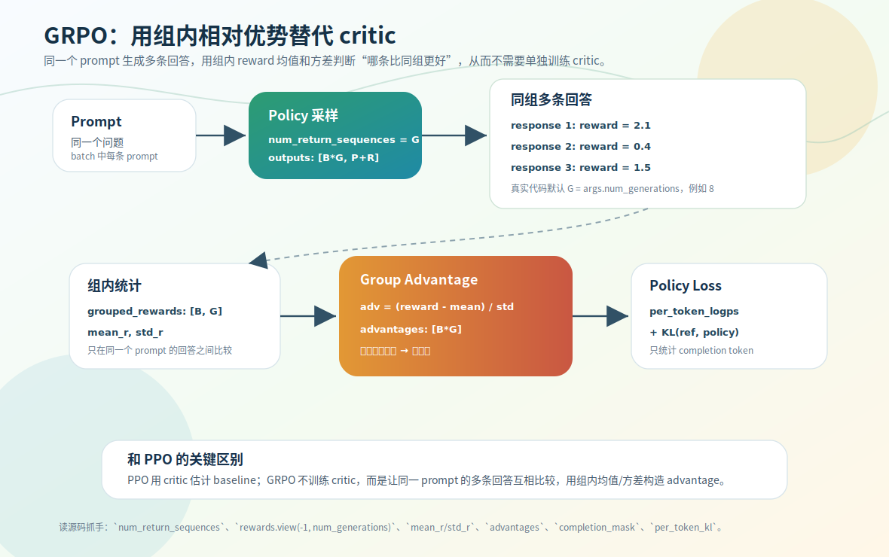

# GRPO：组内相对 reward，不用 critic

PPO 要训练一个 critic 来估 baseline。GRPO（Group Relative Policy Optimization）省掉 critic：**让同一个 prompt 生成多条回答，在这一组内部比较谁更好**，用组内均值当 baseline。这一节看它怎么构造组内相对 advantage。

源码：`trainer/train_grpo.py`，`grpo_train_epoch`。相比 PPO，脚本里**没有** `CriticModel`、`old_actor_model`、`value_loss`，只留 policy / ref / reward 三个模型。

> 版本差异：MiniMind-3 GRPO 默认走 **CISPO** 变体，不是本节的经典 clipped surrogate，见 [第 9 章](../09-minimind2-vs-3/04-grpo-cispo.md)。

## 同一个 prompt 生成多条回答

```python
outputs = model_for_gen.generate(**prompt_inputs, num_return_sequences=args.num_generations, ...)  # 默认 8
completion_ids = outputs[:, prompt_inputs["input_ids"].size(1):]   # 只留 response，[B*G, R]
```

`num_generations`（默认 8）让每个 prompt 生成 G 条回答，batch 维从 `B` 变成 `B*G`（PPO 默认每 prompt 1 条）。这是 GRPO 多出来的采样成本，也是「组」的来源。

## 组内相对 advantage

每条回答打分得到 `rewards: [B*G]`，reshape 回组结构再算组内均值/标准差：

```python
grouped_rewards = rewards.view(-1, args.num_generations)                       # [B, G]
mean_r = grouped_rewards.mean(dim=1).repeat_interleave(args.num_generations)   # [B*G]
std_r  = grouped_rewards.std(dim=1).repeat_interleave(args.num_generations)
advantages = torch.clamp((rewards - mean_r) / (std_r + 1e-4), -10, 10)
advantages = (advantages - advantages.mean()) / (advantages.std() + 1e-8)      # batch 内再标准化
```

核心是 `advantage = (reward − 组均值) / 组标准差`：这条回答相对**同一 prompt 的其他回答**好了几个标准差。高于同组平均→正→增强，低于→负→削弱。`repeat_interleave` 把每组的均值复制 G 份对齐扁平的 `rewards`，`+1e-4`/`clamp` 防数值爆炸。

为什么在同组内比？不同 prompt 难度不同（简单事实题 vs 复杂推理题），直接跨 prompt 比 reward 不公平。GRPO 只问「同一个问题下，模型自己采样的这些候选里哪个更好」，用组内均值替代了 PPO critic 的「这个 prompt 正常能得几分」。



## policy loss 与 ref KL

GRPO 没有 old actor，但保留 ref_model 做漂移约束：

```python
kl_div = ref_per_token_logps - per_token_logps
per_token_kl = torch.exp(kl_div) - kl_div - 1                       # k3 KL 估计，token 级
per_token_loss = -(torch.exp(per_token_logps - per_token_logps.detach()) * advantages.unsqueeze(1)
                   - args.beta * per_token_kl)                       # beta 默认 0.02
policy_loss = ((per_token_loss * completion_mask).sum(dim=1) / completion_mask.sum(dim=1)).mean()
```

几个点：

- `advantages.unsqueeze(1)` 把**回答级** advantage 广播到该回答的每个 token——同一条 response 的所有有效 token 共享一个 advantage。
- `completion_mask` 只统计 EOS 之前的有效 token（延续 SFT/DPO 只监督有效区域的思想）。
- `args.beta * per_token_kl` 是 ref 约束，平衡「追 reward」和「别偏离原模型」。
- `torch.exp(per_token_logps - per_token_logps.detach())`：前向值≈1（同一个量相减），但梯度仍流经当前 `per_token_logps`。**别把它误读成 PPO 的新旧 policy ratio**——GRPO 没有 old_actor，这只是「让当前 token log-prob 的梯度承载 advantage 信号」的工程写法。

那 `per_token_kl = exp(kl_div) − kl_div − 1`（`kl_div = ref_logp − policy_logp`）是怎么回事？这是 KL 的 **k3 估计**（出自 Schulman《Approximating KL Divergence》）。直接拿 `policy_logp − ref_logp` 也能无偏估计 KL，但单个 token 上可能为负、方差大；k3 在保持**无偏**（期望仍等于 KL）的同时**恒 ≥ 0**（因为 `eˣ − x − 1 ≥ 0`，policy 与 ref 一致时正好为 0）、方差更小，拿来当逐 token 的漂移惩罚更稳。v2 的 PPO 用的就是那个朴素均值 `(actor_logp − ref_logp).mean()`（见 [02-ppo 折叠 §5](02-ppo.md)），v3 统一改用 k3（见 [第 9 章](../09-minimind2-vs-3/03-ppo-rewrite.md)）。

## GRPO vs PPO

| 维度 | PPO | GRPO |
|---|---|---|
| 每 prompt 生成 | 1 条 | 多条（默认 8）|
| critic | 需要 | 不需要 |
| baseline | critic value | 同组 reward 均值 |
| advantage | `reward − value` | `(reward − 组均值)/组标准差` |
| old actor | 需要 | 不需要 |
| ref model | 有 | 有 |
| 主要代价 | 多训一个 critic | 多生成、多打分 |

一句话：**PPO 用 critic 学 baseline，GRPO 用同一 prompt 的多条回答现场算 baseline。** GRPO 不是免费——省掉 critic 训练，成本转移到多样本生成和 reward 评估。

> GRPO 之后衍生出一批变体（Dr.GRPO、DAPO、GSPO 等），各自针对它留下的某个问题，CISPO 也是其中一员。把它们放在一起对照，见本章延伸节 [06-grpo-variants](06-grpo-variants.md)。

<details>
<summary>源码细节：组结构、completion_mask 与梯度承载写法</summary>

正文给了机制骨架，这里补 `grpo_train_epoch` 里几个张量级细节（贴真实片段）。

**1. 组结构靠「连续排列」成立：reshape + repeat_interleave**

`view(-1, num_generations)` 能把扁平 rewards 切回 `[B, G]`，前提是同一个 prompt 的 G 条回答在 batch 维上**连续相邻**。这由 `generate` 的 `num_return_sequences` 保证——它对每个 prompt 连续输出 G 条：

```python
outputs = model_for_gen.generate(**prompt_inputs, num_return_sequences=args.num_generations, ...)  # [B*G, P+R]，每 prompt 的 G 条相邻
...
grouped_rewards = rewards.view(-1, args.num_generations)                      # [B*G] -> [B, G]，每行=一个 prompt 的 G 条
mean_r = grouped_rewards.mean(dim=1).repeat_interleave(args.num_generations)  # [B] -> [B*G]
```

`mean(dim=1)` 得到每组一个均值 `[B]`，`repeat_interleave(G)` 把每个均值**连续复制 G 份**（`[m0,m1] → [m0,m0,m0,m1,m1,m1]`，G=3），正好和扁平的 `rewards [B*G]` 逐元素对齐相减。注意是 `repeat_interleave` 不是 `repeat`——后者会变成 `[m0,m1,m0,m1,...]`，对不齐组。

**2. get_per_token_logps：用 logits_to_keep + shift 取 completion 区 log-prob**

per-token log-prob 只需要 completion（response）区，不要 prompt 区。函数用 `logits_to_keep=n_keep+1` 让模型只算末尾 `n_keep+1` 个位置的 logits，再 `[:, :-1]` 做 [shift](../08-training-mechanics/02-logits-to-logprob.md) 对齐：

```python
def get_per_token_logps(mdl, input_ids, n_keep):
    logits = mdl(input_ids, logits_to_keep=n_keep + 1).logits[:, :-1, :]   # 只留末尾、再 shift 去尾
    per_token_logps = []
    for logits_row, ids_row in zip(logits, input_ids[:, -n_keep:]):        # 目标 token 取末尾 n_keep 个
        per_token_logps.append(torch.gather(logits_row.log_softmax(dim=-1), 1, ids_row.unsqueeze(1)).squeeze(1))
    return torch.stack(per_token_logps)                                     # [B*G, R]
```

`n_keep` 就是 `completion_ids.size(1)`（response 长度 R），所以拿到的是 `[B*G, R]` 的逐 token log-prob，不含 prompt。多算的那 `+1` 个位置在 `[:, :-1]` 里被 shift 掉。

**3. completion_mask：EOS argmax 三步定位有效区**

response 里 EOS 之后是 pad，不该算进 loss。定位每条回答的 EOS 位置分三步：

```python
is_eos = completion_ids == tokenizer.eos_token_id                         # [B*G, R]
eos_idx = torch.full((is_eos.size(0),), is_eos.size(1), ...)              # 默认填 R（无 EOS 的情况）
eos_idx[is_eos.any(dim=1)] = is_eos.int().argmax(dim=1)[is_eos.any(dim=1)] # 有 EOS 的取首个 EOS 位
completion_mask = (torch.arange(is_eos.size(1)).expand(is_eos.size(0), -1) <= eos_idx.unsqueeze(1)).int()  # [B*G, R]
```

`argmax(is_eos.int())` 取**第一个** True 的下标（首个 EOS）。`eos_idx` 默认填满长度 R——这处理「没生成 EOS、回答被 max_gen_len 截断」的情况：整条 response 都算有效。`<= eos_idx` 让 mask 含 EOS 那一位（模型也要学会在该位置输出 EOS），和 [SFT](../05-sft/01-assistant-only-supervision.md) 监督到结束符的思想一致。

**4. exp(per_token_logps − per_token_logps.detach())：前向 1、梯度走当前 logp**

正文点过这个工程写法，补它的张量层面：

```python
per_token_loss = -(torch.exp(per_token_logps - per_token_logps.detach()) * advantages.unsqueeze(1)
                   - args.beta * per_token_kl)                            # [B*G, R]
```

`per_token_logps` 和 `per_token_logps.detach()` 数值完全相等，相减 = 0，`exp(0) = 1`——所以**前向**这一项就等于 `advantages`，loss 数值上是纯 REINFORCE 的 `−advantage × 1`。但 `.detach()` 那一支无梯度，反向时 `d/dθ exp(logp − detach) = exp(·)·d(logp)/dθ = 1·d(logp)/dθ`，**梯度恰好是 `d(per_token_logps)/dθ`**。等价于直接对 `−advantage × per_token_logps` 求梯度（REINFORCE 的策略梯度），写成 `exp(x−x.detach())` 是为了让前向值稳定在 1、不引入额外缩放。`advantages.unsqueeze(1)` 把回答级 `[B*G]` 广播到每个 token `[B*G, R]`。

这和 PPO 的 `ratio = exp(actor_logp − old_logp)`（[02-ppo](02-ppo.md) 折叠块）形似神不同：PPO 两个 logp 来自**不同模型**（当前 actor vs old actor 快照），ratio 真的有大小、参与 clip；GRPO 这里两个 logp 是**同一个量**，前向恒等于 1，纯粹为承载梯度。v3 的 GRPO/CISPO 才引入真正的新旧 logp ratio（[第 9 章](../09-minimind2-vs-3/04-grpo-cispo.md)）。

</details>

## 练习

1. GRPO 为什么不需要 critic？baseline 从哪来？
2. `num_return_sequences=num_generations` 把 batch 维变成什么？为什么要 reshape 成 `[B, G]`？
3. `advantage = (reward − mean_r) / (std_r + 1e-4)` 表示什么？为什么在同组内比而不是全 batch 比？
4. `torch.exp(per_token_logps - per_token_logps.detach())` 是 PPO 的 ratio 吗？为什么？
5.（源码细节）`mean_r` 为什么用 `repeat_interleave(G)` 而不是 `repeat(G)`？`completion_mask` 对「没生成 EOS 被截断」的回答怎么处理？

<details>
<summary>参考答案</summary>

1. 用同一 prompt 多条回答的组内 reward 均值当 baseline、组内相对表现构造 advantage，不需训练 critic；baseline 是组均值。
2. 从 `B` 变成 `B*G`；reshape 成 `[B, G]` 让每行对应同一 prompt 的 G 条回答，才能在组内比较。
3. 这条回答相对同组平均好几个标准差；同组比能消除不同 prompt 难度差异带来的 reward 不可比。
4. 不是。GRPO 没有 old_actor；该式前向≈1、只让梯度流经当前 log-prob 承载 advantage，不是新旧 policy 概率比。
5. `repeat_interleave(G)` 把每个组均值连续复制 G 份（`[m0,m0,m0,m1,m1,m1]`），才能和扁平 `rewards[B*G]` 里「同 prompt 的 G 条相邻」逐元素对齐；`repeat(G)` 会变成 `[m0,m1,m0,m1,...]` 对不齐。`completion_mask` 的 `eos_idx` 默认填满长度 R，所以没生成 EOS、被 max_gen_len 截断的回答整条都算有效 token。
</details>
