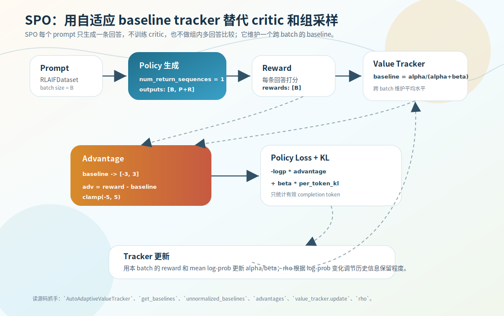

# SPO：自适应 baseline tracker

PPO 用 critic 估 baseline，GRPO 用同组多回答的均值估 baseline。SPO 两者都不用：**既不训练 critic，也不为同一 prompt 生成多条回答，而是用一个 `AutoAdaptiveValueTracker` 维护跨 batch 的 baseline。** 它是这三种里最轻量的。

源码：`trainer/train_spo.py`，`AutoAdaptiveValueTracker`、`spo_train_epoch`。

> 版本差异：**MiniMind-3 已移除 SPO**（没有 `train_spo.py`），本节是 MiniMind2-only，见 [第 9 章](../09-minimind2-vs-3/05-thinking-scale-removals.md)。

三种 baseline 一句话对比：

```text
PPO:  reward − critic value
GRPO: reward − 组内均值
SPO:  reward − tracker baseline
```

SPO 相比 PPO 没有 `CriticModel` / `old_actor` / `value_loss` / `ratio`/`clip`；相比 GRPO 没有 `num_generations` / 组内 mean/std。每个 prompt 只生成一条回答（`num_return_sequences=1`），靠 tracker 判断它好不好。

## AutoAdaptiveValueTracker：用 α/β 维护历史水平

tracker 维护两个统计量 `alpha`、`beta`，baseline 取：

```python
def get_baselines(self, batch_size):
    baseline = self.alpha / (self.alpha + self.beta)   # [0, 1]
    return torch.full((batch_size,), baseline)
```

直觉：`alpha` 累计「历史偏好」证据，`beta` 累计「历史偏差」证据，`alpha/(alpha+beta)` 是归一化空间里的历史平均水平。reward 被限制在 `[-3, 3]`，所以 baseline 要从 `[0,1]` 映射回原始尺度：

```python
scale = 3.0
unnormalized_baselines = baselines * (2 * scale) - scale   # [0,1] → [-3,3]
advantages = (rewards - unnormalized_baselines).clamp(-5.0, 5.0)
```

`advantage = reward − tracker baseline`：比历史平均好为正、差为负。注意 SPO **不再做 batch 内归一化**（不像 GRPO 的组内 mean/std），因为 tracker 已经提供了跨 batch 的稳定基线。



## policy loss

```python
per_token_loss = -per_token_logps * advantages.unsqueeze(1) + args.beta * per_token_kl
policy_loss = ((per_token_loss * completion_mask).sum(dim=1) / completion_mask.sum(dim=1)).mean()
```

和 GRPO 同构：advantage 广播到每个 token（`-log_prob * advantage`，正优势鼓励、负优势抑制），`beta * per_token_kl` 用 ref_model 约束漂移，`completion_mask` 只统计 EOS 前有效 token。没有 PPO 的 ratio/clip——因为 SPO 没有 old_actor。

## baseline 怎么更新：rho 控制历史保留

每个 batch 后用本批结果更新 tracker：

```python
rho = value_tracker.update(rewards, per_token_logps.detach(), response_masks)
# update 内部：
self.alpha = rho * self.alpha + avg_normalized_reward          # 新证据并入
self.beta  = rho * self.beta  + (1 - avg_normalized_reward)
```

`rho`（限制在 `[0.5, 0.96]`）决定旧 α/β 保留多少：

```python
kl = abs(self.old_mean_logprob - cur_mean_logprob)
rho = 2 ** (-kl / self.D_half)
```

policy 分布变化小（mean log-prob 变化小）→ rho 大 → 多保留历史；变化大 → rho 小 → 少保留历史、让 baseline 更快适应新分布。近期 reward 普遍更高，α 变大、baseline 提高，反之亦然。

## 三者对比与诚实边界

| 维度 | PPO | GRPO | SPO |
|---|---|---|---|
| critic | 需要 | 不需要 | 不需要 |
| old actor | 需要 | 不需要 | 不需要 |
| 每 prompt 生成 | 1 条 | 多条 | 1 条 |
| baseline | critic value | 同组均值 | adaptive tracker |
| 主要代价 | 多训 critic | 多生成多评分 | baseline 依赖统计追踪质量 |

一句话：**PPO 用模型估 baseline，GRPO 用同题多回答估 baseline，SPO 用跨 batch 的自适应统计估 baseline。**

诚实说，SPO 是这份代码里更偏工程尝试的实现：baseline 只是统计追踪，不像 critic 能针对不同 prompt 精细估值；reward 分布变化快时 tracker 可能滞后；reward model 有偏，tracker 也跟着偏。理论标准性不如经典 PPO——这也是 MiniMind-3 把它移除的背景之一。

## 练习

1. SPO 的 baseline 和 PPO、GRPO 分别来自哪？SPO 每个 prompt 生成几条回答？
2. `get_baselines` 返回 `alpha/(alpha+beta)`，为什么还要 `* (2*scale) - scale`？
3. tracker 更新里的 `rho` 控制什么？policy 分布变化大时 rho 怎么变、有什么效果？
4. SPO 为什么不像 GRPO 那样做 batch 内归一化？

<details>
<summary>参考答案</summary>

1. PPO 来自 critic value，GRPO 来自同组均值，SPO 来自跨 batch 的 `AutoAdaptiveValueTracker`；SPO 每 prompt 只生成 1 条。
2. `alpha/(alpha+beta)` 在 `[0,1]` 归一化空间，reward 在 `[-3,3]`，映射 `*(2*scale)-scale` 把 baseline 还原到 reward 原始尺度才能相减。
3. rho 控制旧 α/β 保留多少；变化大时 rho 变小、少保留历史，让 baseline 更快适应新分布。
4. 因为 tracker 已提供跨 batch 的稳定基线，不需要再用当前 batch 的 mean/std 归一化（GRPO 没有跨 batch baseline，才靠组内 std）。
</details>
