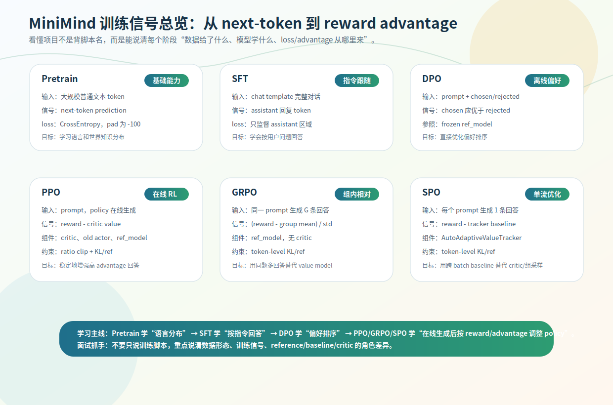
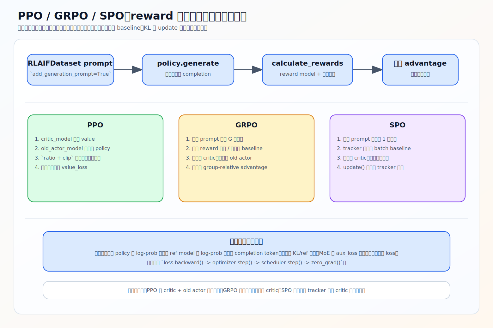

# 训练信号总表与统一源码主链

第 3–7 章拆了六种训练：Pretrain、SFT、DPO、PPO、GRPO、SPO。这一节不引入新算法，把它们压成一张总表，并点出三个在线 RL 共享的源码主链。一句话贯穿全章：**各训练阶段的差异，本质是「训练信号从哪来」不同。**

## 一张表看懂六种训练

| 阶段 | 数据形态 | 在线生成 | 训练信号 | 关键 loss / advantage | 主要学到 |
|---|---|:--:|---|---|---|
| [Pretrain](../03-pretrain/02-forward-to-loss.md) | 普通文本 | 否 | 下一个 token | CrossEntropy | 语言分布、世界知识 |
| [SFT](../05-sft/01-assistant-only-supervision.md) | chat 对话 | 否 | assistant 回复 token | masked CrossEntropy | 指令跟随、对话格式 |
| [DPO](../06-dpo/02-dpo-loss-and-math.md) | prompt + chosen/rejected | 否 | chosen 应优于 rejected | preference log-ratio | 离线偏好排序 |
| [PPO](02-ppo.md) | prompt | 是 | reward − critic value | clipped policy objective | 稳定增强高 advantage 回答 |
| [GRPO](03-grpo.md) | prompt | 是 | reward 相对同组均值 | group-relative advantage | 无 critic 的在线偏好优化 |
| [SPO](04-spo.md) | prompt | 是 | reward − tracker baseline | single-stream policy loss | 轻量自适应 baseline RL |

记这张表比记脚本名重要——它告诉你每阶段把什么当「该学习的信号」。



## 三条主线

**Pretrain / SFT 都是 next-token CrossEntropy，区别在 mask。** Pretrain 监督除 pad 外所有 token（学语言分布）；SFT 只监督 assistant 区域（学怎么答）。两者数据语义和 mask 不同，但 loss 同源。

**DPO 学的是偏好方向，不是唯一答案。** 用 chosen/rejected 偏好对，比较 policy 相对 reference 是否更偏向 chosen，离线、不在线采样、不用 advantage。

**PPO / GRPO / SPO 都是在线生成 + reward 优化。** 共同骨架是 `loss = -log_prob(response) * advantage`，但都不是「reward 高就直接强化」，而是看 response 相对某个 **baseline** 的好坏。

## baseline / advantage 的统一理解

三种 RL 的 advantage 都是：

```text
advantage = 当前回答表现 − 某种预期水平（baseline）
```

差别全在 baseline 怎么来：

| 方法 | baseline 来源 | advantage 含义 |
|---|---|---|
| PPO | critic value | 比 critic 预期好多少 |
| GRPO | 同 prompt 多回答的组内均值 | 比同题其他回答好多少 |
| SPO | adaptive tracker | 比跨 batch 历史 baseline 好多少 |

这条统一线很重要：它避免把 RLHF 误解成「reward 高就强化」。真实训练还要处理 baseline、KL、mask、采样噪声、更新稳定性。

## reference model：对齐训练的锚点

DPO / PPO / GRPO / SPO 都有 reference 的影子。作用统一：**提供冻结参照，防止 policy 更新失去锚点。** DPO 里 ref 是偏好差的参照；PPO/GRPO/SPO 里 ref 是 KL 惩罚的漂移约束。背后风险是 reward hacking 和行为漂移——只追 reward，模型会钻 reward model 空子或丢掉原有语言能力。ref 不告诉模型什么答案最好，只约束它别走太远。

## 离线 vs 在线

- **离线**（Pretrain / SFT / DPO）：训练样本已含要学的文本或偏好对，不需当前 policy 现场生成。
- **在线**（PPO / GRPO / SPO）：训练时当前 policy 基于 prompt 生成 response 再打分。

在线阶段带来生成成本、reward model 成本、reward hacking 风险、分布漂移、采样随机性。所以 **RL 不是「更高级所以一定更好」**——它更接近偏好优化闭环，但也更难稳定。第 [10 章](../10-experiments/03-eval-conclusions-sft-vs-rl.md) 的真实评测正印证这一点。

## 统一源码主链

三个 RL 脚本（`train_ppo/grpo/spo.py`）算法不同，但 `*_train_epoch` 共享一条主链：

```text
batch prompts
→ tokenize prompt
→ 当前 policy model.generate 生成 completion（PPO/SPO 1 条，GRPO 多条）
→ reward model 给 completion 打分 → rewards
→ 构造 advantage（PPO: reward−value；GRPO: 组内归一；SPO: reward−tracker）
→ get_per_token_logps：policy 和 ref 对生成 token 的逐 token log-prob
→ per_token_loss = −log_prob × advantage（+ ref 的 KL 惩罚）
→ completion_mask 只统计 EOS 前有效 token，聚合成标量
→ backward + optimizer.step 更新 policy
```

差异只集中在「advantage 怎么构造」和「要不要 critic/old_actor」，其余（在线生成、reward 打分、per-token log-prob、completion_mask、ref KL、更新）都一样。把这条链记住，三个 RL 脚本就不再显得散。



## 练习

1. Pretrain 和 SFT 都是 next-token CrossEntropy，训练信号差异在哪？
2. DPO 和 PPO/GRPO/SPO 最大的流程差异是什么？
3. 用统一公式说明 PPO/GRPO/SPO 的 advantage，三者 baseline 各来自哪？
4. 三个 RL 脚本共享的源码主链有哪些步骤？差异集中在哪一步？

<details>
<summary>参考答案</summary>

1. Pretrain 监督除 pad 外所有有效 token（学语言分布）；SFT 只监督 assistant 区域（学指令跟随），system/user 仅作上下文。
2. DPO 用现成 chosen/rejected 离线偏好优化；PPO/GRPO/SPO 让当前 policy 在线生成 response，再用 reward + advantage 更新。
3. `advantage = 回答表现 − baseline`；PPO baseline 是 critic value，GRPO 是同组均值，SPO 是 adaptive tracker。
4. prompt → generate → reward 打分 → 构造 advantage → policy/ref per-token log-prob → `−log_prob×advantage + KL`、completion_mask 聚合 → 更新；差异集中在 advantage 构造（及是否需要 critic/old_actor）。
</details>
