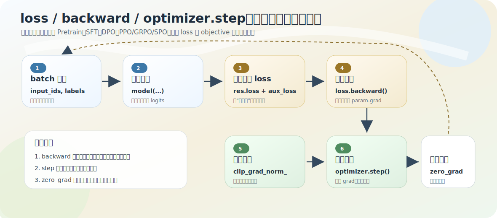

# 共用更新骨架：loss → backward → step → zero_grad

第 3–7 章里，Pretrain、SFT、DPO、PPO、GRPO、SPO 各有各的 loss。但它们最后都落到**同一件事**：用 loss 产生梯度，再让 optimizer 根据梯度更新参数。这一章（第 8 章）把这条「从 logits 到参数更新」的链拆开、统一。本节先讲最底层的更新骨架——它是所有训练脚本的地基。

源码：`trainer/train_pretrain.py`、`model/model_minimind.py` `MiniMindForCausalLM.forward`。

## 一个标量 loss 怎么改动上千万参数

核心问题：为什么一个标量 loss 能让几千万参数发生有方向的变化？最小答案三句：

- **forward** 建立从参数到 loss 的计算图：`参数 → hidden_states → logits → loss`；
- **backward** 沿计算图反向，算出每个参数对 loss 的影响（梯度）；
- **optimizer.step** 根据梯度真正修改参数。

loss 不是凭空出现的——`embed_tokens / attention / mlp / norm / lm_head → hidden_states → logits → cross_entropy`，只要某参数参与了前向、影响了 loss，autograd 就能反向追踪「这个参数变大/变小，loss 会怎么变」，这个方向和大小就是梯度。

## 六步更新链

Pretrain 和 Full SFT 的核心训练链几乎一字不差（[03-pretrain/03-training-loop](../03-pretrain/03-training-loop.md) 看过完整循环）：

```python
with autocast_ctx:
    res = model(input_ids, labels=labels)
    loss = res.loss + res.aux_loss
    loss = loss / args.accumulation_steps      # ③ 梯度累积缩放
scaler.scale(loss).backward()                  # ④ 算梯度

if (step + 1) % args.accumulation_steps == 0:
    scaler.unscale_(optimizer)
    torch.nn.utils.clip_grad_norm_(model.parameters(), args.grad_clip)  # ⑤ 限梯度尺度
    scaler.step(optimizer)                     # ⑥ 更新参数
    scaler.update()
    optimizer.zero_grad(set_to_none=True)      # ⑦ 清梯度
```

①前向 ②得 loss（loss 来自 `F.cross_entropy`，见 [02-forward-to-loss](../03-pretrain/02-forward-to-loss.md)）③累积缩放 ④backward ⑤clip ⑥step ⑦zero_grad。最容易混的是 ④ 和 ⑥。

## backward ≠ step，中间隔着 param.grad

这是本节最该记住的一点：

- **`backward()` 只计算梯度、写到 `param.grad`，不改参数值。** `param.grad` 记录「为让 loss 变小，这个参数该往哪动、动多强」。
- **`optimizer.step()` 才读取 `param.grad` 和优化器内部状态，真正改参数。** 它不重新前向、不重算 loss。最简单的 SGD 是 `参数 = 参数 − lr × 梯度`；MiniMind 用 AdamW，更新规则更复杂但本质一样（细节见 [05-optimizer-adamw-scheduler](05-optimizer-adamw-scheduler.md)）。



## 梯度为什么会「累积」

PyTorch 默认每次 `backward` 把新梯度**加**到已有 `param.grad` 上。这被用来实现梯度累积：

```python
loss = loss / args.accumulation_steps
```

显存放不下大 batch，就分多次 forward/backward、把梯度攒起来，每 `accumulation_steps` 步才 `step` 一次。先把每个小 batch 的 loss 除以步数，多次累积后梯度尺度才接近一个大 batch（不除等于人为放大梯度，见 [03-training-loop](../03-pretrain/03-training-loop.md)）。所以循环里有两种 step：DataLoader 每 batch 都 backward，optimizer 每攒够才更新。

`zero_grad()` 必须有——更新后清空，否则上一轮梯度混进下一轮。三句话记住节奏：**backward 累积梯度，step 消费梯度更新参数，zero_grad 清空准备下一轮。**

## 几个配角

- **`clip_grad_norm_`** 改的是**梯度**尺度（这一步梯度整体太大就按比例缩小），不直接改参数。直觉：backward 得到「往哪走」，clip 防止「走太猛」，step 真正「迈出去」。它和 PPO ratio clip 的区别见 [06-clipping](06-clipping.md)。
- **`scaler`**（GradScaler）：fp16 下 loss/梯度可能数值下溢，先放大 loss 再 backward、更新前还原。不改训练目标，只保数值稳定。bfloat16 通常不启用（`GradScaler(enabled=(dtype=='float16'))`）。
- **冻结模型**（DPO/PPO 的 ref_model）：在 `torch.no_grad()` 下前向或设 `requires_grad_(False)`，能产出 log-prob 参与 loss 数值，但参数不收梯度、不被更新。**谁的参数产生 grad，谁才被 step 更新。**

## 不同阶段 loss 不同，更新骨架相同

| 阶段 | loss / objective | 更新谁 |
|---|---|---|
| Pretrain / SFT | next-token `cross_entropy` | 语言模型参数 |
| DPO | `−logsigmoid(β·logits)` | policy 参数 |
| PPO | `policy_loss + value_loss + KL + aux` | actor + critic |
| GRPO / SPO | `policy_loss + aux` | policy 参数 |

**训练阶段的差异主要在 loss 怎么构造；参数更新的底层是同一套 autograd + optimizer。** 这正是本章要统一的主线：后面几节把「logits 怎么变成 loss」这一上游链补齐（[02](02-logits-to-logprob.md) log-prob、[03](03-token-to-sequence-objective.md) mask 聚合、[04](04-full-training-math-chain.md) 完整链）。

## 常见误区

- **「loss 变小，参数自动变好」**——loss 不改参数；它通过 backward 产生梯度、optimizer 用梯度改参数。
- **「backward 更新参数」**——backward 只算并累积梯度，step 才更新。
- **「DPO/PPO 是特殊算法，不用普通反向传播」**——它们特殊在 loss 构造；只要得到可微标量 loss，底层仍是 autograd + optimizer。

<details>
<summary>源码细节：scaler / unscale_ / clip / step 的调用顺序为什么是这个</summary>

正文讲了每个配角的作用，这里补它们**顺序不能换**的原因（贴 `train_pretrain.py` 的 `train_epoch` 真实片段+函数名锚点，无行号，以片段为准）。

```python
scaler.scale(loss).backward()                      # ① loss 放大后再 backward
if (step + 1) % args.accumulation_steps == 0:
    scaler.unscale_(optimizer)                     # ② 先把梯度还原回真实尺度
    torch.nn.utils.clip_grad_norm_(model.parameters(), args.grad_clip)  # ③ 再裁剪
    scaler.step(optimizer)                         # ④ 更新（内部查 inf/nan）
    scaler.update()                                # ⑤ 调整下次的缩放因子
    optimizer.zero_grad(set_to_none=True)          # ⑥ 清梯度
```

**① scale 在 backward 前**：fp16 下小梯度会下溢成 0，先把 loss 乘一个大因子，链式法则下所有梯度同比放大，避开下溢。放大后的梯度存进 `param.grad`。

**② unscale_ 必须在 clip 之前**：此刻 `param.grad` 还是放大状态。`clip_grad_norm_` 按梯度范数裁剪，如果对放大后的梯度裁，阈值 `grad_clip=1.0` 就完全不是真实尺度的 1.0 了。所以先 `unscale_` 把梯度除回真实尺度，clip 才裁在对的量级上。**顺序换了，裁剪阈值就失真。**

**④ scaler.step 内部带 inf/nan 检查**：放大可能导致梯度溢出成 inf。`scaler.step` 发现 inf/nan 就**跳过这次更新**（不调 `optimizer.step`），避免污染参数；正常则照常更新。

**⑤ scaler.update 动态调因子**：根据这一步有没有溢出，调整下次的缩放倍数——溢出就调小、长期不溢出就试着调大，自适应找最大安全放大倍数。

**⑥ zero_grad 在 step 之后**：梯度累积期间（没到 `accumulation_steps`）不进这个 if 块、不清零，让梯度继续在 `param.grad` 上累加；到了累积边界才 step + 清零。这就是「DataLoader 每 batch backward、optimizer 每攒够才 step/zero_grad」的两种 step 节奏。

bfloat16 时 `GradScaler(enabled=False)`，`scale`/`unscale_`/`step`/`update` 都退化成直通（不放大、直接调 `optimizer.step`），因为 bf16 动态范围大、不需要防下溢。

</details>

## 练习

1. 为什么说 `backward()` 不等于参数更新？两者中间隔着什么？
2. 梯度累积为什么把 loss 除以 `accumulation_steps`？循环里的两种 step 各指什么？
3. `clip_grad_norm_` 改的是梯度还是参数？漏掉 `zero_grad` 会怎样？
4. DPO/PPO 目标函数特殊，为什么底层仍是 autograd + optimizer？
5.（源码细节）为什么 `scaler.unscale_(optimizer)` 必须在 `clip_grad_norm_` 之前调用？

<details>
<summary>参考答案</summary>

1. backward 只沿计算图算梯度、累积到 `param.grad`，不改参数值；optimizer.step 才据梯度更新。中间隔着 `param.grad`。
2. 用多次小 batch 梯度模拟大 batch，先缩小每次 loss 再累积，最终梯度尺度才接近大 batch；两种 step 是 DataLoader 每 batch 取数+backward、optimizer 每 accumulation_steps 步更新一次。
3. 改的是梯度（按范数缩放），不直接改参数；漏 `zero_grad` 会把上一轮梯度错误叠加进下一轮。
4. 它们特殊在 loss/objective 构造，只要得到可微标量 loss，autograd 就能算梯度、optimizer 就能更新需训练的参数。
5. backward 后 `param.grad` 是被 scaler 放大过的；`clip_grad_norm_` 按范数裁剪，若裁放大后的梯度，`grad_clip` 阈值就不是真实尺度。先 `unscale_` 还原真实梯度，clip 才裁在对的量级上。
</details>
