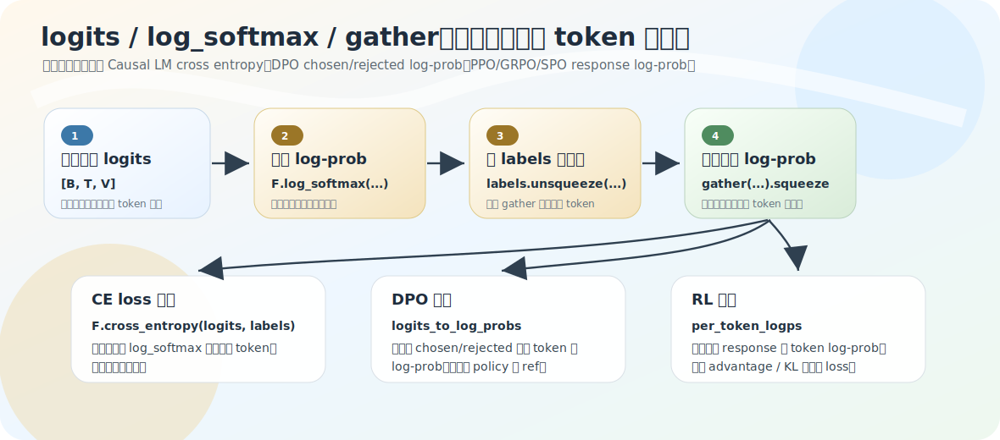

# logits → token log-prob：log_softmax + gather

[01-update-skeleton](01-update-skeleton.md) 讲了标量 loss 怎么改参数。但 loss 里用到的「目标 token 概率」是怎么从 logits 取出来的？这一节补上游：`logits → log_softmax → gather → 目标 token log-prob`。这条链同时出现在 Pretrain 的 cross_entropy、[DPO](../06-dpo/01-preference-optimization.md) 的 chosen/rejected log-prob、[PPO](../07-ppo-grpo/02-ppo.md) 的 actor/old/ref log-prob、[GRPO/SPO](../07-ppo-grpo/03-grpo.md) 的 per-token log-prob——是所有训练目标的共同上游。

源码：`model/model_minimind.py`（cross_entropy）、`trainer/train_dpo.py` `logits_to_log_probs`、`train_grpo.py` `get_per_token_logps`。

## logits 不是概率

`lm_head` 输出的 `logits` 形状 `[B, T, V]`（V=vocab_size，默认 6400），每个位置对整个词表给一排原始分数。它不是概率：可以是负数、不要求加起来等于 1、尺度任意。概率要求 `每个值≥0、总和=1`，所以先过 softmax 把一排分数变成分布：`[2.1, -0.3, 0.7] → [0.72, 0.07, 0.21]`。

代码直接用 `log_softmax`（softmax 再取 log），而不是 softmax：数值更稳，且下游 loss/ratio 往往要的就是 log-prob。log-prob 通常是负数，越接近 0 概率越高（`0.8→−0.22`，`0.01→−4.60`）。归一化必须在**词表维**（DPO `dim=2`、PPO `dim=-1`），因为每个位置的问题是「全词表里下一个 token 是谁」——不是 batch 维也不是 seq 维。

## gather：从一整排里取目标那一个

`log_softmax` 后形状还是 `[B, T, V]`——每个位置保留全词表的 log-prob。但训练只要目标 token 那一个。`logits_to_log_probs`：

```python
log_probs = F.log_softmax(logits, dim=2)                                  # [B, T, V]
log_probs_per_token = torch.gather(log_probs, dim=2, index=labels.unsqueeze(2)).squeeze(-1)  # [B, T]
```

`labels` 存每个位置的目标 token id，`gather` 按这些 id 在词表维取对应 log-prob。极简例子：某位置 `log_probs = [-3.0, -0.2, -2.1, -1.4]`，目标 id=1，gather 取出 `-0.2`。`labels.unsqueeze(2)` 把 `[B,T]` 变 `[B,T,1]`（gather 的 index 要和被取维度对齐），取完 `.squeeze(-1)` 回到 `[B,T]`，每位置一个目标 token log-prob。



## cross_entropy 其实就是这条链

Pretrain/SFT 的 `F.cross_entropy(shift_logits, shift_labels, ignore_index=-100)` 没显式写 log_softmax/gather，但等价于：

```text
cross_entropy = log_softmax(logits) → gather 取真实 label 的 log-prob → 加负号 → 对有效位置平均
            = - log p(真实 token)，再平均
```

模型给真实 token 概率越高 → `log p` 越接近 0 → `−log p` 越小 → loss 越小。这就是语言模型 CE 的最小直觉。

## 为什么各训练阶段都要显式取 token log-prob

CE 把「取 log-prob + 加负号 + 平均」一步打包成标量。但 DPO/PPO/GRPO/SPO 不能只要这个平均后的标量：

- **DPO** 要比较 chosen/rejected、policy/ref 四个 log-prob 再作差（[dpo-loss](../06-dpo/02-dpo-loss-and-math.md)），必须显式拿到每个 token 的 log-prob，再 mask 聚合、拆 chosen/rejected。
- **PPO** 要 `ratio = exp(actor_logp − old_logp)`、`kl = (actor_logp − ref_logp)`，得先有 response 每个 token 的 log-prob 再按 mask 求和。
- **GRPO/SPO** 要 `per_token_logps` 配 advantage、KL、completion_mask 组成 per-token loss。

所以这几类方法不是只看「生成的文字好不好」，训练时还必须知道「policy 对自己生成的每个 token 给了多大概率」。CE 把这条链藏在内部，RL/DPO 把它显式拆开——但底层都是 log_softmax + gather。

## shift 和 gather 的配合

语言模型固定对齐「位置 t 的 logits 预测位置 t+1 的 token」，所以 CE 路径 `shift_logits = logits[..., :-1, :]`、`shift_labels = labels[..., 1:]`，PPO 路径也有 `labels = gen_out[:, 1:]` + `logits[:, :-1]`。两者都在做同一件事——把「预测位置」和「被预测 token」错开一位（[02-forward-to-loss](../03-pretrain/02-forward-to-loss.md)），否则就成了拿当前位置预测当前位置，不是 next-token prediction。

## 练习

1. 为什么 logits 不能直接当概率？为什么 `log_softmax` 在词表维而非 batch/seq 维做？
2. `gather` 在做什么？`labels.unsqueeze(2)` 和 `.squeeze(-1)` 各是为什么？
3. `F.cross_entropy` 和 `log_softmax + gather` 是什么关系？
4. DPO/PPO 为什么不能只用 cross_entropy 给的标量，要显式取 token log-prob？

<details>
<summary>参考答案</summary>

1. logits 可负、不归一、尺度任意，不满足概率的非负+和为1；每个位置要在全词表里选下一个 token，归一化必须在词表维。
2. gather 按 `labels` 里的目标 token id 在词表维取对应 log-prob；`unsqueeze(2)` 让 index 形状 `[B,T,1]` 对齐被取维度，`squeeze(-1)` 取完回到 `[B,T]`。
3. cross_entropy 等价于 log_softmax + 按 label gather 取 log-prob + 加负号 + 有效位置平均，即 `−log p(真实 token)` 的平均。
4. CE 把取 log-prob+平均打包成标量；DPO 要比较 chosen/rejected/policy/ref 四个 log-prob 作差、PPO 要算 ratio/KL，都需要每个 token 的 log-prob，不能只要平均后的标量。
</details>
