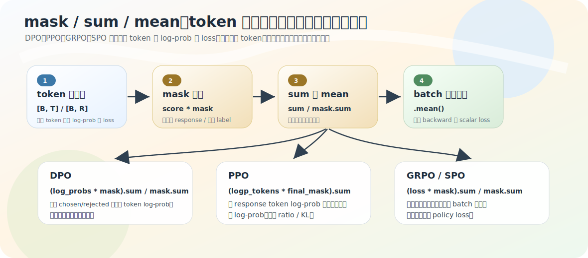

# token 分数 → 序列目标：mask / sum / mean

上一节从 logits 取出了每个 token 的 log-prob，形状还是 `[B, T]`——每个 token 一个分数。但训练目标要的是一条回答的分数、或一个能 backward 的标量 loss。这一步靠 `mask / sum / mean`。很多训练目标的差别不只在公式，还在**哪些 token 被算进去、怎么聚合**。

源码：`train_dpo.py`、`train_ppo.py`、`train_grpo.py`、`train_spo.py` 的聚合段。

## mask 的本质

mask 是一张 0/1 表，形状和 token 分数一样（`[B, T]` 或 `[B, R]`）：1=参与计算，0=不参与。`scores * mask` 保留有效 token 分数、把无效位置乘成 0。比「删除 token」方便——张量形状保持整齐。mask 筛什么因目标而异：padding、prompt、EOS 之后的内容，都可能被筛掉（延续 [SFT](../05-sft/01-assistant-only-supervision.md)、[RL](../07-ppo-grpo/01-rl-overview.md) 只监督有效区域的思想）。

## 三种聚合：DPO 平均、PPO 求和、GRPO/SPO 两层

这是本节的核心——**sum 和 mean 不是随便选，对应不同训练目标**。

**DPO：mask 平均**（`dpo_loss` 里）

```python
seq_lengths = mask.sum(dim=1, keepdim=True).clamp_min(1e-8)
policy_log_probs = (policy_log_probs * mask).sum(dim=1) / seq_lengths.squeeze()
```

即 `序列分数 = sum(token_logprob * mask) / sum(mask)`。为什么除以长度？chosen/rejected 长度可能不同，log-prob 多为负、token 越多累加越负，长回答会被天然惩罚。平均后比较的是「每个有效 token 的平均 log-prob」，减少长度差异对偏好比较的干扰。`clamp_min(1e-8)` 防空 mask 除零成 NaN——凡用 `mask.sum` 当分母都要防 0 长度。

**PPO：求和**（不除长度）

```python
actor_logp = (logp_tokens * final_mask).sum(dim=1)
```

因为 PPO 要的是**整条 response 的 log-prob**。序列概率是各 token 条件概率相乘，取 log 后乘变加：

$$\log p(\text{response}) = \log p(t_1) + \cdots + \log p(t_R)$$

所以 response log-prob 自然是 token log-prob 之和。`final_mask` 筛掉 prompt 区域和 padding（`resp_mask & ~labels.eq(pad)`），因为 PPO 更新的是 policy 生成的 response，不是 prompt。

**GRPO/SPO：先长度平均，再 batch 平均**

```python
policy_loss = ((per_token_loss * completion_mask).sum(dim=1) / completion_mask.sum(dim=1)).mean()
```

两层：先对每条回答内有效 token 做平均（避免长回答贡献更大 loss 尺度），再 `.mean()` 把 batch 收成标量。`completion_mask` 还和 EOS 有关（`is_eos` 定位回答结束），EOS 之后的 token 不算有效回答内容。

一句话记忆（本项目源码的直觉，非数学定理）：**DPO 偏比较→平均；PPO 算整段 response 概率→求和；GRPO/SPO 算 token-level loss→先长度平均再 batch 平均。**



## 最后都要收成标量

optimizer 需要「一个统一目标对参数的梯度」，所以张量逐级收：`token-level → sequence-level → batch scalar`。

```text
GRPO:  [B*num_gen, R] → [B*num_gen] → scalar
DPO:   [2B, T] → [2B] → chosen/rejected split → [B] → mean scalar
PPO:   [B, P+R-1] → [B] → ratio/surr → mean scalar
```

别只盯公式，要看清张量在哪一步从 token 级收成 batch 标量——这个标量才进 `loss.backward()`（[01-update-skeleton](01-update-skeleton.md)）。

## 把 02–03 串起来

[02-logits-to-logprob](02-logits-to-logprob.md) + 本节合起来已是大半条训练数学链：

```text
logits [B,T,V] → 目标 token log-prob [B,T] → mask 聚合 [B] → mean scalar loss → backward/step
```

[下一节](04-full-training-math-chain.md) 把它收成一条完整链。

## 常见误区

- **「mask 只为处理 padding」**——还可筛 prompt、response 范围、EOS 后内容，看训练目标。
- **「sum/mean 随便选」**——sum 是整段序列 log-prob，mean 是长度归一化后的平均分数/loss，对应不同目标和尺度。
- **「PPO response 越长越吃亏所以该平均」**——本项目 PPO 用 sum 形成整段 response log-prob（序列概率取 log 即 token log-prob 之和）；是否长度归一化是算法设计选择，按源码讲。

<details>
<summary>源码细节：mask*scores 的逐元素广播、keepdim 又 squeeze 的来回</summary>

聚合的 token log-prob/gather 机制是 [02-logits-to-logprob](02-logits-to-logprob.md) 的同款，这里只补聚合这几行里容易看花的形状细节（贴真实片段+函数名锚点，无行号，以片段为准）。

**1. `scores * mask` 是逐元素乘，形状必须一致**

`policy_log_probs` 和 `mask` 都是 `[B, T]`（或 `[B, R]`），`*` 是逐元素相乘——无效位被乘成 0、有效位保留。两者形状必须对齐才不触发意外广播。`mask` 常是 int/long（0/1），和 float 的 log-prob 相乘时 PyTorch 自动把 mask 提升成 float，结果是 float，不丢精度。

**2. DPO 那两行 `keepdim=True` 又 `.squeeze()` 的来回**

```python
seq_lengths = mask.sum(dim=1, keepdim=True).clamp_min(1e-8)        # [B, 1]
policy_log_probs = (policy_log_probs * mask).sum(dim=1) / seq_lengths.squeeze()  # [B] / [B]
```

`mask.sum(dim=1, keepdim=True)` 保留维度得 `[B, 1]`（`keepdim` 让它能在别处和 `[B, T]` 广播）；但这里分子 `(...).sum(dim=1)` 是 `[B]`，所以 `seq_lengths.squeeze()` 把 `[B,1]` 压回 `[B]`、和分子同形再相除。一个 `keepdim=True` 配一个 `.squeeze()`，是为了形状两头都能对齐——保留是为通用，压回是为这次相除。

**3. completion_mask 的 EOS 构造**

GRPO/SPO 的 `completion_mask` 用 `is_eos.int().argmax` 定位首个 EOS、`arange <= eos_idx` 生成掩码——和 [07-ppo-grpo/03-grpo](../07-ppo-grpo/03-grpo.md) 折叠块讲的同款，这里不重抄。本节只需记住它最终是个 `[B, R]` 的 0/1 张量，和 `per_token_loss` 逐元素相乘后再聚合。

</details>

## 练习

1. mask 除了筛 padding 还能筛什么？`mask * scores` 比删除 token 好在哪？
2. 为什么 DPO 对 token log-prob 做平均、PPO 对 response log-prob 做求和？
3. PPO 的 `final_mask` 排除哪两类 token？GRPO/SPO 的 `completion_mask` 为什么要考虑 EOS？
4. `clamp_min(1e-8)` 防什么？
5.（源码细节）DPO 聚合里 `mask.sum(dim=1, keepdim=True)` 为什么先 `keepdim` 又在相除时 `.squeeze()`？

<details>
<summary>参考答案</summary>

1. 还能筛 prompt、response 范围、EOS 之后内容；`mask*scores` 把无效位置乘 0、保持张量形状整齐，比删除方便。
2. DPO 比较 chosen/rejected 序列偏好，平均减少长度差异影响；PPO 要整条 response 的 log-prob，而序列 log-prob 是 token log-prob 之和。
3. final_mask 排除 prompt 区域和 padding；completion_mask 用 EOS 定位回答结束，EOS 后 token 不算有效回答内容。
4. 防 `mask.sum()=0`（空 mask）当分母时除零产生 NaN。
5. `keepdim=True` 得 `[B,1]`、保留维度以便通用广播；但分子 `.sum(dim=1)` 是 `[B]`，所以 `.squeeze()` 把分母压回 `[B]` 与分子同形再逐元素相除。
</details>
