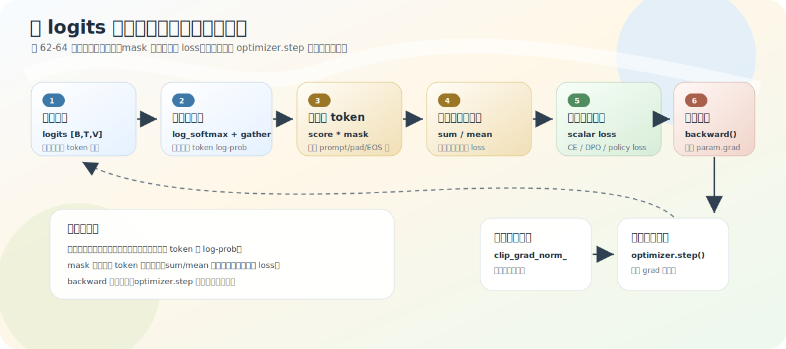
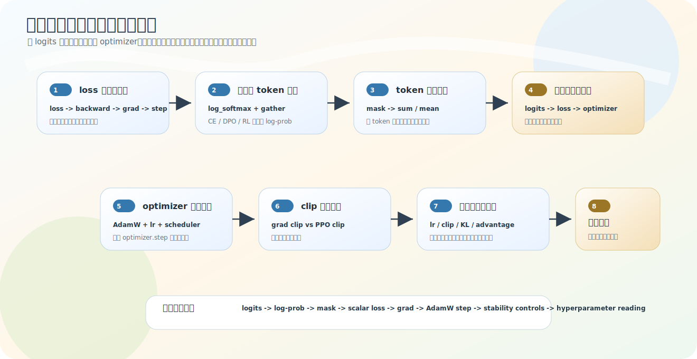

# 一条完整训练数学链

[01](01-update-skeleton.md)–[03](03-token-to-sequence-objective.md) 三节分别讲了链的三段。这一节不加新公式，只把它们收成一条完整链——这条链是解释 Pretrain、SFT、DPO、PPO、GRPO、SPO 的共同地基。

## 完整链

```text
input_ids
→ model forward
→ logits [B,T,V]
→ log_softmax + gather            （02 节）
→ 目标 token log-prob [B,T]
→ mask 筛有效 token               （03 节）
→ sum / mean 聚合
→ scalar loss / objective
→ backward 计算梯度               （01 节）
→ optimizer.step 更新参数
```

它回答了那个最常见的问题：模型训练时，loss 从哪里来，又怎么让参数变化？拆成三层：

1. **概率提取**：每个位置输出全词表 logits，`log_softmax` 得每个 token 的 log-prob，`gather` 按 label/生成 token id 取出目标 token 的 log-prob。
2. **目标聚合**：不是所有 token 都参与，`mask` 去掉 padding/prompt/EOS 后内容，`sum`/`mean` 把 token 级分数聚成序列分数或 batch scalar。
3. **参数更新**：scalar loss 经 `backward` 算梯度写入 `param.grad`，`optimizer.step` 才据梯度改参数。



## 对照源码定位

| 链路位置 | 源码 | 关键变量 |
|---|---|---|
| logits | `model_minimind.py` | `hidden_states → lm_head → logits` |
| CE loss | `model_minimind.py` | `shift_logits`/`shift_labels`/`F.cross_entropy` |
| DPO token log-prob | `train_dpo.py` | `logits_to_log_probs`/`log_softmax`/`gather` |
| DPO 序列聚合 | `train_dpo.py` | `(log_probs*mask).sum / mask.sum` |
| PPO response log-prob | `train_ppo.py` | `logp_tokens`/`final_mask`/`actor_logp` |
| GRPO/SPO token loss 聚合 | `train_grpo/spo.py` | `completion_mask`/`per_token_loss`/`policy_loss` |
| 反向传播 | 各训练脚本 | `loss.backward()` |
| 参数更新 | 各训练脚本 | `optimizer.step()` |



## 各阶段在这条链上的差异

| 阶段 | 概率提取 | 聚合 | scalar 目标 | 更新对象 |
|---|---|---|---|---|
| Pretrain | CE 内部 | 有效 label 平均 | next-token CE | 语言模型 |
| Full SFT | CE 内部 | assistant label 平均 | assistant-only CE | 语言模型 |
| DPO | 显式 log_softmax+gather | mask 平均后拆 chosen/rejected | `−logsigmoid(β·logits)` | policy |
| PPO | 显式 log_softmax+gather | response log-prob 求和 | clipped policy + value + KL | actor + critic |
| GRPO | 显式 per-token log-prob | completion_mask 平均 | group-relative policy loss | policy |
| SPO | 显式 per-token log-prob | completion_mask 平均 | tracker-baseline policy loss | policy |

**共同点：最后都收成 scalar loss 再 backward/step。差异点：loss 怎么构造、哪些 token 被 mask、sum/mean 怎么聚合。** 这比单独背「DPO 是 −logsigmoid、PPO 是 ratio clip」更能说明你读过源码——因为它补上了「公式前面的数据来源」和「公式后面的参数更新」。

## 张量在哪一步收成标量

别只盯公式，要看张量何时从 token 级收成 batch 标量：

```text
GRPO:  [B*num_gen, R] → [B*num_gen] → scalar
DPO:   [2B, T] → [2B] → chosen/rejected split → [B] → mean scalar
PPO:   [B, P+R-1] → [B] → ratio/surr → mean scalar
```

这个 scalar 才进 `loss.backward()`。

链到这里，「logits → loss → 参数更新」就闭合了。但还有一步没拆：`optimizer.step` 具体怎么决定参数改多少——learning rate、AdamW、weight decay、scheduler。[下一节](05-optimizer-adamw-scheduler.md) 补这个。

## 练习

1. 从 `logits [B,T,V]` 到 scalar loss，最少经过哪几步？
2. 各训练阶段在这条链上「共同」和「差异」各是什么？
3. DPO、PPO 在这条链上除了「离线/在线」，聚合方式有何不同？
4. 为什么训练脚本最后都要把目标收成标量？

<details>
<summary>参考答案</summary>

1. 词表维 `log_softmax` → `gather` 取目标 token log-prob → `mask` 筛有效 token → `sum/mean` 聚合成标量。
2. 共同：都收成 scalar loss 再 backward/step；差异：loss 构造、mask 范围、sum/mean 聚合方式。
3. DPO 把 policy/ref 对 chosen/rejected 的平均 token log-prob 作差再 −logsigmoid；PPO 把 response token log-prob 求和成整段 log-prob，再与 old policy 形成 ratio、配 advantage/clip。
4. optimizer 需要一个统一目标对参数求梯度，所以逐级聚合成标量，该标量经 backward 才给每个参数产生梯度。
</details>
