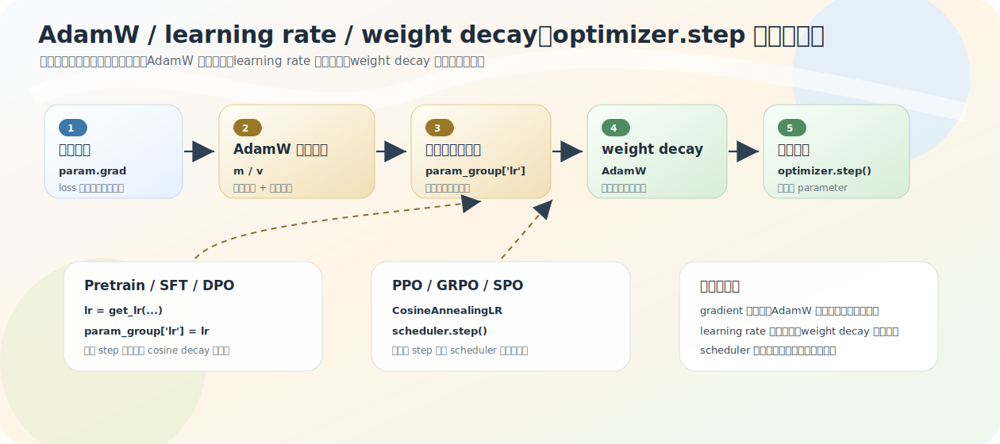

# 优化器：AdamW / learning rate / weight decay / scheduler

[04-full-training-math-chain](04-full-training-math-chain.md) 把链收到了 `scalar loss → backward → param.grad → optimizer.step`。但 `optimizer.step` 具体怎么根据梯度改参数？这一节讲最小直觉，不展开 AdamW 的完整论文公式，目标是看懂训练脚本里的 `AdamW(...)` / `get_lr(...)` / `scheduler.step()`。

源码：各 `train_*.py` 的优化器构造、`trainer/trainer_utils.py` `get_lr`（L40–41）。

一句话框架：**梯度给方向，AdamW 用历史梯度统计让更新更稳，learning rate 控制每步迈多大，weight decay 抑制权重过大，scheduler 决定 lr 随训练怎么变。**

## 从 SGD 到 AdamW

最简单的更新是 `参数 = 参数 − lr × 梯度`：梯度给方向，lr 给步长。lr 太大会震荡甚至发散，太小训练慢甚至卡住——它直接控制更新尺度。

MiniMind 多数入口用 `optim.AdamW(model.parameters(), lr=args.learning_rate)`。AdamW 比 SGD 多三样：

- **一阶动量**：梯度方向的滑动平均。mini-batch 梯度有噪声，「当前说往右、最近很多步也往右，就更有信心往右」，方向更稳。
- **二阶动量**：梯度平方的滑动平均。记录每个参数梯度幅度，让不同参数按自己的尺度调步长——不同参数不一定适合同样大小的更新，所以 AdamW 比 SGD 更自适应。
- **decoupled weight decay**：把权重衰减从梯度更新里解耦，单独约束参数大小，别让模型靠特别大的权重硬记训练数据。这就是 AdamW 里的「W」。

记忆：**AdamW = Adam 的自适应梯度更新 + 更合理的 weight decay。** 即使有自适应机制，lr 仍控制全局步长（AdamW 定方向和相对尺度，lr 定整体迈多大）。本项目建 `AdamW` 时没显式传 `weight_decay`，用的是 PyTorch 默认值。

## 各阶段 lr 差好几个数量级

| 阶段 | 默认 lr |
|---|---|
| Pretrain | 5e-4 |
| Full SFT | 1e-6 |
| DPO | 4e-8 |
| PPO actor | 8e-8 |
| GRPO | 8e-8 |
| SPO | 1e-7 |

不是偶然：越到后面对齐阶段，越不希望大步破坏已学到的能力，所以 lr 小很多。这也呼应第 [10 章](../10-experiments/02-server-training-records.md) DPO 曲线——lr 4e-8 极小，loss 变化大部分是噪声。

## scheduler：两种写法，同一目的

scheduler 不改 loss、不定梯度方向，只控制 **lr 随 step 怎么变**。本项目两种写法：

**手动 get_lr**（Pretrain / SFT / DPO）：

```python
lr = get_lr(epoch * iters + step, args.epochs * iters, args.learning_rate)
for param_group in optimizer.param_groups:
    param_group['lr'] = lr
# get_lr: return lr * (0.1 + 0.45*(1 + cos(pi * current_step / total_steps)))
```

这是 cosine decay：初期约 `lr×1.0`，后期最低约 `lr×0.1`——逐渐下降但不归零。

**scheduler 对象**（PPO / GRPO / SPO）：

```python
scheduler = CosineAnnealingLR(optimizer, T_max=total_steps, eta_min=args.learning_rate / 10)
optimizer.step()
scheduler.step()
```

目标一样（cosine 形式下降），只是写法不同。`scheduler.step()` 在 `optimizer.step()` **之后**——先用当前 lr 完成本次更新，再让 scheduler 准备下次的 lr。注意 **scheduler 不是另一个 optimizer，它只更新 optimizer 里的 lr,不改模型参数。**

## 各对象分工

| 对象 | 回答的问题 | 代码 |
|---|---|---|
| `param.grad` | 参数往哪改 | `loss.backward()` 后 |
| `AdamW` | 怎么把梯度变成更稳的更新 | `optim.AdamW(...)` |
| `learning_rate` | 这一步整体迈多大 | `lr=...` / `param_group['lr']` |
| `weight_decay` | 是否抑制权重过大 | AdamW 参数 |
| `scheduler`/`get_lr` | lr 随 step 怎么变 | `get_lr` / `CosineAnnealingLR` |
| `optimizer.step()` | 真正执行更新 | 训练循环 |



## 常见误区

- **「AdamW 只是 SGD 别名」**——AdamW 维护一阶/二阶动量 + decoupled weight decay，比 SGD 自适应。
- **「lr 决定方向」**——梯度和 AdamW 统计定方向与相对尺度，lr 定整体步长。
- **「scheduler 直接改参数」**——它只更新 optimizer 的 lr，不改模型参数。
- **「weight decay 是普通 loss 的一部分」**——AdamW 里它是 decoupled 的参数大小约束。

## 练习

1. AdamW 的一阶、二阶动量各解决什么问题？
2. 各对齐阶段（SFT/DPO/PPO）的 lr 为什么比 Pretrain 小很多？
3. Pretrain/SFT/DPO 与 PPO/GRPO/SPO 在 lr 调度写法上有何不同？为什么 `scheduler.step` 在 `optimizer.step` 之后？
4. scheduler 和 optimizer 的区别是什么？

<details>
<summary>参考答案</summary>

1. 一阶动量平滑梯度方向、减少 mini-batch 噪声；二阶动量记录梯度平方尺度、让不同参数步长自适应。
2. 对齐阶段不希望大步破坏预训练/SFT 已学到的能力，所以用很小的 lr 温和更新。
3. Pretrain/SFT/DPO 用 `get_lr` 手动写入 `param_groups`；PPO/GRPO/SPO 用 `CosineAnnealingLR`+`scheduler.step()`。`scheduler.step` 在后，是先用当前 lr 完成本次更新、再准备下次 lr。
4. optimizer 据梯度真正更新参数；scheduler 只更新 optimizer 用的 lr，不改模型参数。
</details>
