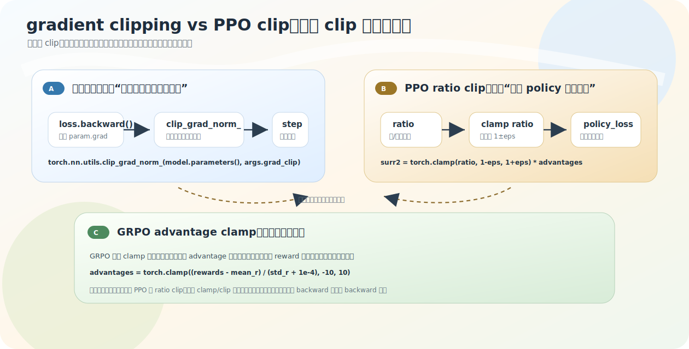

# 各种 clip：gradient clip / PPO ratio clip / advantage clamp

训练脚本里 `clip`、`clamp` 出现好几次：`clip_grad_norm_` 是 clip，PPO 的 `ratio` 要 clip，GRPO 的 `advantage` 也用 `torch.clamp`。名字像，但**完全不是一回事**。这一节教一个习惯：看到 clip/clamp，先问它**裁剪的对象是谁**。

源码：`train_pretrain.py`、`train_ppo.py`、`train_grpo.py`。

## 三个 clip，三个层级

| 机制 | 裁剪对象 | 位置 | 目的 |
|---|---|---|---|
| gradient clipping | `param.grad` 范数 | backward 后、step 前 | 防参数更新过猛 |
| PPO ratio clip | `ratio = π_new/π_old` | 构造 policy_loss 时 | 防 policy 相对 old 变化太猛 |
| advantage clamp | 标准化后的 advantage | 构造 loss 前 | 防极端 reward 放大训练信号 |

关键观察：**PPO 里 ratio clip 和 gradient clipping 同时出现**——如果是同一回事，就不会都写。

## gradient clipping：保护参数更新

发生在链的尾端（[01-update-skeleton](01-update-skeleton.md)）：

```python
scaler.scale(loss).backward()
if (step + 1) % args.accumulation_steps == 0:
    scaler.unscale_(optimizer)
    torch.nn.utils.clip_grad_norm_(model.parameters(), args.grad_clip)   # grad_clip 默认 1.0
    scaler.step(optimizer)
```

它不参与定义 loss，只拿已算出的梯度做安全处理。`clip_grad_norm_` 不是逐元素截断，而是看**所有参数梯度合起来的整体范数**，太大就按比例整体缩小——方向不变、长度缩短，像把一根长箭头等比缩短。两个细节：必须在 `backward()` 之后（此时才有 `param.grad`）；混合精度下先 `unscale_` 把梯度还原正常尺度再 clip，否则裁的不是真实范数。它属于**更新前的安全阀**。

## PPO ratio clip：保守的训练目标

出现在更早处，参与构造 policy_loss（[02-ppo](../07-ppo-grpo/02-ppo.md)）：

```python
ratio = torch.exp(actor_logp - old_logp)
surr2 = torch.clamp(ratio, 1.0 - args.clip_epsilon, 1.0 + args.clip_epsilon) * advantages  # clip_epsilon 默认 0.1
policy_loss = -torch.min(surr1, surr2).mean()
```

它裁剪的是新旧 policy 概率比，目的是「即使 advantage 很高，也别让 policy 一步把这条回答概率推太猛」。**它裁的是 policy 变化比例，不是梯度。**

为什么不能等 gradient clipping 再处理?两者管不同层:PPO clip 管「训练目标本身别鼓励 policy 离 old 太远」(在定义优化什么时就变保守),gradient clipping 管「已算出的梯度别让更新太大」。只用梯度裁剪,policy objective 仍会持续鼓励把概率比推远——梯度裁剪只能缩小每步,改不了目标的偏好方向。所以 **PPO clip 是目标函数设计的一部分,不是普通数值技巧**。反过来也不能替代:reward/advantage 偏大、KL/value loss 波动、critic 梯度不稳都可能让梯度变大,PPO clip 只约束 ratio,管不了这些,所以仍需 gradient clipping。两者**互补**。

`grad_clip`(梯度范数上限)和 `clip_epsilon`(ratio 偏离 1 的范围)是**两个不同超参**,数值上都是小数,但单位含义完全不同,不能放一起比。

## advantage clamp：保护训练信号

GRPO 里（[03-grpo](../07-ppo-grpo/03-grpo.md)）：

```python
advantages = torch.clamp((rewards - mean_r) / (std_r + 1e-4), -10, 10)
```

它裁的是**标准化后的 advantage 值**。某个 reward 极端大/小时 advantage 会很极端，进而让 policy loss 信号过强，clamp 到 `[-10,10]` 防止这种放大。它在**信号层**，既不是梯度裁剪也不是 PPO ratio clip。

## 一条链上看三者

```text
reward / labels / preference
    ↓  GRPO advantage clamp（信号层）
构造 advantage 或目标 token log-prob
    ↓  PPO ratio clip（目标层）
构造 loss / objective
    ↓
backward → param.grad
    ↓  clip_grad_norm_（梯度层）
optimizer.step 更新参数
```

一句话：**越靠前的 clip 越是在改训练信号或目标，越靠后的 clip 越是在保护参数更新。**



## 常见误区

- **「PPO clip 就是梯度裁剪」**——PPO clip 裁 ratio（objective 设计），梯度裁剪裁 `param.grad`（step 前安全处理）。
- **「有 clip_grad_norm_ 就不用 PPO ratio clip」**——梯度裁剪改不了 objective 是否鼓励过大 policy shift。
- **「有 PPO ratio clip 就不用梯度裁剪」**——ratio clip 只约束概率比，保证不了所有参数梯度稳定。
- **「`torch.clamp` 出现就是 PPO clip」**——`clamp` 只是张量截断；裁 ratio 才是 PPO clip，裁 advantage 是 advantage clamp。

## 练习

1. `clip_grad_norm_` 裁的是什么？在 `backward` 前还是后？为什么混合精度下要先 `unscale_`？
2. PPO 的 `torch.clamp(ratio, 1-eps, 1+eps)` 裁的是什么？为什么它不能被 gradient clipping 替代？
3. GRPO 的 `torch.clamp(advantage, -10, 10)` 和前两者有何区别？
4. `grad_clip` 和 `clip_epsilon` 能放一起比较吗？

<details>
<summary>参考答案</summary>

1. 裁所有参数梯度的整体范数，在 `backward` 之后、`step` 之前；混合精度会缩放梯度，先 `unscale_` 还原才能裁到真实范数。
2. 裁新旧 policy 概率比 ratio；它参与构造 policy objective、让目标本身保守，梯度裁剪只缩小已算出的梯度、改不了目标的偏好方向。
3. 它裁标准化后的 advantage 值（信号层），防极端 reward 放大信号；既不是梯度范数裁剪也不是 ratio 裁剪。
4. 不能。grad_clip 是梯度范数上限，clip_epsilon 是 ratio 偏离 1 的范围，单位和含义不同。
</details>
