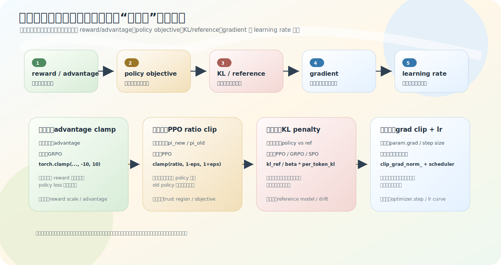
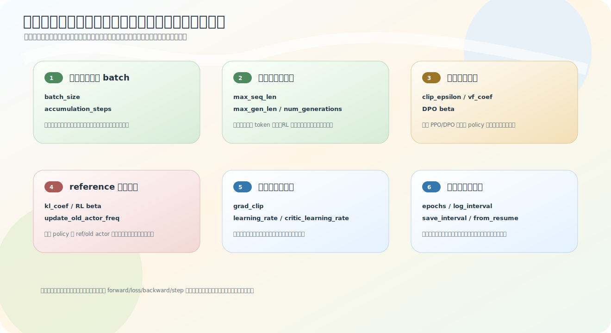

# 稳定性分层与训练参数速读

「这个技巧是为了训练更稳定」——但「稳定」太大，可能指 lr 太大走飞、梯度过猛、policy 偏离 old 太多、reward 太极端、行为偏离 reference 五种完全不同的问题，解决位置也各不同。这一节做两件收尾的事：把稳定性机制按层级归位，再给训练脚本一堆 `parser.add_argument` 一个分层读法。它是 [第 8 章](01-update-skeleton.md) 的总收束。

源码：`trainer_utils.py` `get_lr`、各 `train_*.py` 的 clip / KL / parser。

## 稳定性机制的五层

[06-clipping](06-clipping.md) 区分了三个 clip，把它们和 lr、KL 放一起，按「管什么对象」分五层：

| 层级 | 机制 | 管的对象 | 典型源码 |
|---|---|---|---|
| 信号层 | advantage clamp / 归一化 | reward 转成的 advantage | `torch.clamp(advantages, -10, 10)` |
| 目标层 | PPO ratio clip | `π_new/π_old` | `torch.clamp(ratio, 1±eps)` |
| 漂移约束层 | KL / reference penalty | policy 与 ref 的距离 | `kl_ref` / `per_token_kl` |
| 梯度层 | gradient clipping | `param.grad` 范数 | `clip_grad_norm_` |
| 步长层 | learning rate / scheduler | 参数更新步长 | `get_lr` / `CosineAnnealingLR` |

一句话：**lr/scheduler 控制每步走多大，gradient clipping 控制梯度别太大，PPO ratio clip 控制 policy 别相对 old 变太猛，KL penalty 控制 policy 别整体偏离 reference，advantage clamp 控制 reward 差异别把信号放太极端。** 都叫「稳定性」，但落在不同层——这是读 RL 训练代码不混乱的关键。

还要注意这五层**不是每个阶段都用满**：Pretrain/SFT 只碰梯度层（grad clip）和步长层（lr/scheduler）；信号层（advantage clamp）、目标层（ratio clip）、漂移约束层（KL/ref）都是在线 RL 才多出来的。这也是为什么 RL 训练脚本明显比 SFT 复杂——它要同时管更多层稳定性。

## 训练参数按链路分层读

训练脚本末尾一堆 `parser.add_argument`，别按出现顺序背，按训练链路分层读——看到一个参数先问「它控制链路的哪一层」：

| 层级 | 常见参数 | 先问的问题 |
|---|---|---|
| 数据量层 | `batch_size`, `accumulation_steps` | 一次更新看多少样本信号？ |
| 序列层 | `max_seq_len`, `max_gen_len`, `num_generations` | 样本多长、RL 生成多少回答？ |
| 采样层 | `temperature`, `top_p`, `do_sample` | RL 在线生成时怎么采样？ |
| 目标层 | `clip_epsilon`, `vf_coef`, DPO `beta` | loss 对 policy 拉动多强？ |
| 漂移约束层 | `kl_coef`, RL `beta`, `update_old_actor_freq` | policy 离 ref/old 多远算过头？ |
| 梯度层 | `grad_clip` | 梯度范数最多多大？ |
| 步长层 | `learning_rate`, `critic_learning_rate`, scheduler | 每步走多大？ |
| 记录恢复层 | `log_interval`, `save_interval`, `from_resume` | 证据和恢复现场怎么存？ |

这比背「PPO 的 lr 是 8e-8」有用——调参和面试更关心「这个参数影响什么、为什么这么小、调大调小会怎样」。

## 几个易踩的点

**有效 batch 不只看 batch_size。** `effective batch ≈ batch_size × accumulation_steps`（× GPU 数）。Pretrain 的 `batch_size=32, accumulation_steps=8` 意味着每次真正 `optimizer.step` 前累计 8 个小 batch 的梯度（[01-update-skeleton](01-update-skeleton.md) 的梯度累积）。batch_size 小但 accumulation_steps 大，有效 batch 仍可能不小。

**actor 和 critic 可有不同 lr。** PPO 里 `actor_optimizer` 用 `learning_rate`、`critic_optimizer` 用 `critic_learning_rate`——它们目标不同（生成策略 vs 价值估计），lr 分开控。读到 lr 先问「给哪个模型用的」。

**PPO 目标层参数要放回总 loss 看。** `loss = policy_loss + vf_coef * value_loss + kl_coef * kl_ref + aux_loss`：`clip_epsilon` 限 ratio 偏离、`vf_coef` 调 critic value loss 权重、`kl_coef` 调 reference 约束强度。单看名字没用，放回总 loss 才知道各调哪部分。

**同名 `beta` 不是一回事。** DPO 的 `beta` 在 `−logsigmoid(beta * logits)`，是偏好差缩放系数（[dpo-loss](../06-dpo/02-dpo-loss-and-math.md)）；GRPO/SPO 的 `beta` 在 `per_token_loss = ... + beta * per_token_kl`，是 KL penalty 权重（[grpo](../07-ppo-grpo/03-grpo.md)）。名字一样、公式位置不同——读到同名参数要看它在哪个公式里。

**RL 的采样设置也是训练的一部分。** PPO/GRPO/SPO 训练时要当前 policy 在线 `generate`，`temperature` / `do_sample` 直接决定生成什么样的 response 去拿 reward——采样太保守探索不到更好的回答，太随机则 reward 信号噪声大。监督学习的数据是死的、没有这一层；RL 的数据是模型现采的，所以采样层参数也算训练设置，不只是推理设置。

**记录恢复层不改训练数学，但是实验证据的基础。** `from_resume` 恢复训练现场、`save_interval` 决定多久存权重、`log_interval` 决定多久记 loss/reward/KL——它们不进 loss，但决定你能不能复盘和续训（第 [10 章](../10-experiments/02-server-training-records.md) 的真实记录就靠这些）。

## 至此第 8 章收束

从 [01](01-update-skeleton.md) 的 backward/step，到 [02](02-logits-to-logprob.md) 的 log-prob、[03](03-token-to-sequence-objective.md) 的 mask 聚合、[04](04-full-training-math-chain.md) 的完整链、[05](05-optimizer-adamw-scheduler.md) 的优化器、[06](06-clipping.md) 的 clip，再到本节的稳定性与参数分层——「从 logits 到参数更新」这条贯穿 Pretrain/SFT/DPO/PPO/GRPO/SPO 的训练机制就完整了。各阶段表面 loss 不同，底层共享这一条链。

## 练习

1. 稳定性五层各管什么对象？PPO ratio clip 和 KL penalty 分别在哪一层、约束什么？
2. 读训练参数为什么要分层而非按顺序背？`effective batch` 怎么算？
3. PPO 的 `clip_epsilon / vf_coef / kl_coef` 放回总 loss 各调哪部分？
4. DPO 的 `beta` 和 GRPO/SPO 的 `beta` 为什么不能混为一谈？

参考答案

1. 信号层（advantage）、目标层（ratio）、漂移约束层（policy 与 ref 距离）、梯度层（grad 范数）、步长层（lr）。PPO ratio clip 在目标层、约束 π_new/π_old；KL penalty 在漂移约束层、约束 policy 偏离 reference 的程度。
2. 分层能知道每个参数影响链路哪一层、调它的收益与代价，比背默认值有用；`effective batch ≈ batch_size × accumulation_steps × GPU 数`。
3. `clip_epsilon` 限 ratio 偏离 1 的范围（policy 目标保守度），`vf_coef` 调 critic value loss 在总 loss 的权重，`kl_coef` 调 actor 相对 reference 的约束强度。
4. DPO `beta` 是 `−logsigmoid(beta·logits)` 里的偏好差缩放系数；GRPO/SPO `beta` 是 `per_token_kl` 的权重。公式位置和含义都不同。

