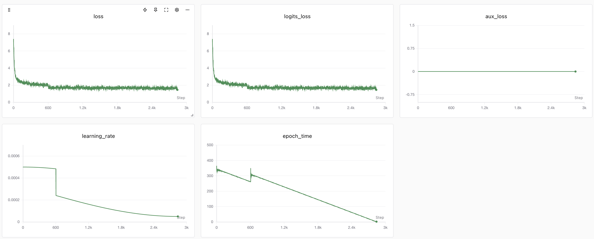
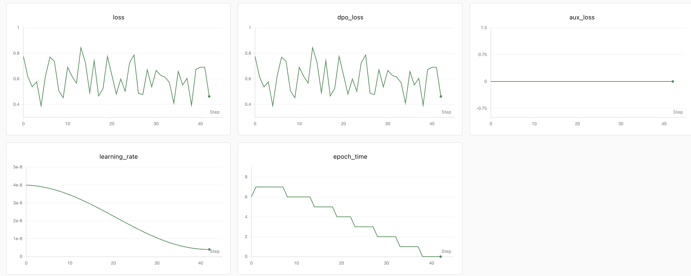
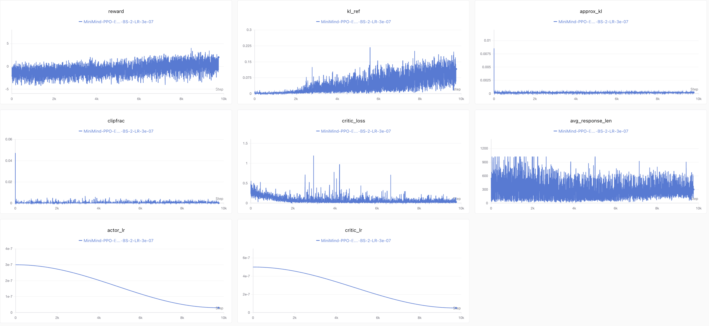
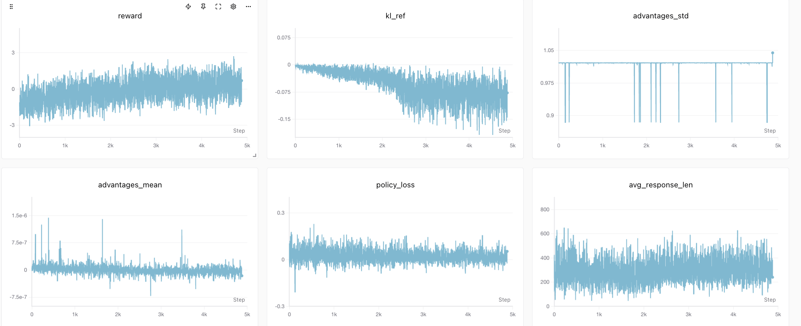
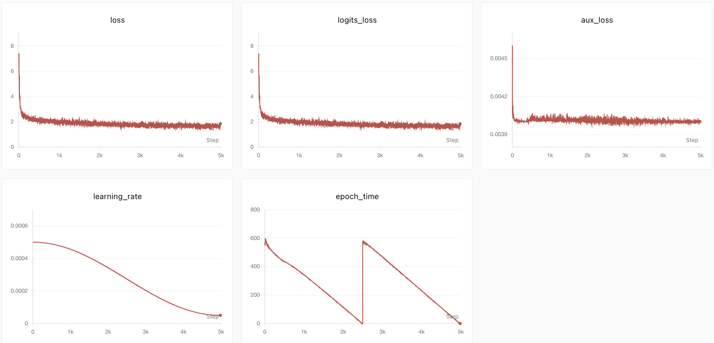
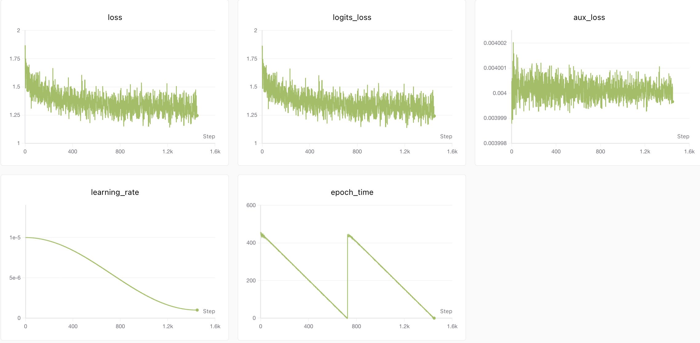
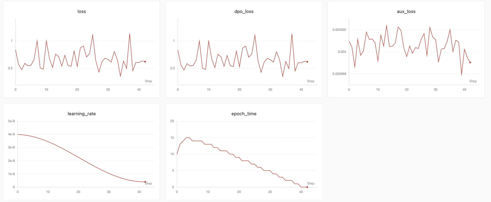
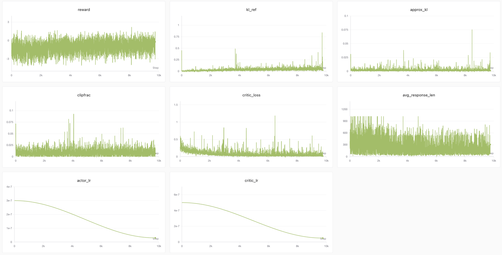
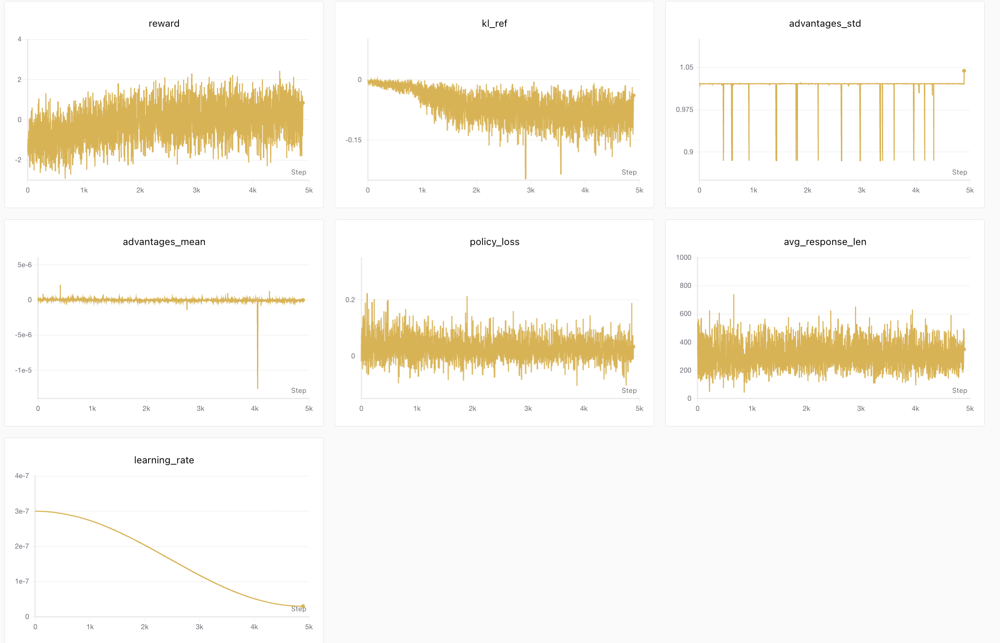

# 服务器训练记录

这一节是 MiniMind-3（768 维、8 层 dense）在服务器上的真实训练记录：环境、数据、命令、loss、训练曲线。所有数字来自实际运行日志与 SwanLab 训练曲线，下方为曲线截图。

## 环境与数据

```text
日期：2026-06-09
GPU：NVIDIA，CUDA driver 12.2
torch 2.5.1+cu121 / transformers 4.57.6 / datasets 3.6.0
训练精度：dtype=bfloat16
```

pretrain 数据 `pretrain_t2t.jsonl`，7,970,519 条样本，字段 `text`（第一行 JSON 异常，修复后替换）。

## Pretrain

```text
命令：trainer/train_pretrain.py，hidden_size=768、num_hidden_layers=8、batch_size=32、
     accumulation_steps=8、max_seq_len=380、epochs=2、learning_rate=5e-4、dtype=bfloat16
进度：Epoch [2/2](249079/249079)
输出：out/pretrain_768.pth（约 132M）；resume checkpoint 约 619M、step=249079
```

训练曲线：loss 从 ~7.4 快速降到 ~2，再缓慢收敛到末值 ~1.46（最低 ~1.31）；`logits_loss` 同步；`aux_loss=0`（dense，[02-model/06-moe](../02-model/06-moe.md) 讲过 dense 时 aux_loss 恒为 0）。`learning_rate` 和 `epoch_time` 可见两段，对应 resume 续训。



## Full SFT

```text
命令：trainer/train_full_sft.py，Epoch=2、BatchSize=64、LearningRate=1e-5（起训权重 pretrain_768.pth）
最终 loss：末值 ~1.25（最低 ~1.14，从 ~1.82 缓慢下降）；aux_loss=0
输出：out/full_sft_768.pth
```

训练曲线：loss 从 ~1.82 噪声下降到末值 ~1.25（最低 ~1.14）；`epoch_time` 两段=2 epoch。


## DPO

```text
Epoch=1、BatchSize=4、LearningRate=4e-8
```

`dpo_loss` 在初始值 ~0.69（=−log 0.5，[06-dpo/02](../06-dpo/02-dpo-loss-and-math.md) 的 −logsigmoid 在 logits≈0 时正是这个值）附近震荡（0.39–0.85），末值 ~0.46；记录点很少（~42）、lr 极小（4e-8）。

**边界**：步数少 + lr 极小，loss 变化大部分是噪声，**不能据此说已学到稳定偏好**，需后续固定 prompt eval 验证。这正是 [05-optimizer](../08-training-mechanics/05-optimizer-adamw-scheduler.md) 提到的——对齐阶段 lr 故意调到极小，避免破坏 SFT 已有能力。



把默认 4e-8 调到 1e-6（25×）重训一条做对照：`dpo_loss` 不再平噪声，而是从 ~0.65 整体上漂、方差增大到 ~1.5–2.0（~4300 step）。但固定 prompt eval 显示模型仍连贯应答、事实错误和调前没两样——能力未塌。两点合起来印证 [06-dpo/02](../06-dpo/02-dpo-loss-and-math.md) 的那条纪律：`dpo_loss` 是弱指标，loss 上漂说明 lr 偏大、训练不稳，但「不稳」和「能力受损」是两件事，判断 DPO 好坏得回到 eval。

## PPO

```text
Epoch=1、BatchSize=2、LearningRate=3e-7
```

reward 噪声很大、**无清晰上升趋势**（末值 ~2.0，区间 −4.2~4.1）；`kl_ref` 随训练升到末值 ~0.12（峰 ~0.22）；`approx_kl` / `clipfrac` 很低（更新受控）；`critic_loss` 整体稳步下降到末值 ~0.03，期间偶有尖峰（最高 ~1.2，属偶发跳动、非趋势）。

**边界**：约 10k step，reward 未见明显改善，符合 README 所述「PPO reward 提升缓慢」。



## GRPO

```text
Epoch=1、BatchSize=4、LearningRate=3e-7、loss_type=cispo（8 层 768）
```

（约 4875 step）reward 噪声大、**无明显单调上升**（末值 ~0.70，区间 −3.0~2.7）；`kl_ref` 从 ~0 缓慢下漂到末值 ~−0.08（最低 −0.19）；`advantages_std` ~1（最低 ~0.88）、`advantages_mean ≈ 0`（[03-grpo](../07-ppo-grpo/03-grpo.md) 的组内归一，均值本就接近 0）；`avg_response_len` 噪声大、末值 ~240（区间 45–660）。

**边界**：仍是训练奖励/统计、非能力评测。reward 不明显上升，需结合 [下一节](03-eval-conclusions-sft-vs-rl.md) 的 8 层 eval（输出反而更长更繁复）一起看。



## MoE 训练记录（`use_moe=1`，4 expert / top-1）

Dense 主线跑通后，对 MoE 变体做一次全链路复现。架构：8 层 768、4 专家 / top-1、无共享专家（总参约 198M，激活参约 64M；详见 [02-model/06-moe](../02-model/06-moe.md)）。配置与 Dense 同参（`hidden_size`、`num_hidden_layers`、`epochs`、`batch_size`、`learning_rate` 一致），只翻 `use_moe`。

### MoE Pretrain

```text
命令：trainer/train_pretrain.py，use_moe=1，hidden_size=768、num_hidden_layers=8、batch_size=32、
     accumulation_steps=8、max_seq_len=380、epochs=2、learning_rate=5e-4、dtype=bfloat16
输出：out/pretrain_768_moe.pth
```

训练曲线：loss 从 7.4009 降到末值 1.8436（最低 1.3581）；logits_loss 同步；**aux_loss 全程非零（0.00396–0.00460）**——这正是负载均衡辅助损失在工作的证据，与 Dense 的 aux_loss=0 形成对照。



### MoE Full SFT

```text
命令：trainer/train_full_sft.py，use_moe=1，Epoch=2、BatchSize=64、LearningRate=1e-5
     起训权重 pretrain_768_moe.pth
输出：out/full_sft_768_moe.pth
```

训练曲线：loss 从 1.8691 噪声下降到末值 1.2457（最低 1.1403）；aux_loss 仍在 0.004 附近，路由持续工作。



### MoE DPO

```text
命令：trainer/train_dpo.py，use_moe=1，Epoch=1、BatchSize=4、LearningRate=4e-8
     起训权重 full_sft_768_moe.pth
输出：out/dpo_768_moe.pth
```

训练曲线：`dpo_loss` 末值 0.62（区间 0.35–1.13），记录点很少（~42）、lr 极小（4e-8 起、衰减到 4e-9）；aux_loss 仍在 0.004 附近。和 Dense DPO 一样，步数少加极小 lr，loss 变化大部分是噪声，判断好坏得回到 eval（[06-dpo/02](../06-dpo/02-dpo-loss-and-math.md) 的弱指标纪律）。



### MoE PPO

```text
命令：trainer/train_ppo.py，use_moe=1，Epoch=1、BatchSize=2、LearningRate=3e-7
     起训权重 full_sft_768_moe.pth
输出：out/ppo_actor_768_moe.pth
```

训练曲线（约 9750 step）：reward 末值 −0.21（区间 −4.20~2.21）、噪声大无明显上升；`kl_ref` 升到末值 0.02（峰 0.84）；`approx_kl` / `clipfrac` 很低（更新受控）；`critic_loss` 末值 0.02（偶有尖峰，最高 ~1.2）；`avg_response_len` 末值 ~308。约 10k step，reward 未见明显改善，与 Dense PPO 一致。



### MoE GRPO

```text
命令：trainer/train_grpo.py，use_moe=1，Epoch=1、BatchSize=4、LearningRate=3e-7、loss_type=cispo
     起训权重 full_sft_768_moe.pth
输出：out/grpo_768_moe.pth
```

训练曲线（约 4891 step）：reward 末值 0.84（区间 −2.93~2.43）、噪声大无明显单调上升；`kl_ref` 从 ~0 缓慢下漂到末值 −0.04（最低 −0.25）；`advantages_std` ~1、`advantages_mean ≈ 0`（组内归一，[03-grpo](../07-ppo-grpo/03-grpo.md)）；`avg_response_len` 末值 ~349（区间 42–740）。

和 Dense GRPO 对照：reward 0.84 vs 0.70、`avg_response_len` 349 vs 240，两条都是平噪声、无上升——MoE 末值略高但仍在同量级噪声内，**不构成「MoE 更好」的结论**，能力差异要看 eval。



### 小结：MoE 训练曲线也是过程证据

- MoE 五阶段全跑通（pretrain → full_sft → DPO / PPO / GRPO），`aux_loss` 始终非零（~0.004），**4 expert / top-1 路由真正在工作**。
- pretrain / SFT 的 loss 末值与 Dense 量级相近（1.84 vs 1.46 pretrain；1.25 vs 1.25 SFT），但**步数轴不同，不能据此下能力结论**——要谈效果，需做固定 prompt eval（方法同 Dense 主线）。
- 这是后续实验必须记住的纪律：对 MoE 模型，**训练 loss 和 aux_loss 只证明「训练在跑」，不能证明「MoE 更好」**，能力差异需要严格对照的 eval。

## 小结：训练曲线只是过程证据

- pretrain / SFT 的 loss 正常收敛；DPO 因步数少 + 极小 lr 几乎没动；PPO / GRPO 的 reward 都是平噪声、无明显上升。
- 这些只支撑「训练过程证据」。**要谈「能力 / 效果」，必须对权重做固定 prompt eval 对比**——这是下一节的内容。把训练曲线（reward 升没升）和能力评测（答得对不对）分开，是这一章最重要的纪律。

## 练习

1. 这一节的训练曲线（loss / reward）能用来说明「模型能力提升」吗？为什么？
2. DPO 的 `dpo_loss` 初始值为什么约 0.69？为什么说它的曲线「大部分是噪声」？
3. pretrain 曲线里 `learning_rate` 和 `epoch_time` 为什么呈两段？

<details>
<summary>参考答案</summary>

1. 不能。它们是训练过程证据（loss 收敛、reward 升降），不等于能力；要谈能力须做固定 prompt eval 对比。
2. `dpo_loss = −logsigmoid(β·logits)`，初始 policy≈reference 时 logits≈0，`−logsigmoid(0)=−log0.5≈0.69`；DPO 步数少（~42 点）+ lr 极小（4e-8），loss 变化大部分是噪声，不能据此说学到稳定偏好。
3. 因为 resume 续训——训练中断后从 checkpoint 恢复，lr 调度和计时各成一段，对应 2 个 epoch。
</details>
